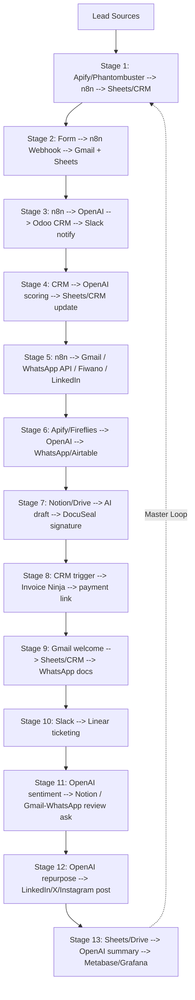
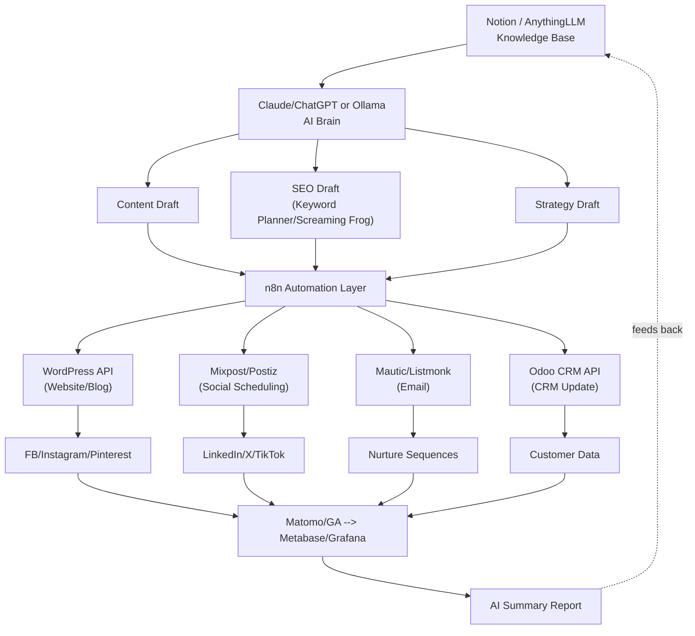
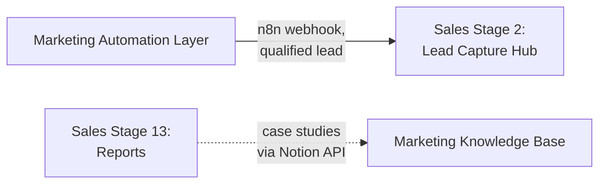

# Growth Engine — Detailed Build Map
**Kaunsa software, kiske through connect hoga, kaunsa n8n template kaha lagega — sab stage-wise.**

Base rule: sab kuch **Docker** pe self-hosted hoga, aur **n8n** hi central automation layer hai jo sab tools ko connect karta hai. Har template yaha se aayega: [nivyindia/all_n8n_templates_collection](https://github.com/nivyindia/all_n8n_templates_collection) — download `.json` → n8n me **Workflows → Import from File** → credentials fill karo → activate.

---

## SALES FUNNEL — Stage by Stage

### Stage 1 — Lead Generation / Scraping
| Kya chahiye | Detail |
|---|---|
| Core software | n8n (automation) + Google Sheets ya CRM (storage) |
| Scraping tools (outside n8n) | Apify / Phantombuster / Octoparse — inse data nikalta hai, n8n webhook/API se receive karta hai |
| Connects via | Scraping tool → Webhook/HTTP node (n8n) → Google Sheets node ya CRM API node |
| Template 1 | [AI agent that can scrape webpages](https://github.com/nivyindia/all_n8n_templates_collection/blob/main/OpenAI_and_LLMs/AI%20agent%20that%20can%20scrape%20webpages.json) — folder: `OpenAI_and_LLMs` |
| Template 2 | [Automate Competitor Research with Exa.ai, Notion and AI Agents](https://github.com/nivyindia/all_n8n_templates_collection/blob/main/Notion/Automate%20Competitor%20Research%20with%20Exa.ai,%20Notion%20and%20AI%20Agents.json) — folder: `Notion` (Notion API credential chahiye) |
| Template 3 | [VoiceAgent Lite — Phone Call Logger](https://github.com/nivyindia/all_n8n_templates_collection/blob/main/Other_Integrations_and_Use_Cases/VoiceAgent%20Lite%20-%20Phone%20Call%20Logger.json) — cold-call transcript ko Vapi.ai/Bland.ai webhook se leke Sheets me log karta hai |

### Stage 2 — Lead Capture Hub
| Kya chahiye | Detail |
|---|---|
| Core software | n8n Forms ya website form → Gmail (welcome email) → Google Sheets |
| Connects via | Form submit → Webhook trigger (n8n) → Gmail node (SMTP/OAuth credential) → Google Sheets node |
| Template 1 | [ClientFlow Lite — Simple Onboarding](https://github.com/nivyindia/all_n8n_templates_collection/blob/main/Other_Integrations_and_Use_Cases/ClientFlow%20Lite%20-%20Client%20Onboarding%20Automation.json) — folder: `Other_Integrations_and_Use_Cases` |
| Template 2 | [Qualifying Appointment Requests with AI & n8n Forms](https://github.com/nivyindia/all_n8n_templates_collection/blob/main/Forms_and_Surveys/Qualifying%20Appointment%20Requests%20with%20AI%20%26%20n8n%20Forms.json) — folder: `Forms_and_Surveys` |

### Stage 3 — CRM Ingestion & Enrichment
| Kya chahiye | Detail |
|---|---|
| Core software | Odoo Community (CRM) ya Pipedrive/ERPNext + OpenAI GPT-4o (enrichment) + Slack (notify) |
| Connects via | Sheets/Form → n8n → OpenAI node (enrich data) → CRM API node (write) → Slack node (notify team) |
| Template 1 | [Enrich Pipedrive's Organization Data with OpenAI GPT-4o & Notify it in Slack](https://github.com/nivyindia/all_n8n_templates_collection/blob/main/Slack/Enrich%20Pipedrive_s%20Organization%20Data%20with%20OpenAI%20GPT-4o%20&%20Notify%20it%20in%20Slack.json) — folder: `Slack` |
| Template 2 | [AI-Driven Lead Management and Inquiry Automation with ERPNext & n8n](https://github.com/nivyindia/all_n8n_templates_collection/blob/main/OpenAI_and_LLMs/AI-Driven%20Lead%20Management%20and%20Inquiry%20Automation%20with%20ERPNext%20&%20n8n.json) — agar ERPNext use kar rahe ho to yeh direct fit hai |
| Template 3 | [Chat with a Google Sheet using AI](https://github.com/nivyindia/all_n8n_templates_collection/blob/main/Google_Drive_and_Google_Sheets/Chat%20with%20a%20Google%20Sheet%20using%20AI.json) — agar Sheets hi CRM ki jagah use ho raha hai |

### Stage 4 — AI Qualification Engine
| Kya chahiye | Detail |
|---|---|
| Core software | OpenAI GPT-4 + Google Sheets ya CRM |
| Connects via | CRM/Sheets trigger → OpenAI node (score lead hot/warm/cold) → Sheets/CRM update node |
| Template | [Qualify new leads in Google Sheets via OpenAI's GPT-4](https://github.com/nivyindia/all_n8n_templates_collection/blob/main/Google_Drive_and_Google_Sheets/Qualify%20new%20leads%20in%20Google%20Sheets%20via%20OpenAI_s%20GPT-4.json) — folder: `Google_Drive_and_Google_Sheets` |

### Stage 5 — Outreach & Nurture
| Channel | Software | Connects via | Template |
|---|---|---|---|
| Email | Gmail/SMTP | Gmail OAuth credential in n8n | [LeadPilot Lite - AI Cold Email Writer](https://github.com/nivyindia/all_n8n_templates_collection/blob/main/Gmail_and_Email_Automation/LeadPilot%20Lite%20-%20AI%20Cold%20Email%20Writer.json) |
| Email | Gmail + website scrape | Gmail + HTTP node | [Website-Grounded Cold Email Writer](https://github.com/nivyindia/all_n8n_templates_collection/blob/main/Gmail_and_Email_Automation/Website-Grounded%20Cold%20Email%20Writer.json) |
| Email | Gmail | IMAP + Gmail credential | [A Very Simple "Human in the Loop" Email Response System](https://github.com/nivyindia/all_n8n_templates_collection/blob/main/Gmail_and_Email_Automation/A%20Very%20Simple%20_Human%20in%20the%20Loop_%20Email%20Response%20System%20Using%20AI%20and%20IMAP.json) |
| WhatsApp | WhatsApp Business API | Meta/WhatsApp Business API credential (or Fiwano) | [Building Your First WhatsApp Chatbot](https://github.com/nivyindia/all_n8n_templates_collection/blob/main/WhatsApp/Building%20Your%20First%20WhatsApp%20Chatbot.json) |
| WhatsApp | WhatsApp + company docs (RAG) | WhatsApp API + Vector DB (Pinecone/Qdrant) | [Complete business WhatsApp AI-Powered RAG Chatbot](https://github.com/nivyindia/all_n8n_templates_collection/blob/main/WhatsApp/Complete%20business%20WhatsApp%20AI-Powered%20RAG%20Chatbot%20using%20OpenAI.json) |
| WhatsApp + IG + Messenger | Fiwano (unified inbox) | Fiwano API credential | [Receive and Send Messages Across WhatsApp, Instagram and Facebook Messenger with Fiwano](https://github.com/nivyindia/all_n8n_templates_collection/blob/main/WhatsApp/Receive%20and%20Send%20Messages%20Across%20WhatsApp%2C%20Instagram%20and%20Facebook%20Messenger%20with%20Fiwano.json) |
| LinkedIn | Notion (queue) + OpenAI | Notion API credential | [Automate LinkedIn Outreach with Notion and OpenAI](https://github.com/nivyindia/all_n8n_templates_collection/blob/main/Notion/Automate%20LinkedIn%20Outreach%20with%20Notion%20and%20OpenAI.json) |

### Stage 6 — Discovery Call → Meeting Prep → Notes
| Kya chahiye | Detail |
|---|---|
| Core software | Apify (research) + WhatsApp (delivery) OR Fireflies + Airtable |
| Connects via | Calendar trigger → Apify API node → OpenAI summarize → WhatsApp node (send to rep) |
| Template 1 | [Automate Sales Meeting Prep with AI & APIFY Sent To WhatsApp](https://github.com/nivyindia/all_n8n_templates_collection/blob/main/WhatsApp/Automate%20Sales%20Meeting%20Prep%20with%20AI%20&%20APIFY%20Sent%20To%20WhatsApp.json) |
| Template 2 | [AI Agent for project management and meetings with Airtable and Fireflies](https://github.com/nivyindia/all_n8n_templates_collection/blob/main/Airtable/AI%20Agent%20for%20project%20management%20and%20meetings%20with%20Airtable%20and%20Fireflies.json) — Fireflies (call transcript) → Airtable (tasks) |
| Template 3 | [vAssistant for Hubspot Chat using OpenAi and Airtable](https://github.com/nivyindia/all_n8n_templates_collection/blob/main/Airtable/vAssistant%20for%20Hubspot%20Chat%20using%20OpenAi%20and%20Airtable.json) |

### Stage 7 — Proposal / Quotation / Contract
| Kya chahiye | Detail |
|---|---|
| Core software | Notion (KB) ya Google Drive (KB) + Gemini/OpenAI + **DocuSeal** (e-signature, separate install) |
| Connects via | Notion/Drive API → AI node (draft) → PDF node → **DocuSeal API/webhook** (signature) |
| Template 1 | [Notion knowledge base AI assistant](https://github.com/nivyindia/all_n8n_templates_collection/blob/main/Notion/Notion%20knowledge%20base%20AI%20assistant.json) |
| Template 2 | [RAG Chatbot for Company Documents using Google Drive and Gemini](https://github.com/nivyindia/all_n8n_templates_collection/blob/main/Google_Drive_and_Google_Sheets/RAG%20Chatbot%20for%20Company%20Documents%20using%20Google%20Drive%20and%20Gemini.json) |
| Template 3 | [Ask questions about a PDF using AI](https://github.com/nivyindia/all_n8n_templates_collection/blob/main/PDF_and_Document_Processing/Ask%20questions%20about%20a%20PDF%20using%20AI.json) |
| **E-signature (no template — separate tool)** | Install **[DocuSeal](https://github.com/docusealco/docuseal)** (self-hosted, Docker) → connect via **[n8n-nodes-docuseal](https://github.com/docusealco/n8n-nodes-docuseal)** community node → webhook fires back into n8n when signed |

### Stage 8 — Invoice → Payment
| Kya chahiye | Detail |
|---|---|
| Core software | **Invoice Ninja** (self-hosted, invoice generation + payment link) |
| Connects via | CRM "deal won" trigger → n8n → Invoice Ninja node (create invoice) → Invoice Ninja sends payment link itself |
| Template 1 (extraction, agar client PDF invoice bhejta hai) | [Invoice data extraction with LlamaParse and OpenAI](https://github.com/nivyindia/all_n8n_templates_collection/blob/main/PDF_and_Document_Processing/Invoice%20data%20extraction%20with%20LlamaParse%20and%20OpenAI.json) |
| Template 2 | [Invoice data extraction with human-in-the-loop validation using Cradl AI](https://github.com/nivyindia/all_n8n_templates_collection/blob/main/PDF_and_Document_Processing/Invoice%20data%20extraction%20with%20human-in-the-loop%20validation%20and%20auto-training%20using%20Cradl%20AI.json) |
| Template 3 (generation) | [Invoiceninjatrigger Workflow](https://github.com/nivyindia/all_n8n_templates_collection/blob/main/workflows/Invoiceninja/1004_Invoiceninja_Automate_Triggered.json) — folder: `workflows/Invoiceninja` |
| Template 4 (chase payment) | [Unpaid Invoice Reminder](https://github.com/nivyindia/all_n8n_templates_collection/blob/main/Finance_Accounting/unpaid_invoice_reminder.json) — folder: `Finance_Accounting` |

### Stage 9 — Client Onboarding
| Kya chahiye | Detail |
|---|---|
| Core software | Gmail (welcome email) + Google Sheets/CRM + WhatsApp (doc collection) |
| Connects via | Payment confirmed trigger → n8n → Gmail node → Sheets/CRM update → WhatsApp RAG bot (docs collect) |
| Template 1 | [ClientFlow Lite — Simple Onboarding](https://github.com/nivyindia/all_n8n_templates_collection/blob/main/Other_Integrations_and_Use_Cases/ClientFlow%20Lite%20-%20Client%20Onboarding%20Automation.json) |
| Template 2 | [Complete business WhatsApp AI-Powered RAG Chatbot](https://github.com/nivyindia/all_n8n_templates_collection/blob/main/WhatsApp/Complete%20business%20WhatsApp%20AI-Powered%20RAG%20Chatbot%20using%20OpenAI.json) |

### Stage 10 — Service Delivery / Support
| Kya chahiye | Detail |
|---|---|
| Core software | Slack + Linear (ticketing) |
| Connects via | Client message → Slack node → Linear API node (create ticket) → Linear webhook back to Slack |
| Template 1 | [Customer Support Channel and Ticketing System with Slack and Linear](https://github.com/nivyindia/all_n8n_templates_collection/blob/main/Slack/Customer%20Support%20Channel%20and%20Ticketing%20System%20with%20Slack%20and%20Linear.json) |
| Template 2 | [Sentiment Analysis Tracking on Support Issues with Linear and Slack](https://github.com/nivyindia/all_n8n_templates_collection/blob/main/Slack/Sentiment%20Analysis%20Tracking%20on%20Support%20Issues%20with%20Linear%20and%20Slack.json) |

### Stage 11 — Client Success (Feedback → Review → Referral)
| Kya chahiye | Detail |
|---|---|
| Core software | OpenAI (sentiment) + Notion (testimonial log) + Gmail/WhatsApp (review ask) |
| Connects via | Feedback form/message → OpenAI node (score sentiment) → Notion node (if positive) OR Gmail/WhatsApp node (send review link) |
| Template 1 | [AI Customer feedback sentiment analysis](https://github.com/nivyindia/all_n8n_templates_collection/blob/main/OpenAI_and_LLMs/AI%20Customer%20feedback%20sentiment%20analysis.json) |
| Template 2 | [Add positive feedback messages to a table in Notion](https://github.com/nivyindia/all_n8n_templates_collection/blob/main/Notion/Add%20positive%20feedback%20messages%20to%20a%20table%20in%20Notion.json) |
| Template 3 (reply monitoring only) | [Automate Google Business reviews with AI responses](https://n8n.io/workflows/6590-automate-google-business-reviews-with-ai-responses-slack-alerts-and-sheets-logging/) — external, n8n.io official |
| **Send review request (no template — build 2 nodes yourself)** | Trigger: CRM status = "job complete" → Action: Gmail node OR WhatsApp node (jo Stage 5 me already wired hai) bhejta hai Google Business review link |

### Stage 12 — Revenue Expansion (Cross-sell / Upsell / Repurposing)
| Kya chahiye | Detail |
|---|---|
| Core software | OpenAI + social platforms (LinkedIn, X, Instagram) |
| Connects via | Case study/article trigger → OpenAI node (repurpose) → Social media API nodes (post) |
| Template 1 | [FlowScribe Lite - AI Content Repurposing (4 Platforms)](https://github.com/nivyindia/all_n8n_templates_collection/blob/main/Instagram_Twitter_Social_Media/FlowScribe%20Lite%20-%20AI%20Content%20Repurposing%204%20Platforms.json) |
| Template 2 | [Grounded Article to Thread and LinkedIn Post](https://github.com/nivyindia/all_n8n_templates_collection/blob/main/Instagram_Twitter_Social_Media/Grounded%20Article%20to%20Thread%20and%20LinkedIn%20Post.json) |

### Stage 13 — Management Dashboard / Weekly Reports
| Kya chahiye | Detail |
|---|---|
| Core software | Metabase/Grafana (dashboard) + Google Sheets/Drive (data source) |
| Connects via | Scheduled trigger (weekly) → Google Sheets/Drive node → OpenAI node (summarize) → Metabase reads from same DB |
| Template 1 | [Summarize New Documents from Google Drive and Save Summary in Google Sheet](https://github.com/nivyindia/all_n8n_templates_collection/blob/main/Google_Drive_and_Google_Sheets/Summarize%20the%20New%20Documents%20from%20Google%20Drive%20and%20Save%20Summary%20in%20Google%20Sheet.json) |
| Template 2 | [Chat with a Google Sheet using AI](https://github.com/nivyindia/all_n8n_templates_collection/blob/main/Google_Drive_and_Google_Sheets/Chat%20with%20a%20Google%20Sheet%20using%20AI.json) |
| Template 3 | [Social Media Analysis and Automated Email Generation](https://github.com/nivyindia/all_n8n_templates_collection/blob/main/Instagram_Twitter_Social_Media/Social%20Media%20Analysis%20and%20Automated%20Email%20Generation.json) |

---

## MARKETING FUNNEL — Layer by Layer

**Important:** Sales funnel jaise marketing ke liye ek dedicated "Stage 1, 2, 3..." template table original blueprint me nahi hai. Marketing side layer-based hai (KB → AI Brain → Content/SEO/Strategy → Automation → Channels → Analytics), aur templates in layers ke liye repo ke general-purpose Notion/Gmail/Social folders se hi reuse hote hain — koi alag "marketing-only" template folder nahi hai. Yeh honestly bata raha hoon taki galat expectation na bane.

### Layer 1 — Company Knowledge Base
| Kya chahiye | Detail |
|---|---|
| Software | Notion (recommended) ya AnythingLLM ya BookStack |
| Connects via | Manual entry / Notion API — AI Brain isko RAG (retrieval) ke through padhta hai |
| Template | Koi direct template nahi — yeh sirf content storage hai. RAG connect karne ke liye Stage 7 wala template reuse hoga: [Notion knowledge base AI assistant](https://github.com/nivyindia/all_n8n_templates_collection/blob/main/Notion/Notion%20knowledge%20base%20AI%20assistant.json) |

### Layer 2 — AI Brain
| Kya chahiye | Detail |
|---|---|
| Software (paid, easy) | Claude ya ChatGPT (API key) |
| Software (free, self-hosted) | Ollama + Open WebUI ya AnythingLLM |
| Connects via | n8n → OpenAI/Anthropic node (API credential) — ya Ollama ka local HTTP endpoint |
| Template | [RAG Chatbot for Company Documents using Google Drive and Gemini](https://github.com/nivyindia/all_n8n_templates_collection/blob/main/Google_Drive_and_Google_Sheets/RAG%20Chatbot%20for%20Company%20Documents%20using%20Google%20Drive%20and%20Gemini.json) — is pattern ko Content/SEO/Strategy teeno ke liye adapt karo |

### Layer 3 — Content / SEO / Strategy Generation
| Kya chahiye | Detail |
|---|---|
| Software | AI Brain (Layer 2) + Google Keyword Planner/Screaming Frog (SEO data) |
| Connects via | Scheduled trigger → AI Brain node (generate) → Google Sheets/Notion node (save draft) |
| Template | Koi dedicated "content calendar" template repo me nahi hai — Notion KB assistant template (Layer 1) ko hi content-generation prompt ke saath customise karna padega |

### Layer 4 — Automation Layer (fan-out)
| Output | Software | Connects via | Template |
|---|---|---|---|
| Website/Blog | WordPress | WordPress REST API node (username + application password) | Koi direct WordPress-publish template repo me list nahi hai — HTTP Request node se WordPress API call karna padega |
| Social Scheduling | Mixpost Community ya Postiz | API credential in n8n | [FlowScribe Lite - AI Content Repurposing (4 Platforms)](https://github.com/nivyindia/all_n8n_templates_collection/blob/main/Instagram_Twitter_Social_Media/FlowScribe%20Lite%20-%20AI%20Content%20Repurposing%204%20Platforms.json) |
| Email Marketing | Mautic ya Listmonk | Mautic API credential | Repo ke `Gmail_and_Email_Automation` folder ke templates adapt karo (koi Mautic-specific template list nahi hai) |
| CRM Update | Odoo Community | CRM API node | [Enrich Pipedrive's Organization Data with OpenAI GPT-4o](https://github.com/nivyindia/all_n8n_templates_collection/blob/main/Slack/Enrich%20Pipedrive_s%20Organization%20Data%20with%20OpenAI%20GPT-4o%20&%20Notify%20it%20in%20Slack.json) jaisa pattern reuse karo |

### Layer 5 — Channels (real accounts)
| Channel | Connects via |
|---|---|
| Facebook / Instagram / Pinterest | Meta Graph API credential in Mixpost/Postiz |
| LinkedIn / X / TikTok | Platform-specific API credential in Mixpost/Postiz |
| Nurture Sequences | Mautic's own SMTP/email sending, triggered by n8n |
| Customer Data | Odoo CRM, updated via API node |

### Layer 6 — Analytics & Reports
| Kya chahiye | Detail |
|---|---|
| Software | Matomo ya Google Analytics + Metabase/Grafana |
| Connects via | Scheduled trigger → Analytics API node (pull data) → AI Brain node (summarize) → back into Knowledge Base (Notion) |
| Template | [Social Media Analysis and Automated Email Generation](https://github.com/nivyindia/all_n8n_templates_collection/blob/main/Instagram_Twitter_Social_Media/Social%20Media%20Analysis%20and%20Automated%20Email%20Generation.json) |

---

## Where Marketing and Sales Physically Connect
| Connection | Software | Connects via |
|---|---|---|
| Marketing → Sales | Website/social form submits qualified lead | Same n8n instance, same webhook that feeds Sales Stage 2 (Lead Capture Hub) |
| Sales → Marketing | Stage 13 reports feed case studies back | CRM data → n8n → Notion (Knowledge Base), which Marketing's AI Brain reads from |

---

## Diagram — Sales Funnel Software Flow

## Diagram — Marketing Funnel Software Flow

## Diagram — Where the Two Funnels Meet

---

## Two Gaps With No Template (build these manually)
| Gap | Fix |
|---|---|
| E-signature (Sales Stage 7) | Install **DocuSeal** separately, connect via its official n8n community node |
| Send Google Review request (Sales Stage 11) | 2-node build: CRM "job complete" trigger → Gmail/WhatsApp node (reuse Stage 5 credential) |
