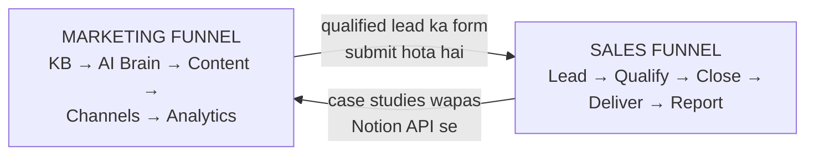
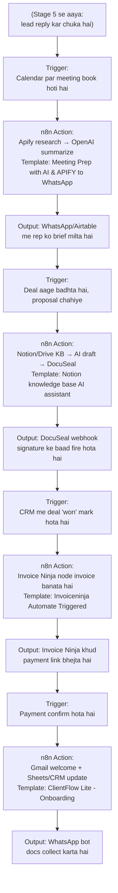
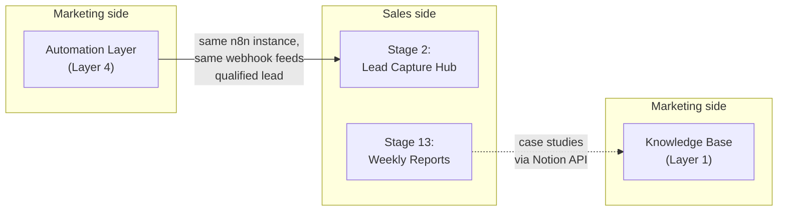

# Growth Engine — Clear Trigger-by-Trigger Diagram

**Kaise padhein:** Har box me 3 cheezein hain — **Trigger** (kya event chalu karta hai), **n8n Action** (kaunsa tool/template use hota hai), **Output** (result kaha jata hai). Arrow batata hai ki ek stage khatam hote hi agla kaise automatically shuru hota hai.

Rules:
- **Docker** pe sab self-hosted hai
- **n8n** central automation layer hai jo sab tools ko connect karta hai
- Har template: [nivyindia/all_n8n_templates_collection](https://github.com/nivyindia/all_n8n_templates_collection) se — `.json` download → n8n me **Import from File** → credentials fill → activate

---

## 0. Master overview — dono funnels ek nazar me

Neeche dono funnels ko stage-by-stage khola gaya hai, phir yeh connection point detail me dikhaya gaya hai.

---

## PART 1 — Sales Funnel (Stage 1 to 5): Lead se Outreach tak

```mermaid
flowchart TD
    START(("Naya prospect<br/>maujood hai")) --> T1["Trigger:<br/>Scraping tool run hota hai"]
    T1 --> A1["n8n Action:<br/>Apify/Phantombuster/Octoparse → Webhook<br/>Template: AI agent that can scrape webpages"]
    A1 --> O1["Output: Google Sheets<br/>ya CRM me row banta hai"]

    O1 --> T2["Trigger:<br/>Website/n8n Form submit hota hai"]
    T2 --> A2["n8n Action:<br/>Webhook → Gmail welcome mail<br/>Template: Qualifying Appointment Requests with AI"]
    A2 --> O2["Output: Sheets me<br/>lead capture hota hai"]

    O2 --> T3["Trigger:<br/>Naya row Sheet/Form me aata hai"]
    T3 --> A3["n8n Action:<br/>OpenAI enrich → CRM write → Slack notify<br/>Template: Enrich Pipedrive Data with GPT-4o"]
    A3 --> O3["Output: CRM me lead<br/>enriched, team ko Slack ping"]

    O3 --> T4["Trigger:<br/>Naya lead CRM/Sheet me aata hai"]
    T4 --> A4["n8n Action:<br/>OpenAI scoring (hot/warm/cold)<br/>Template: Qualify new leads via GPT-4"]
    A4 --> O4["Output: CRM/Sheet<br/>me score update hota hai"]

    O4 --> T5["Trigger:<br/>Lead 'hot/warm' mark ho chuka hai"]
    T5 --> A5["n8n Action:<br/>Gmail / WhatsApp API / Fiwano / LinkedIn<br/>Template: LeadPilot Lite - AI Cold Email Writer"]
    A5 --> O5["Output: Reply track hota hai,<br/>agle stage ko feed"]
```

---

## PART 2 — Sales Funnel (Stage 6 to 9): Meeting se Onboarding tak

---

## PART 3 — Sales Funnel (Stage 10 to 13): Delivery se Report tak (loop wapas)

```mermaid
flowchart TD
    O9b["(Stage 9 se aaya:<br/>client onboard ho chuka hai)"] --> T10["Trigger:<br/>Client Slack par message karta hai"]
    T10 --> A10["n8n Action:<br/>Slack → Linear ticket create<br/>Template: Support Channel with Slack and Linear"]
    A10 --> O10["Output: Linear webhook<br/>wapas Slack me update deta hai"]

    O10 --> T11["Trigger:<br/>Feedback form/message aata hai"]
    T11 --> A11["n8n Action:<br/>OpenAI sentiment score<br/>Template: AI Customer feedback sentiment analysis"]
    A11 --> O11["Output: Positive → Notion log<br/>+ Gmail/WhatsApp review-ask (manual 2-node build)"]

    O11 --> T12["Trigger:<br/>Case study/article ready hota hai"]
    T12 --> A12["n8n Action:<br/>OpenAI repurpose content<br/>Template: FlowScribe Lite - AI Content Repurposing"]
    A12 --> O12["Output: LinkedIn/X/Instagram<br/>par auto-post"]

    O12 --> T13["Trigger:<br/>Scheduled trigger (weekly) chalta hai"]
    T13 --> A13["n8n Action:<br/>Sheets/Drive data → OpenAI summarize<br/>Template: Summarize Docs & Save Summary in Sheet"]
    A13 --> O13["Output: Metabase/Grafana<br/>dashboard update hota hai"]

    O13 -.->|"Master loop:<br/>naye leads/insights"| T1b(("Wapas Stage 1"))
```

---

## PART 4 — Marketing Funnel (Layer 1 to 6): Knowledge Base se Analytics tak

```mermaid
flowchart TD
    TK1["Trigger:<br/>Manual entry / naya doc add hota hai"] --> AK1["n8n Action:<br/>Notion/AnythingLLM me store<br/>Template: Notion knowledge base AI assistant"]
    AK1 --> OK1["Output: Knowledge Base<br/>RAG ke liye ready"]

    OK1 --> TK2["Trigger:<br/>Content/SEO/Strategy draft chahiye"]
    TK2 --> AK2["n8n Action:<br/>OpenAI/Anthropic node (ya Ollama local)<br/>Template: RAG Chatbot with Google Drive and Gemini"]
    AK2 --> OK2["Output: AI Brain se<br/>draft milta hai"]

    OK2 --> TK3["Trigger:<br/>Scheduled trigger chalta hai"]
    TK3 --> AK3["n8n Action:<br/>AI Brain generate + Keyword Planner data<br/>Template: Notion KB template hi adapt karo"]
    AK3 --> OK3["Output: Draft Sheets/Notion<br/>me save hota hai"]

    OK3 --> TK4["Trigger:<br/>Draft ready/approved hota hai"]
    TK4 --> AK4["n8n Action:<br/>WordPress / Mixpost / Mautic / Odoo nodes<br/>Template: FlowScribe Lite - AI Content Repurposing"]
    AK4 --> OK4["Output: Har channel<br/>apna publish karta hai"]

    OK4 --> TK5["Trigger:<br/>Content publish ho chuka hai"]
    TK5 --> AK5["n8n Action:<br/>FB/IG/Pinterest, LinkedIn/X/TikTok,<br/>Email nurture, CRM update"]
    AK5 --> OK5["Output: Real accounts<br/>par live content"]

    OK5 --> TK6["Trigger:<br/>Scheduled trigger (Matomo/GA pull)"]
    TK6 --> AK6["n8n Action:<br/>AI node summarize karta hai<br/>Template: Social Media Analysis and Email Generation"]
    AK6 --> OK6["Output: Report Notion KB<br/>me wapas feed hota hai"]

    OK6 -.->|"Master loop:<br/>naye insights"| TK1b(("Wapas Layer 1"))
```

---

## PART 5 — Jahan dono funnels physically milte hain

---

## Do Gaps — koi ready template nahi hai (manually banao)

| Gap | Kaha | Fix |
|---|---|---|
| E-signature | Sales Stage 7 | **DocuSeal** (self-hosted, Docker) separately install karo → [n8n-nodes-docuseal](https://github.com/docusealco/n8n-nodes-docuseal) community node se connect karo |
| Google Review request | Sales Stage 11 | 2-node build: CRM "job complete" trigger → Gmail/WhatsApp node (Stage 5 wala credential reuse karo) |

---

## Sab Templates — Ek Nazar Me (source: [all_n8n_templates_collection](https://github.com/nivyindia/all_n8n_templates_collection))

| Stage/Layer | Template Naam | Folder |
|---|---|---|
| Sales 1 | AI agent that can scrape webpages | `OpenAI_and_LLMs` |
| Sales 2 | Qualifying Appointment Requests with AI & n8n Forms | `Forms_and_Surveys` |
| Sales 3 | Enrich Pipedrive's Organization Data with OpenAI GPT-4o & Notify it in Slack | `Slack` |
| Sales 4 | Qualify new leads in Google Sheets via OpenAI's GPT-4 | `Google_Drive_and_Google_Sheets` |
| Sales 5 | LeadPilot Lite - AI Cold Email Writer | `Gmail_and_Email_Automation` |
| Sales 6 | Automate Sales Meeting Prep with AI & APIFY Sent To WhatsApp | `WhatsApp` |
| Sales 7 | Notion knowledge base AI assistant | `Notion` |
| Sales 8 | Invoiceninja Automate Triggered Workflow | `workflows/Invoiceninja` |
| Sales 9 | ClientFlow Lite - Client Onboarding Automation | `Other_Integrations_and_Use_Cases` |
| Sales 10 | Customer Support Channel and Ticketing System with Slack and Linear | `Slack` |
| Sales 11 | AI Customer feedback sentiment analysis | `OpenAI_and_LLMs` |
| Sales 12 | FlowScribe Lite - AI Content Repurposing (4 Platforms) | `Instagram_Twitter_Social_Media` |
| Sales 13 | Summarize the New Documents from Google Drive and Save Summary in Google Sheet | `Google_Drive_and_Google_Sheets` |
| Marketing L1 | Notion knowledge base AI assistant | `Notion` |
| Marketing L2 | RAG Chatbot for Company Documents using Google Drive and Gemini | `Google_Drive_and_Google_Sheets` |
| Marketing L3 | (adapt L1 template) | `Notion` |
| Marketing L4 | FlowScribe Lite - AI Content Repurposing (4 Platforms) | `Instagram_Twitter_Social_Media` |
| Marketing L6 | Social Media Analysis and Automated Email Generation | `Instagram_Twitter_Social_Media` |
