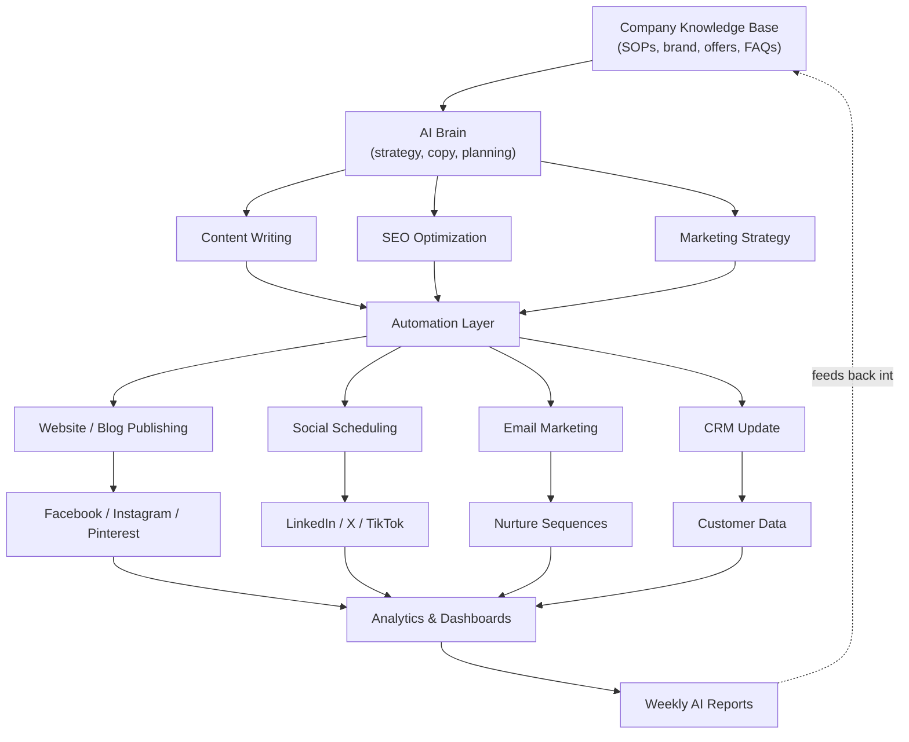
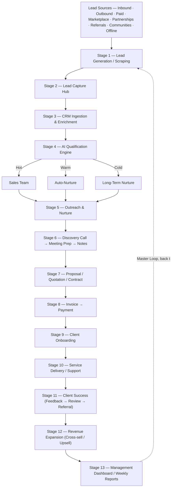
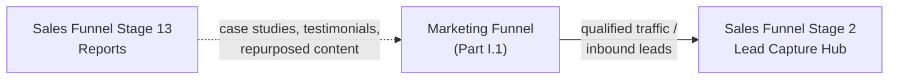

# Growth Engine — Unified Marketing + Sales Automation Blueprint

**Built:** 2026-07-24 · **Merges:** `AI-Marketing-Automation-Stack.md` (marketing funnel) + `Sales-Funnel-Automation-Stack.md` (sales funnel) into a single document.

**What's different from the two source files:** those docs put the flowchart boxes and the tool names/links in the same ASCII diagram. This file separates them —

- **Part I** is flowcharts only — stages and arrows, no tool names, no links. Read this to understand the *shape* of the system.
- **Part III** is tools-and-links only — every function mapped to its software and a working link, in tables, nothing else. Read this when you're ready to actually build.
- **Part II** covers what I checked for gaps in the n8n automation layer: I re-cloned the actual template repository (not just re-read the old doc) and searched the web for anything the repo doesn't cover.
- **Parts IV–VI (added in a second pass)** cover the layer *before* automation — the actual lead-extraction tools, acquisition channels, and community-building methods (Telegram, Discord, WhatsApp, Slack, Facebook Groups, Skool/Circle) that exist in the full `Growth-Engine.zip` export but weren't in either of the two original `.md` files at all.

---

## Part I — Flowcharts

### I.1 Marketing Funnel Flow

### I.2 Sales Funnel Flow

### I.3 Where the Two Funnels Meet

---

## Part II — Gap Check: What Was Missing and What I Did About It

The original sales-funnel doc flagged four gaps in §9 of that file. Rather than re-stating those, I re-cloned the live repository (`nivyindia/all_n8n_templates_collection`, sparse-checked out to verify actual current contents — it has grown since that doc was written, into 2,750+ files across ~40 category folders, not the ~280 the original doc described) and searched the web for anything outside it.

| # | Gap (as originally flagged) | What I found | Status |
|---|---|---|---|
| 1 | Onboarding: form → welcome email → Sheets pipeline (Stages 2 & 9) — only a folder link, no direct file | **`ClientFlow Lite — Simple Onboarding (Email + Log)`** — confirmed present in the repo. Webhook → validate → Gmail welcome email → log to Sheets → respond. Exactly the workflow the old doc was looking for. | **Resolved** — direct link in Part III |
| 2 | Cold-call log → Sheets via Vapi.ai/Bland.ai webhook (Stage 1) — only a folder link | **`VoiceAgent Lite — Simple Call Logger`** — confirmed present. Webhook receives the call payload → parses it → logs to Sheets → responds. | **Resolved** — direct link in Part III |
| 3 | Invoice *generation* + payment-link send (Stage 8) — repo only had extraction templates | The repo now includes a native **Invoice Ninja** trigger node (`Invoiceninjatrigger Workflow`) — Invoice Ninja is a free/OSS invoicing tool with its own PDF generation and payment-link send built in; n8n triggers/reacts to it rather than reinventing invoice generation. Paired with **`Unpaid Invoice Reminder`** (RAG-based follow-up agent, also in the repo) for the chase-payment side. | **Resolved** — direct links in Part III |
| 4 | E-signature (Stage 7) — no free/OSS template in the repo | Confirmed still absent from the repo. Found externally: **DocuSeal** — AGPLv3 open-source DocuSign alternative, self-hosted, with an official n8n community node (`n8n-nodes-docuseal`) supporting create-submission and signed/completed webhook triggers. | **Filled from outside the repo** — external tool, not a template, see Part III §III.9 |
| 5 | Google Review request send (Stage 11) | Confirmed no dedicated "send a review request" template exists in the repo or as an official n8n template. What does exist is a *review-monitoring* template (watches for new reviews and drafts AI replies) — a different job. Sending the *request* itself is a two-node build (a trigger off "job marked complete" in your CRM → an email/WhatsApp node you already have wired for Stage 5) — genuinely trivial enough that it doesn't need a dedicated template. | **Still a gap as a template — flagged honestly, not invented; workaround given** |

Net effect: three of the four original gaps had templates that simply weren't visible in the older snapshot of the repo the source doc was written against; one (e-signature) is genuinely still open and needed an outside tool; one (review-request send) isn't really a gap so much as a two-node task using tools already in this stack.

---

## Part III — Software, Templates & Links

Pure reference. No flow narrative here — just: function → tool → link.

### III.1 Layered Architecture (Marketing)

| Layer | Free / OSS | Paid / Proprietary |
|---|---|---|
| AI Brain | [Ollama](https://ollama.com/) + [Open WebUI](https://github.com/open-webui/open-webui) + [AnythingLLM](https://anythingllm.com/) + [LibreChat](https://github.com/danny-avila/LibreChat) | Claude, ChatGPT, Gemini |
| Automation | [n8n](https://n8n.io/) (self-hosted, free) — [Activepieces](https://www.activepieces.com/) / [Node-RED](https://nodered.org/) as OSS alternatives | — |
| Knowledge Base | [Notion](https://www.notion.so/), [AnythingLLM](https://anythingllm.com/), [Wiki.js](https://js.wiki/), [BookStack](https://www.bookstackapp.com/), [Nextcloud](https://nextcloud.com/), [GitHub](https://github.com/) | — |
| Image Creation | [Stable Diffusion](https://stability.ai/), [ComfyUI](https://github.com/comfyanonymous/ComfyUI), [AUTOMATIC1111](https://github.com/AUTOMATIC1111/stable-diffusion-webui), [Fooocus](https://github.com/lllyasviel/Fooocus), [InvokeAI](https://github.com/invoke-ai/InvokeAI) | Adobe Firefly, Midjourney, Ideogram, ChatGPT Image Gen |
| Video Creation | ComfyUI Video workflows, [Wan2.1](https://github.com/Wan-Video/Wan2.1), [Stable Video Diffusion](https://github.com/Stability-AI/generative-models), [CogVideoX](https://github.com/THUDM/CogVideo) | Veo, Runway, Kling, Pika, Luma |
| Voice | [Piper TTS](https://github.com/rhasspy/piper), [Coqui TTS](https://github.com/coqui-ai/TTS), [XTTS](https://github.com/coqui-ai/TTS) | ElevenLabs, PlayHT |
| AI Avatar / Presenter | *No credible free/OSS option — verify current landscape* | HeyGen, Synthesia |
| Design (Canva-class) | [Penpot](https://penpot.app/), [GIMP](https://www.gimp.org/), [Krita](https://krita.org/), [Inkscape](https://inkscape.org/) | Canva |

### III.2 Social Media Scheduling & Publishing

| Type | Tool |
|---|---|
| Self-hosted OSS | [Mixpost Community](https://mixpost.app/) or [Postiz](https://postiz.com/) — both legitimate, pick one |
| Free tier | [Buffer Free](https://buffer.com/), [Publer Free](https://publer.io/), [Metricool Free](https://metricool.com/) |

### III.3 SEO

| Function | Free / OSS | Paid |
|---|---|---|
| Keyword research | [Google Keyword Planner](https://ads.google.com/home/tools/keyword-planner/), [Google Trends](https://trends.google.com/), [Keyword Surfer](https://surferseo.com/keyword-surfer-extension/), [SEO Minion](https://seominion.com/), [Ubersuggest](https://neilpatel.com/ubersuggest/) free tier | Ahrefs, SEMrush |
| Technical audit | [Screaming Frog](https://www.screamingfrog.co.uk/seo-spider/) (free ≤500 URLs), [SiteOne Crawler](https://crawler.siteone.io/), [SEO PowerSuite](https://www.link-assistant.com/) free tier | — |
| Search Console | [Google Search Console](https://search.google.com/search-console) | — |

### III.4 Email Marketing

| Tool | Notes |
|---|---|
| [Mautic](https://www.mautic.org/) | Full marketing-automation suite |
| [Listmonk](https://listmonk.app/) | Lighter weight |
| [Mailtrain](https://mailtrain.org/), [Postal](https://docs.postalserver.io/) | Additional OSS options |

### III.5 Supporting Infrastructure

| Category | Free / OSS Options |
|---|---|
| CRM | [Odoo Community](https://www.odoo.com/), [ERPNext](https://frappe.io/erpnext), [EspoCRM](https://www.espocrm.com/) |
| Project management | [Plane](https://plane.so/), [OpenProject](https://www.openproject.org/), [Taiga](https://www.taiga.io/), [Vikunja](https://vikunja.io/) |
| Docs / SOPs | [BookStack](https://www.bookstackapp.com/), [Wiki.js](https://js.wiki/), [Outline](https://www.getoutline.com/), [Docusaurus](https://docusaurus.io/), [MkDocs](https://www.mkdocs.org/) |
| Cloud storage | [Nextcloud](https://nextcloud.com/), [Seafile](https://www.seafile.com/), [Syncthing](https://syncthing.net/) |
| Password mgmt | [Vaultwarden](https://github.com/dani-garcia/vaultwarden), [KeePassXC](https://keepassxc.org/) |
| Website | WordPress + Gutenberg or [Elementor Free](https://elementor.com/) |
| Video editing | [Kdenlive](https://kdenlive.org/), [Shotcut](https://shotcut.org/), [Olive](https://www.olivevideoeditor.org/), [Blender](https://www.blender.org/) |
| Audio editing | [Audacity](https://www.audacityteam.org/), [Ardour](https://ardour.org/) |
| Screen recording | [OBS Studio](https://obsproject.com/) |
| Speech-to-text | [Whisper](https://github.com/openai/whisper), [Faster Whisper](https://github.com/SYSTRAN/faster-whisper) |
| Analytics | [Matomo](https://matomo.org/), [Umami](https://umami.is/), [Plausible](https://plausible.io/), Google Analytics, Looker Studio, [Metabase](https://www.metabase.com/), [Grafana](https://grafana.com/), [Superset](https://superset.apache.org/) |
| Forms | [Formbricks](https://formbricks.com/), [Form.io](https://www.form.io/), [OhMyForm](https://ohmyform.com/) |
| Helpdesk / chat | [Chatwoot](https://www.chatwoot.com/), [FreeScout](https://freescout.net/), [Zammad](https://zammad.org/), [Rocket.Chat](https://www.rocket.chat/), [Mattermost](https://mattermost.com/) |
| Monitoring | [Uptime Kuma](https://github.com/louislam/uptime-kuma), Grafana, [Prometheus](https://prometheus.io/) |
| Version control | [Git](https://git-scm.com/), [Gitea](https://about.gitea.com/), [Forgejo](https://forgejo.org/) |
| Hosting | [Docker](https://www.docker.com/), [Portainer CE](https://www.portainer.io/), [Coolify](https://coolify.io/) |
| Database | PostgreSQL, MariaDB, SQLite |
| AI agent/workflow builders | [Flowise](https://flowiseai.com/), [Langflow](https://www.langflow.org/), [Dify Community](https://dify.ai/), Open WebUI Pipelines |
| Free stock assets | Images: [Unsplash](https://unsplash.com/), [Pexels](https://www.pexels.com/), [Pixabay](https://pixabay.com/) · Video: Pexels, Pixabay, [Mixkit](https://mixkit.co/) · Icons: [SVG Repo](https://www.svgrepo.com/), [Iconify](https://iconify.design/) · Illustrations: [unDraw](https://undraw.co/) |

### III.6 Sales Funnel — Stage-by-Stage Templates

All links below resolve inside **[nivyindia/all_n8n_templates_collection](https://github.com/nivyindia/all_n8n_templates_collection)** unless marked "external." Quick-start: sign up for [n8n](https://n8n.io/) → download the `.json` → **Workflows → Import from File** → configure credentials → activate.

**Stage 1 — Lead Generation / Scraping**

| Function | Template |
|---|---|
| General-purpose web scrape agent | [AI agent that can scrape webpages](https://github.com/nivyindia/all_n8n_templates_collection/blob/main/OpenAI_and_LLMs/AI%20agent%20that%20can%20scrape%20webpages.json) |
| Competitor / market research | [Automate Competitor Research with Exa.ai, Notion and AI Agents](https://github.com/nivyindia/all_n8n_templates_collection/blob/main/Notion/Automate%20Competitor%20Research%20with%20Exa.ai,%20Notion%20and%20AI%20Agents.json) |
| Cold-call transcript → Sheets (Vapi.ai/Bland.ai) | [VoiceAgent Lite — Phone Call Logger](https://github.com/nivyindia/all_n8n_templates_collection/blob/main/Other_Integrations_and_Use_Cases/VoiceAgent%20Lite%20-%20Phone%20Call%20Logger.json) *(newly resolved — see Part II)* |

**Stage 2 — Lead Capture Hub**

| Function | Template |
|---|---|
| Form submit → welcome email → Sheets pipeline | [ClientFlow Lite — Simple Onboarding](https://github.com/nivyindia/all_n8n_templates_collection/blob/main/Other_Integrations_and_Use_Cases/ClientFlow%20Lite%20-%20Client%20Onboarding%20Automation.json) *(newly resolved — see Part II)* |
| Appointment/booking pre-qualification | [Qualifying Appointment Requests with AI & n8n Forms](https://github.com/nivyindia/all_n8n_templates_collection/blob/main/Forms_and_Surveys/Qualifying%20Appointment%20Requests%20with%20AI%20%26%20n8n%20Forms.json) |

**Stage 3 — CRM Ingestion & Enrichment**

| Function | Template |
|---|---|
| Auto-enrich company record, notify Slack | [Enrich Pipedrive's Organization Data with OpenAI GPT-4o & Notify it in Slack](https://github.com/nivyindia/all_n8n_templates_collection/blob/main/Slack/Enrich%20Pipedrive_s%20Organization%20Data%20with%20OpenAI%20GPT-4o%20&%20Notify%20it%20in%20Slack.json) |
| ERPNext-native lead + inquiry intake | [AI-Driven Lead Management and Inquiry Automation with ERPNext & n8n](https://github.com/nivyindia/all_n8n_templates_collection/blob/main/OpenAI_and_LLMs/AI-Driven%20Lead%20Management%20and%20Inquiry%20Automation%20with%20ERPNext%20&%20n8n.json) |
| Chat with CRM sheet directly | [Chat with a Google Sheet using AI](https://github.com/nivyindia/all_n8n_templates_collection/blob/main/Google_Drive_and_Google_Sheets/Chat%20with%20a%20Google%20Sheet%20using%20AI.json) |

**Stage 4 — AI Qualification Engine**

| Function | Template |
|---|---|
| Score/tag leads hot/warm/cold in Sheets | [Qualify new leads in Google Sheets via OpenAI's GPT-4](https://github.com/nivyindia/all_n8n_templates_collection/blob/main/Google_Drive_and_Google_Sheets/Qualify%20new%20leads%20in%20Google%20Sheets%20via%20OpenAI_s%20GPT-4.json) |

**Stage 5 — Outreach & Nurture**

| Channel | Function | Template |
|---|---|---|
| Email | Cold email from a lead list | [LeadPilot Lite - AI Cold Email Writer](https://github.com/nivyindia/all_n8n_templates_collection/blob/main/Gmail_and_Email_Automation/LeadPilot%20Lite%20-%20AI%20Cold%20Email%20Writer.json) |
| Email | Cold email grounded in the lead's real website | [Website-Grounded Cold Email Writer](https://github.com/nivyindia/all_n8n_templates_collection/blob/main/Gmail_and_Email_Automation/Website-Grounded%20Cold%20Email%20Writer.json) |
| Email | Draft replies for human approval | [Compose reply draft in Gmail with OpenAI Assistant](https://github.com/nivyindia/all_n8n_templates_collection/blob/main/Gmail_and_Email_Automation/Compose%20reply%20draft%20in%20Gmail%20with%20OpenAI%20Assistant.json) |
| Email | Human-in-the-loop QC gate over IMAP | [A Very Simple "Human in the Loop" Email Response System Using AI and IMAP](https://github.com/nivyindia/all_n8n_templates_collection/blob/main/Gmail_and_Email_Automation/A%20Very%20Simple%20_Human%20in%20the%20Loop_%20Email%20Response%20System%20Using%20AI%20and%20IMAP.json) |
| WhatsApp | First bot / lead capture | [Building Your First WhatsApp Chatbot](https://github.com/nivyindia/all_n8n_templates_collection/blob/main/WhatsApp/Building%20Your%20First%20WhatsApp%20Chatbot.json) |
| WhatsApp | Full RAG chatbot from company docs | [Complete business WhatsApp AI-Powered RAG Chatbot using OpenAI](https://github.com/nivyindia/all_n8n_templates_collection/blob/main/WhatsApp/Complete%20business%20WhatsApp%20AI-Powered%20RAG%20Chatbot%20using%20OpenAI.json) |
| WhatsApp | Higher-quality reply pass | [Respond to WhatsApp Messages with AI Like a Pro!](https://github.com/nivyindia/all_n8n_templates_collection/blob/main/WhatsApp/Respond%20to%20WhatsApp%20Messages%20with%20AI%20Like%20a%20Pro!.json) |
| WhatsApp + IG DM + Messenger | One unified inbox | [Receive and Send Messages Across WhatsApp, Instagram and Facebook Messenger with Fiwano](https://github.com/nivyindia/all_n8n_templates_collection/blob/main/WhatsApp/Receive%20and%20Send%20Messages%20Across%20WhatsApp%2C%20Instagram%20and%20Facebook%20Messenger%20with%20Fiwano.json) |
| LinkedIn | Post drafting from a Notion queue | [Automate LinkedIn Outreach with Notion and OpenAI](https://github.com/nivyindia/all_n8n_templates_collection/blob/main/Notion/Automate%20LinkedIn%20Outreach%20with%20Notion%20and%20OpenAI.json) |

**Stage 6 — Discovery Call → Meeting Prep → Notes**

| Function | Template |
|---|---|
| Pre-call research to rep's WhatsApp | [Automate Sales Meeting Prep with AI & APIFY Sent To WhatsApp](https://github.com/nivyindia/all_n8n_templates_collection/blob/main/WhatsApp/Automate%20Sales%20Meeting%20Prep%20with%20AI%20&%20APIFY%20Sent%20To%20WhatsApp.json) |
| Fireflies transcript → Airtable tasks | [AI Agent for project management and meetings with Airtable and Fireflies](https://github.com/nivyindia/all_n8n_templates_collection/blob/main/Airtable/AI%20Agent%20for%20project%20management%20and%20meetings%20with%20Airtable%20and%20Fireflies.json) |
| Live chat sales assistant tied to CRM | [vAssistant for Hubspot Chat using OpenAi and Airtable](https://github.com/nivyindia/all_n8n_templates_collection/blob/main/Airtable/vAssistant%20for%20Hubspot%20Chat%20using%20OpenAi%20and%20Airtable.json) |

**Stage 7 — Proposal / Quotation / Contract**

| Function | Template |
|---|---|
| Draft grounded in Notion knowledge base | [Notion knowledge base AI assistant](https://github.com/nivyindia/all_n8n_templates_collection/blob/main/Notion/Notion%20knowledge%20base%20AI%20assistant.json) |
| Same, if KB lives in Drive | [RAG Chatbot for Company Documents using Google Drive and Gemini](https://github.com/nivyindia/all_n8n_templates_collection/blob/main/Google_Drive_and_Google_Sheets/RAG%20Chatbot%20for%20Company%20Documents%20using%20Google%20Drive%20and%20Gemini.json) |
| Client Q&A on sent proposal/contract PDF | [Ask questions about a PDF using AI](https://github.com/nivyindia/all_n8n_templates_collection/blob/main/PDF_and_Document_Processing/Ask%20questions%20about%20a%20PDF%20using%20AI.json) |
| **E-signature** | **External — see §III.9** |

**Stage 8 — Invoice → Payment**

| Function | Template |
|---|---|
| Extract structured invoice data | [Invoice data extraction with LlamaParse and OpenAI](https://github.com/nivyindia/all_n8n_templates_collection/blob/main/PDF_and_Document_Processing/Invoice%20data%20extraction%20with%20LlamaParse%20and%20OpenAI.json) |
| Same, with human-review + auto-training | [Invoice data extraction with human-in-the-loop validation and auto-training using Cradl AI](https://github.com/nivyindia/all_n8n_templates_collection/blob/main/PDF_and_Document_Processing/Invoice%20data%20extraction%20with%20human-in-the-loop%20validation%20and%20auto-training%20using%20Cradl%20AI.json) |
| Invoice **generation** + payment link (Invoice Ninja, OSS) | [Invoiceninjatrigger Workflow](https://github.com/nivyindia/all_n8n_templates_collection/blob/main/workflows/Invoiceninja/1004_Invoiceninja_Automate_Triggered.json) *(newly resolved — see Part II)* |
| Chase unpaid invoices | [Unpaid Invoice Reminder](https://github.com/nivyindia/all_n8n_templates_collection/blob/main/Finance_Accounting/unpaid_invoice_reminder.json) *(newly resolved — see Part II)* |

**Stage 9 — Client Onboarding**

| Function | Template |
|---|---|
| Form → welcome email → onboarding pipeline | [ClientFlow Lite — Simple Onboarding](https://github.com/nivyindia/all_n8n_templates_collection/blob/main/Other_Integrations_and_Use_Cases/ClientFlow%20Lite%20-%20Client%20Onboarding%20Automation.json) |
| Document collection / onboarding Q&A over WhatsApp | [Complete business WhatsApp AI-Powered RAG Chatbot using OpenAI](https://github.com/nivyindia/all_n8n_templates_collection/blob/main/WhatsApp/Complete%20business%20WhatsApp%20AI-Powered%20RAG%20Chatbot%20using%20OpenAI.json) |

**Stage 10 — Service Delivery / Support**

| Function | Template |
|---|---|
| Flagged chat message → ticket | [Customer Support Channel and Ticketing System with Slack and Linear](https://github.com/nivyindia/all_n8n_templates_collection/blob/main/Slack/Customer%20Support%20Channel%20and%20Ticketing%20System%20with%20Slack%20and%20Linear.json) |
| Client sentiment tracking on open issues | [Sentiment Analysis Tracking on Support Issues with Linear and Slack](https://github.com/nivyindia/all_n8n_templates_collection/blob/main/Slack/Sentiment%20Analysis%20Tracking%20on%20Support%20Issues%20with%20Linear%20and%20Slack.json) |

**Stage 11 — Client Success (Feedback → Review → Testimonial → Referral)**

| Function | Template |
|---|---|
| Score incoming feedback for sentiment | [AI Customer feedback sentiment analysis](https://github.com/nivyindia/all_n8n_templates_collection/blob/main/OpenAI_and_LLMs/AI%20Customer%20feedback%20sentiment%20analysis.json) |
| Route positive feedback into Notion for testimonials | [Add positive feedback messages to a table in Notion](https://github.com/nivyindia/all_n8n_templates_collection/blob/main/Notion/Add%20positive%20feedback%20messages%20to%20a%20table%20in%20Notion.json) |
| Monitor + AI-draft replies to Google reviews | [Automate Google Business reviews with AI responses, Slack alerts & sheets logging](https://n8n.io/workflows/6590-automate-google-business-reviews-with-ai-responses-slack-alerts-and-sheets-logging/) *(official n8n.io template — monitors/replies, does not send the request)* |
| **Send** the Google Review request itself | **Still a gap — see §III.9 for the two-node workaround** |

**Stage 12 — Revenue Expansion (Cross-sell / Upsell / Referral / Repurposing)**

| Function | Template |
|---|---|
| One case study → 4 platform-native social posts | [FlowScribe Lite - AI Content Repurposing (4 Platforms)](https://github.com/nivyindia/all_n8n_templates_collection/blob/main/Instagram_Twitter_Social_Media/FlowScribe%20Lite%20-%20AI%20Content%20Repurposing%204%20Platforms.json) |
| Case study/article → X thread + LinkedIn post | [Grounded Article to Thread and LinkedIn Post](https://github.com/nivyindia/all_n8n_templates_collection/blob/main/Instagram_Twitter_Social_Media/Grounded%20Article%20to%20Thread%20and%20LinkedIn%20Post.json) |

**Stage 13 — Management Dashboard / Weekly AI Reports**

| Function | Template |
|---|---|
| Auto-summarize new docs into a tracking sheet | [Summarize the New Documents from Google Drive and Save Summary in Google Sheet](https://github.com/nivyindia/all_n8n_templates_collection/blob/main/Google_Drive_and_Google_Sheets/Summarize%20the%20New%20Documents%20from%20Google%20Drive%20and%20Save%20Summary%20in%20Google%20Sheet.json) |
| Query the pipeline/CRM tracker in plain English | [Chat with a Google Sheet using AI](https://github.com/nivyindia/all_n8n_templates_collection/blob/main/Google_Drive_and_Google_Sheets/Chat%20with%20a%20Google%20Sheet%20using%20AI.json) |
| Campaign/social performance → automated email report | [Social Media Analysis and Automated Email Generation](https://github.com/nivyindia/all_n8n_templates_collection/blob/main/Instagram_Twitter_Social_Media/Social%20Media%20Analysis%20and%20Automated%20Email%20Generation.json) |

### III.7 Repo Category Folders (browse instead of following a direct link)

| Folder | Link |
|---|---|
| Gmail & Email Automation | [Browse](https://github.com/nivyindia/all_n8n_templates_collection/tree/main/Gmail_and_Email_Automation) |
| WhatsApp | [Browse](https://github.com/nivyindia/all_n8n_templates_collection/tree/main/WhatsApp) |
| Google Drive & Sheets | [Browse](https://github.com/nivyindia/all_n8n_templates_collection/tree/main/Google_Drive_and_Google_Sheets) |
| Notion | [Browse](https://github.com/nivyindia/all_n8n_templates_collection/tree/main/Notion) |
| Airtable | [Browse](https://github.com/nivyindia/all_n8n_templates_collection/tree/main/Airtable) |
| Slack | [Browse](https://github.com/nivyindia/all_n8n_templates_collection/tree/main/Slack) |
| OpenAI & LLMs | [Browse](https://github.com/nivyindia/all_n8n_templates_collection/tree/main/OpenAI_and_LLMs) |
| PDF & Document Processing | [Browse](https://github.com/nivyindia/all_n8n_templates_collection/tree/main/PDF_and_Document_Processing) |
| Instagram/Twitter/Social | [Browse](https://github.com/nivyindia/all_n8n_templates_collection/tree/main/Instagram_Twitter_Social_Media) |
| Forms & Surveys | [Browse](https://github.com/nivyindia/all_n8n_templates_collection/tree/main/Forms_and_Surveys) |
| Finance & Accounting *(new since original doc)* | [Browse](https://github.com/nivyindia/all_n8n_templates_collection/tree/main/Finance_Accounting) |
| Other Integrations & Use Cases *(new since original doc)* | [Browse](https://github.com/nivyindia/all_n8n_templates_collection/tree/main/Other_Integrations_and_Use_Cases) |

### III.8 Two Complete Reference Stacks (Marketing)

**A — Simplest to start (hosted AI, some paid tools):** n8n · Claude/ChatGPT (hosted) · Odoo Community · Notion + GitHub + Nextcloud · Canva · ChatGPT Images/Ideogram/Adobe Firefly · Veo/Runway/Kling · ElevenLabs · Publer or Metricool · WordPress · Ahrefs/SEMrush + Google Search Console · Google Analytics + Looker Studio · Mautic or Brevo

**B — ₹0–₹5,000, fully free/OSS:** Ollama + Open WebUI · AnythingLLM + Wiki.js · n8n · Odoo Community · Nextcloud · Mixpost Community (or Postiz) · Penpot + GIMP + Inkscape · ComfyUI + Stable Diffusion · ComfyUI + Wan2.1 · Piper TTS · Faster Whisper · Kdenlive · Screaming Frog Free + Google Search Console + Google Trends · Matomo + Metabase · Mautic · Chatwoot · BookStack · Docker + Portainer CE · Uptime Kuma

### III.9 Where the Two Genuine Gaps Land (Outside the Repo)

| Gap | Tool | Link | Notes |
|---|---|---|---|
| E-signature (Stage 7) | **DocuSeal** (self-hosted, AGPLv3) | [docusealco/docuseal](https://github.com/docusealco/docuseal) · [n8n community node](https://github.com/docusealco/n8n-nodes-docuseal) · [n8n.io integration page](https://n8n.io/integrations/docuseal/) | Create/prefill templates, send signature requests, webhook back into n8n on completion. Free self-hosted alternative to DocuSign. |
| Send Google Review request (Stage 11) | No dedicated template — build with what's already in the stack | Trigger: CRM "job complete" status change → Action: [Gmail node](https://docs.n8n.io/integrations/builtin/app-nodes/n8n-nodes-base.gmail/) or WhatsApp node (already used in Stage 5/9) sends the client your Google Business review link | Two nodes, no new tool needed. The official [Google Business review-monitoring template](https://n8n.io/workflows/6590-automate-google-business-reviews-with-ai-responses-slack-alerts-and-sheets-logging/) handles the *reply* side of reviews, not sending the ask. |

---

## Part IV — What Was Still Missing (Round 2): Methods and Channels, Not Just Automations

Parts I–III cover the *n8n automation layer* — what runs once a lead already exists in a sheet or CRM. Going back through the full `Growth-Engine.zip` export (not just the two automation-stack docs), there's a whole layer **before** that automation layer that neither source doc captured: the actual **tools, methods, and channels** used to find leads and build community in the first place. That's what Parts IV–VI add. Each is mapped back to the stage it feeds.

### IV.1 — Stage 1 Deep-Dive: Lead Extraction / Scraping Tool Stack

The sales-funnel doc's Stage 1 only had two n8n templates (a generic scrape agent, a competitor-research agent). The repo's own `DATA SCRAPING METHODS` doc has a much fuller stack behind those two templates:

| Method Type | Example Tools | What It Means | Skill Level |
|---|---|---|---|
| Browser Extensions | Instant Data Scraper, Web Scraper (Chrome), Data Miner | Scrape visible web pages via Chrome extension | Beginner |
| Cloud Scraping Tools | Apify, Phantombuster, TexAu, Octoparse, ParseHub, Outscraper | Hosted scraping with ready templates, schedulable | Intermediate |
| Lead Databases | Apollo.io, ZoomInfo, Lusha, RocketReach, Snov.io, Clearbit | Ready-made B2B contact databases | Beginner–Pro |
| LinkedIn Automation | Sales Navigator, Phantombuster, TexAu, Waalaxy, Evaboot, Linked Helper | Extract/automate from LinkedIn profiles & searches | Intermediate |
| Custom Python Scraping | BeautifulSoup, Scrapy, Selenium, Playwright, requests, pandas | Write your own scraper for anything | Advanced |
| API Data Providers | Clearbit API, Crunchbase API, People Data Labs, FullContact | Buy structured data directly, most legally clean | Pro/Enterprise |

**Budget alternatives to the expensive tools** (cheap replacements the repo specifically calls out):

| Instead of paying full price for… | Use | What it does |
|---|---|---|
| Apollo.io native export limits | Apollo Exporter (Chrome), Aoleads | Chrome extension / cloud scraper pulls Apollo search results into CSV |
| Sales Navigator enterprise export | Airscale, Evaboot, Linked Helper, Dux-Soup, Octopus CRM | Scrapes Sales Nav / LinkedIn search & connection lists |
| ZoomInfo | Apollo.io, RocketReach, Snov.io, Lusha | Cheaper B2B databases with similar coverage |
| Crunchbase Pro | Apify (Crunchbase Scraper), ParseHub, Octoparse | Scrapes startup/funding directories directly |
| Premium Google Maps APIs | Outscraper, Apify (Maps Scraper), Instant Data Scraper | Business name/phone/website/reviews from Maps |

**Highest-intent lead source found in the export — job portal ("hiring") scraping:** companies actively posting jobs are actively budgeted and in-need — a much warmer list than a cold company directory. Workflow:

1. **Scrape hiring companies** — Apify (LinkedIn Jobs / Indeed scraper), Octoparse (Naukri/Monster), Phantombuster (LinkedIn Jobs + recruiter profiles). Filters: department = Finance/Marketing/Tech/HR, active job postings, company headcount growth.
2. **Enrich company → decision-maker** — Apollo.io free plan, SalesQL, Snov.io, RocketReach → founder/HR head/finance head + email/phone.
3. **Outreach with a hiring-specific angle** — e.g. "saw you're hiring for X — we help companies scale this without the hire" — via cold email, LinkedIn DM, or WhatsApp.

**Master legal-status map for lead/data sources** (worth keeping visible — this is a compliance question, not just a tooling one):

| Source Type | Legal Status | Notes |
|---|---|---|
| Job portals (public postings) | ✅ Legal | Public job data |
| LinkedIn/public professional profiles | ✅ Legal | Public data + enrichment |
| Own lead funnels (forms, webinars, lead magnets) | ✅ Best & fully legal | Owned, long-term asset |
| Event/job-fair registration data | ✅ Legal via consent | Registration = consent |
| B2B lead databases (Apollo, ZoomInfo, Snov) | 🟡 Legal via provider's ToS | Aggregated public + partner data |
| College/institute student databases | 🟡 Legal via consent/MoU | Needs a placement-cell partnership, not scraping |
| Ed-tech / coaching-institute lead sharing | 🟡 Semi-legal, consent-based | Partner program terms apply |
| Public review/e-commerce scraping (Amazon, Flipkart) | 🟡 Semi-legal | No personal contact data — market research only |
| **Telegram/database sellers, leaked CRM dumps, call-center data** | ❌ **Illegal, high risk** | **Do not use** — this is the one explicit red line in the source material |

### IV.2 — Stage 1 Deep-Dive: Lead Generation Channels (Beyond the Original "10 Channels")

The sales-funnel doc names its lead sources as one generic list ("Inbound · Outbound · Growth Hack · Paid · Marketplace · Partnerships · Referrals · Communities · Assets · Offline"). The export has a much more granular channel taxonomy behind that shorthand:

| Channel Category | Examples |
|---|---|
| Organic traffic | SEO, blog, YouTube, LinkedIn/X/Instagram/TikTok/Pinterest organic, podcasts, guest blogging, Reddit/Quora, newsletters |
| Freelance marketplaces | Upwork, Fiverr, Freelancer, Toptal, PeoplePerHour, Guru, Workana |
| Professional service marketplaces | Clutch, DesignRush, GoodFirms, Bark, Thumbtack, Sortlist, TechBehemoths |
| Accounting/niche platforms | QuickBooks ProAdvisor Marketplace, Xero Advisor Directory, Bench Partner Network |
| Directories & listings | Google Business Profile, Yelp, Yellow Pages, niche directories |
| Startup databases | Crunchbase, AngelList, Product Hunt, Y Combinator company list |
| Job boards (as a lead source, not just hiring intent) | Indeed, Glassdoor, Wellfound, LinkedIn Jobs, RemoteOK, We Work Remotely |
| Technology/firmographic directories | BuiltWith, Wappalyzer, G2, Capterra — find companies using a specific tech stack |
| Review sites | Yelp, Trustpilot, Tripadvisor, G2, Capterra — active, growth-investing businesses |
| E-commerce stores | Shopify, WooCommerce, Etsy sellers, Amazon brands |
| Trade show exhibitor lists | Construction/Medical/Food/Tech expo exhibitor directories |
| Government business registries | UK Companies House, Australian Business Register, Canadian corporation registries, US state registries |
| Business associations | Chamber of Commerce, trade-specific associations (builders, medical, CPA) |
| Events & networking | Conferences, webinars, virtual summits, local networking |
| PR & media | Press releases, podcasts, industry publications |
| Referrals | Client referrals, affiliate programs, partner referrals |
| Product-led | Free tools, free audits, free trials, freemium |

**Best lead source by service type** (from the export's own recommendation):

| Service | Best Sources |
|---|---|
| Digital Marketing | LinkedIn, Clutch, Google Maps, Shopify stores |
| Tax & Accounting | CPA directories, LinkedIn, Companies House, startups |
| Web Development | Clutch, GoodFirms, startup databases |
| SEO | Google Maps, local businesses, Yelp |
| Virtual Assistants | Agencies, LinkedIn, Upwork agencies |
| Construction | Google Maps, builder associations, trade shows |
| SaaS | Crunchbase, YC, Product Hunt, LinkedIn |

**Free vs. freemium prospecting platforms — safe daily/monthly volume** (useful for planning VA workload without tripping platform limits):

| Platform | Type | Safe/Day | Approx. Free/Month |
|---|---|---|---|
| Facebook Groups | Community | 20–30 | 600–900 |
| Reddit | Community | 10–20 | 300–600 |
| X | Social | 40–60 | 1,200–1,800 |
| Instagram | Social | 30–50 | 900–1,500 |
| TikTok | Social | 20–40 | 600–1,200 |
| Google Maps | Directory | 100–200 leads | 3,000–6,000 |
| Clutch / GoodFirms | B2B Directory | 50–100 leads | 1,500–3,000 |
| Indeed | Job Board | 20–40 companies | 600–1,200 |
| LinkedIn | Professional | 15–25 connections | 450–750 |
| Upwork / Fiverr / Freelancer / PeoplePerHour / Guru | Freelance | 2–20 proposals/bids | 60–600 |
| AngelList / Product Hunt | Startup | 10–20 contacts | 300–600 |

Rough capacity: **~300 prospects/day, ~7,000–9,000/month per VA**, using free tools only.

## Part V — Stage 5/9/11 Deep-Dive: Community Building Across Platforms

The two automation-stack docs cover *messaging* automation (WhatsApp bots, LinkedIn outreach) but not *community-building* as its own channel. The export treats it as one — here's what it covers that Parts I–III don't.

**Platform choice** (from the Community System package):

| Platform | Best For |
|---|---|
| Telegram | Fast-growing, broadcast-heavy or crypto/tech-adjacent audiences; good for a "core" growth/ambassador community — cheap to run, easy bot integration |
| Discord | Younger or tech-savvy audiences, gaming/dev communities |
| WhatsApp | India-heavy B2B audiences, warm/high-touch groups, founder/coach communities |
| Slack | Professional, B2B communities that expect a "workplace" feel |
| Facebook Groups | Broad B2C, older demographics, existing Facebook-native audience |
| Skool / Circle | Paid membership communities with courses/gamification built in |

**n8n bot templates for community platforms** (confirmed present in the template repo, not previously linked in Part III because the source docs didn't treat community as a stage):

| Function | Platform | Template |
|---|---|---|
| General AI chatbot for a community | Telegram | [Telegram AI Chatbot](https://github.com/nivyindia/all_n8n_templates_collection/blob/main/Telegram/Telegram%20AI%20Chatbot.json) |
| Support bot with conversation memory | Telegram | [Telegram AI Support Bot with Conversation Memory](https://github.com/nivyindia/all_n8n_templates_collection/blob/main/Telegram/Telegram%20AI%20Support%20Bot%20with%20Conversation%20Memory.json) |
| Moderate toxic/spam messages | Telegram | [Detect toxic language in Telegram messages](https://github.com/nivyindia/all_n8n_templates_collection/blob/main/Telegram/Detect%20toxic%20language%20in%20Telegram%20messages.json) |
| Long-term memory agent (community FAQ / knowledge bot) | Telegram | [AI Agent Chatbot + Long Term Memory + Note Storage + Telegram](https://github.com/nivyindia/all_n8n_templates_collection/blob/main/Telegram/%F0%9F%A4%96%F0%9F%A7%A0%20AI%20Agent%20Chatbot%20+%20LONG%20TERM%20Memory%20+%20Note%20Storage%20+%20Telegram.json) |
| General AI-powered server bot | Discord | [Discord AI-powered bot](https://github.com/nivyindia/all_n8n_templates_collection/blob/main/Discord/Discord%20AI-powered%20bot.json) |

**The department-based growth-community model** (this is a structural approach the export uses, distinct from the "Community System" client package in your Notion export — it's about running your *own* volunteer/affiliate growth community, not selling community management as a service):

| Department | Purpose | Typical Platform |
|---|---|---|
| Content & Reels | Organic short-form reach, scripted hooks + CTA | Instagram/TikTok, coordinated via Telegram/WhatsApp group |
| Referral & Ambassador | Viral loop via people sharing referral links | Telegram/WhatsApp broadcast group |
| Community & Group Distribution | Post into existing FB/Telegram/WhatsApp groups, rotate to avoid bans | Facebook Groups, Telegram groups, WhatsApp groups |
| Outbound & Partnerships | Cold DM/email, partnership proposals | LinkedIn, email |
| Data & Experiments | Track leads, run A/B tests, declare winners | Sheets/CRM |
| Community Head | Enforce rules, coordinate departments | Cross-platform |

Promotion ladder: `Member → Senior Member → Sub-Leader → Department Leader → Country Leader`, based on consistency/results/trust — start with just 2 departments (Content + Referral) in the first 14 days, add the rest once there's signal.

## Part VI — Cross-Stage: Engagement Micro-Tactics and the Growth-Hacking Tactic Bank

Two more layers the automation docs skip entirely because they're manual/human techniques, not automatable steps — but they materially affect how well Stages 4–6 (qualification → outreach → discovery call) convert.

**Engagement warm-up sequence** (condensed from the export's engagement master table):

| Stage of Engagement | Example Technique | Applies To |
|---|---|---|
| Pre-outreach warmup | Visit profile, like 2–3 recent posts, leave a meaningful comment *before* DMing | LinkedIn/Instagram |
| Inbound attraction | Value posts, problem-based content, client-results showcases | LinkedIn/IG/X |
| DM engagement | Soft opening (non-sales), question-based message, personalization hook | All channels |
| Follow-up | Reminder → value → case study → urgency, in that order | All channels |
| Authority building | Portfolio, testimonials, numbers-based proof | All channels |
| Reactivation | Message old CRM leads after 60–90 days with a new angle | CRM |

Golden insight worth keeping visible: **~80% of deals come from follow-ups, not the first message** — and speed of first reply is itself a conversion factor.

**Growth-hacking tactic bank**, organized by channel (100+ tactics condensed to the categories; score each as Impact × Effort, run 3–5/month, keep what works):

| Category | Example Tactics |
|---|---|
| LinkedIn | Post a client before/after, comment on 10 ICP posts/day, send 20 personalized connection requests/day, run a monthly LinkedIn Live Q&A |
| Email & Outbound | A/B test subject lines, "break-up" email at day 14, Loom video to top 10 prospects, quarterly re-engagement of cold leads |
| Content & SEO | Repurpose 1 article into 5 LinkedIn posts, answer 5 Quora questions/week, build a comparison page ("you vs. alternatives") |
| Community & Network | Join 5 Facebook Groups and engage 30 days before pitching, start a WhatsApp/Telegram/Discord community, get referrals from every client |
| Automation & Leverage | Auto-share new posts via n8n, chatbot for 24/7 lead capture, auto-tag CRM leads by UTM source |
| Partnerships | Partner with adjacent-service providers (web agencies ↔ accountants ↔ coaches), co-branded lead magnets, joint webinars |
| Paid & Distribution | Retarget website visitors, list on Clutch/GoodFirms/DesignRush, referral contests |

**Strategic layer — client-acquisition method categories beyond funnel tactics** (this is a business-model list, not a channel list — worth knowing these exist even if most aren't active yet): partnerships & alliances, channel sales, white-label distribution, platform-based acquisition, product-led growth, pricing-driven acquisition, ecosystem building, community-as-a-product, certification-based distribution, franchise/license models, reseller networks, distribution via education institutes/NGOs, network effects, and thought-leadership moats, among ~40 named categories in the source export. These sit above the day-to-day funnel and are worth a separate strategy review rather than folding into this automation doc.

---

## Part VII — What Stays Human Regardless of Tooling

| Sales side | Marketing side |
|---|---|
| Final proposal/contract sign-off and negotiation terms | Final brand-quality check |
| Signing the contract (e-signature step itself) | Complex video editing |
| Sending outbound at LinkedIn/WhatsApp connection-request volumes (account-risk ceiling, not a fixed number) | Community relationship-building conversations, influencer negotiations |
| Approving AI-drafted replies before they leave the human-in-the-loop templates | Platform-policy-sensitive posting / account safety (Facebook & LinkedIn Groups — auto-joining or auto-posting risks a ban; AI drafts, a human posts) |
| Relationship-building conversation itself, on calls and in community groups | Periodic strategy-direction changes |

---

## Part VIII — Notes on Sourcing

- Every sales-funnel link in Part III.6 was checked against a fresh sparse `git clone` of `nivyindia/all_n8n_templates_collection` on 2026-07-24, not re-copied from the source `.md` files — three previously-flagged gaps turned out to be resolvable because the repo has grown since the original doc was written (the repo's own numbers have moved from ~280 templates in ~18 folders to 2,750+ files across ~40 folders, including new `Finance_Accounting` and expanded `Other_Integrations_and_Use_Cases` folders that didn't exist yet when the source doc was written).
- The marketing-stack tool list in Part III.1–III.5 is carried over from `AI-Marketing-Automation-Stack.md` unchanged — those were already OSS-verified and didn't need repo-checking.
- DocuSeal and the Gmail/WhatsApp review-request workaround are the only two items in Parts I–III sourced from outside the two uploaded files and the template repo.
- **Parts IV–VI (added in round 2)** come from re-reading the full `Growth-Engine.zip` Notion export directly — specifically `DATA SCRAPING METHODS (HIGH-LEVEL) — WITH TOOLS`, `Lead-Sources-for-Clients.md`, `Customer Acquisition Channels`, `Other Marketing Channels`, `Community of Growth Engine`, `COMMUNITY SYSTEM (NIVY LEVEL 3)`, `MASTER TABLE — ENGAGEMENT TECHNIQUES`, `Growth Hacking Master List (100+ Tactics)`, and `OTHER CLIENT ACQUISITION METHOD CATEGORIES` — none of which the original two `.md` files referenced. The Telegram/Discord bot template links were re-verified against the same fresh clone of the template repo used for Part III.

**Still genuinely missing, flagged rather than filled:**
- No dedicated n8n template exists for cross-platform community analytics (a single dashboard spanning Telegram + Discord + WhatsApp + Slack engagement) — each platform's data currently has to be pulled in separately and combined manually or in a custom n8n flow.
- No template automates the "rotate groups to avoid bans" logic in the group-distribution department — that's manual judgment by design, not an oversight.
- The 40-category strategic acquisition list (Part VI) is intentionally left as a list, not a table of tools/links — those are business-model decisions (e.g., "should we build a franchise model") that need a strategy conversation, not a workflow.

---

## Part IX — Cross-References

- `Growth-Engine.zip` (Notion export) — `Automated Sales Funnel` and the Marketing Track M docs this blueprint is built to automate
- `Sales-Funnel-Automation-Stack.md` — original sales-side source, superseded by this file for tool-linking purposes
- `AI-Marketing-Automation-Stack (1).md` — original marketing-side source, superseded by this file for tool-linking purposes
- [nivyindia/all_n8n_templates_collection](https://github.com/nivyindia/all_n8n_templates_collection) — the live template repository every link in Part III (and the Telegram/Discord links in Part V) points into
- From `Growth-Engine.zip`, newly pulled into Parts IV–VI: `DATA SCRAPING METHODS (HIGH-LEVEL) — WITH TOOLS`, `Lead-Sources-for-Clients.md`, `Customer Acquisition Channels`, `Other Marketing Channels`, `Community of Growth Engine`, `COMMUNITY SYSTEM (NIVY LEVEL 3)`, `MASTER TABLE — ENGAGEMENT TECHNIQUES (LEAD GENERATION)`, `Growth Hacking Master List (100+ Tactics)`, `OTHER CLIENT ACQUISITION METHOD CATEGORIES`
