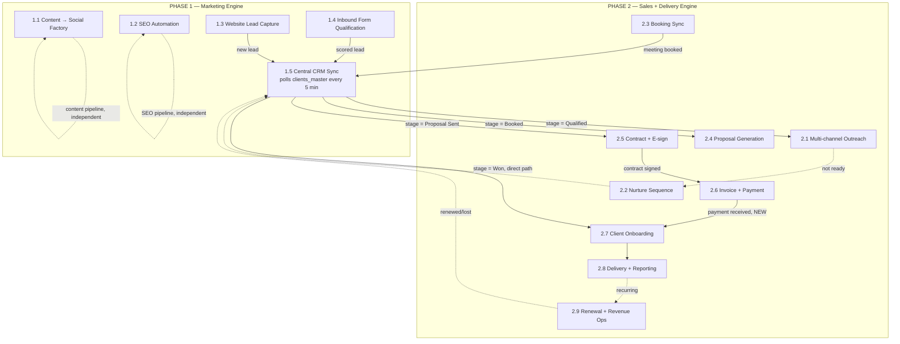

# Growth Engine — Merged Funnel (Marketing + Sales, Pre-Wired)

This is Phase 1 (Marketing Engine) and Phase 2 (Sales + Delivery Engine) joined into
**one logically connected system**. Nothing was squashed into a single giant canvas —
14 separate workflows is still the right shape (each stays independently readable,
testable, and editable). What changed is that the *hand-off points* between them are
now pre-wired instead of left as placeholders.

## What was actually broken before

Every module was built correctly on its own, but the five places where one module
calls another were left as `REPLACE_WITH_..._WORKFLOW_ID` text strings, plus one
hand-off (2.6 → 2.7) that had no node at all yet. Until those were filled in by hand,
Marketing (Phase 1) and Sales (Phase 2) were two disconnected systems that happened to
share a database.

## What this merge did

1. **Gave every module a fixed, permanent workflow ID** (instead of the random ID n8n
   normally assigns on import), so the modules can reference each other correctly
   *before* they've ever been imported anywhere.
2. **Resolved all 5 cross-module placeholders** with those fixed IDs:

   | Caller | Placeholder that was filled in | Now points to |
   |---|---|---|
   | 1.5 Central CRM Sync | `REPLACE_WITH_2.1_OUTREACH_WORKFLOW_ID` | 2.1 Multi-channel Outreach |
   | 1.5 Central CRM Sync | `REPLACE_WITH_2.4_PROPOSAL_GENERATION_WORKFLOW_ID` | 2.4 Proposal Generation |
   | 1.5 Central CRM Sync | `REPLACE_WITH_2.5_CONTRACT_ESIGN_WORKFLOW_ID` | 2.5 Contract + E-sign |
   | 1.5 Central CRM Sync | `REPLACE_WITH_2.7_ONBOARDING_WORKFLOW_ID` | 2.7 Client Onboarding |
   | 2.5 Contract + E-sign | `REPLACE_WITH_2.6_INVOICE_PAYMENT_WORKFLOW_ID` | 2.6 Invoice + Payment |

3. **Built the missing 2.6 → 2.7 hand-off.** Added an `Execute Workflow - 2.7 Client
   Onboarding` node inside `2.6-invoice-payment/workflow.json`, branching in parallel
   off `Postgres - Mark Paid` (alongside the existing receipt email), passing
   `odoo_lead_id` through — exactly the shape the 2.7 README's "Wiring" section
   described, just implemented instead of left as an instruction.
4. **Fixed workflow IDs on every one of the 14 modules**, listed below, so nothing
   here depends on you copying an ID out of a browser URL bar.

## The full connected funnel



The dotted `2.6 → 2.7` line is the one that's genuinely new — before this merge,
a paid client would sit at "Paid" in `clients_master` forever unless someone manually
ran onboarding. Now it fires the moment payment clears, same as the rest of the chain.

## Fixed workflow IDs

| # | Module | Fixed ID |
|---|---|---|
| 1.1 | Content → Social Factory | `819e4885b72bf1be` |
| 1.2 | SEO Automation | `cad75ca2baf1ebeb` |
| 1.3 | Website Lead Capture | `337c9aa1aa3ffde1` |
| 1.4 | Inbound Form Qualification | `5e0a1347fcc9a166` |
| 1.5 | Central CRM Sync | `25527b8572ff348b` |
| 2.1 | Multi-channel Outreach | `1825a46d7bb76459` |
| 2.2 | Nurture Sequence | `59bf120556870457` |
| 2.3 | Booking Sync | `8278dd511829de5f` |
| 2.4 | Proposal Generation | `45a99eb7028f822f` |
| 2.5 | Contract + E-sign | `6a06f8d9cae8f2f1` |
| 2.6 | Invoice + Payment | `56554944d9702690` |
| 2.7 | Client Onboarding | `54d839bd859bb42c` |
| 2.8 | Delivery + Reporting | `3859662fe0ebebb1` |
| 2.9 | Renewal + Revenue Ops | `60bf05193682479a` |

## How to import so the wiring actually holds

This is the part that matters — **which import method you use decides whether any of
the above wiring survives.**

### Option A — CLI import (recommended, zero manual steps)

n8n's CLI import (`n8n import:workflow`) **keeps the `id` field from the JSON file**.
The UI's "Import from File" does **not** — it always assigns a brand-new random ID,
which would silently break every Execute Workflow reference above.

```bash
./import-merged-funnel.sh
```

or by hand, in order:

```bash
n8n import:workflow --separate --input=growth-engine-automation/phase-1
n8n import:workflow --separate --input=growth-engine-automation/phase-2
```

(Docker: `docker exec -u node <container> n8n import:workflow --separate --input=/path/inside/container`)

After this, all 14 workflows exist with the IDs in the table above, and every
Execute Workflow node already points at the right target — nothing to copy-paste.

### Option B — UI import (if you don't have CLI/shell access to the n8n host)

The UI will assign new random IDs, so the placeholders-are-already-filled trick
doesn't carry over. You're back to the original manual process: import each module,
open it, copy its real ID from the browser URL, and paste it into the five Execute
Workflow nodes listed in the table above. The top-level `README.md`'s "Import Order"
section still applies in this case.

## What's still genuinely manual (on purpose)

These can't be pre-wired because they're your secrets/infrastructure, not connections
between modules:

- Every `REPLACE_WITH_CREDENTIAL_ID` (Postgres, SMTP, Odoo, Documenso, etc.) — set up
  once in n8n → Credentials, per the top-level `README.md` "Common Setup" section.
- The n8n environment variables table in the top-level `README.md`.
- Activating each workflow (CLI import leaves everything inactive).
- The items under "Launch-Readiness Blockers" in the top-level `README.md` (pricing
  logic, `odoo_partner_id` linking, payment-webhook signature verification, Gotenberg
  wiring, Metabase PDF export) — these are product decisions, not wiring gaps.
