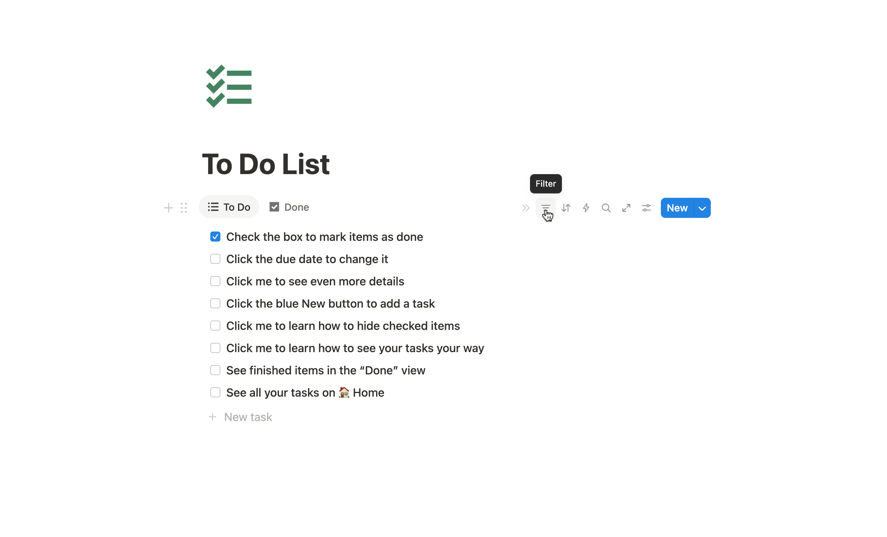

# Click me to learn how to hide checked items

Due date: January 27, 2026
Status: Not started
Assignee: Nivy

From the list, click the ‣ button to change your filters.

Select “Status”. 

Then check “To Do” and “In Progress” to only see unchecked items in the list. Click “Save for everyone” to finish.

<aside>

**Notion Tip**

You can keep track of all sorts of other information about your to dos!

Click “➕ Add a property” to see all the other things you can do.

</aside>