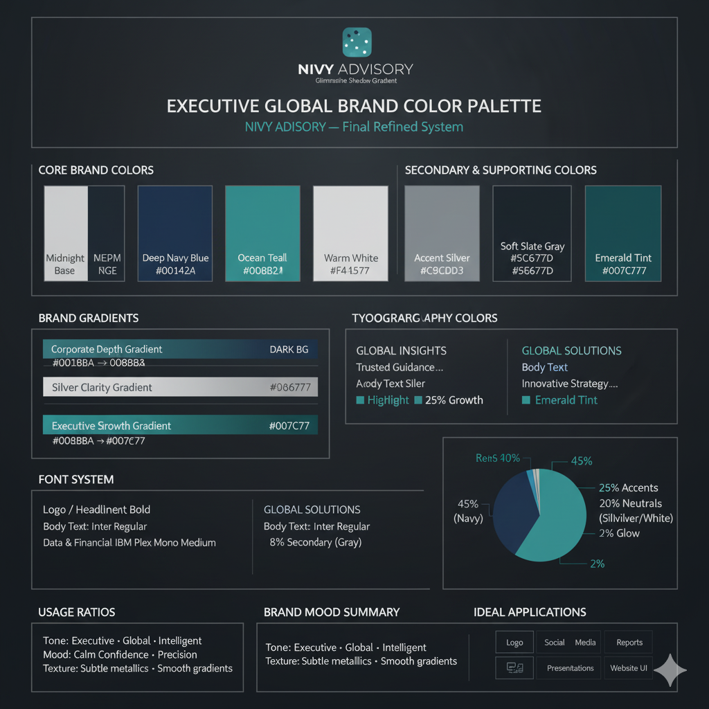
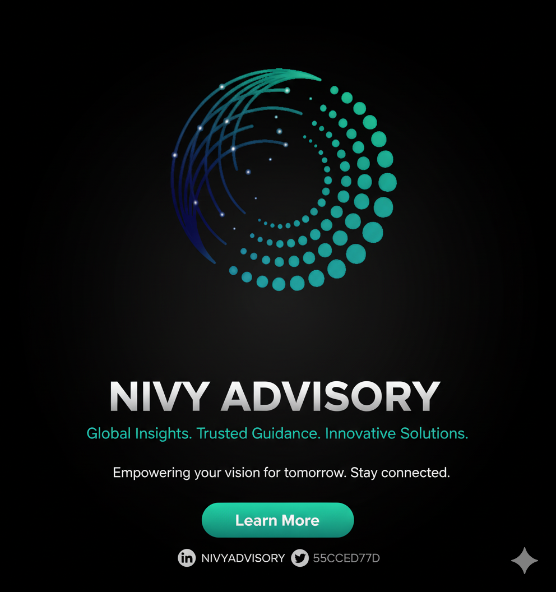
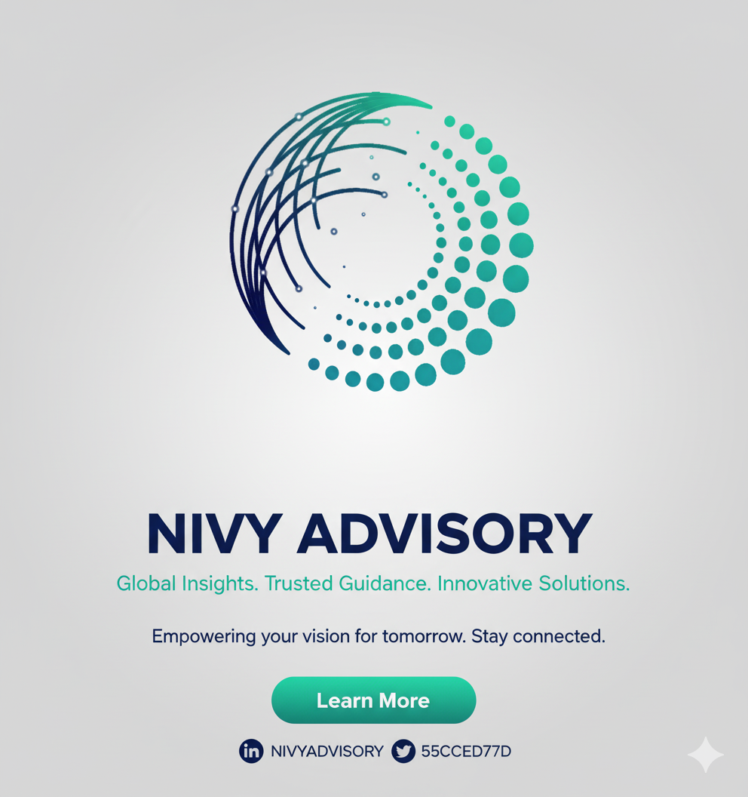
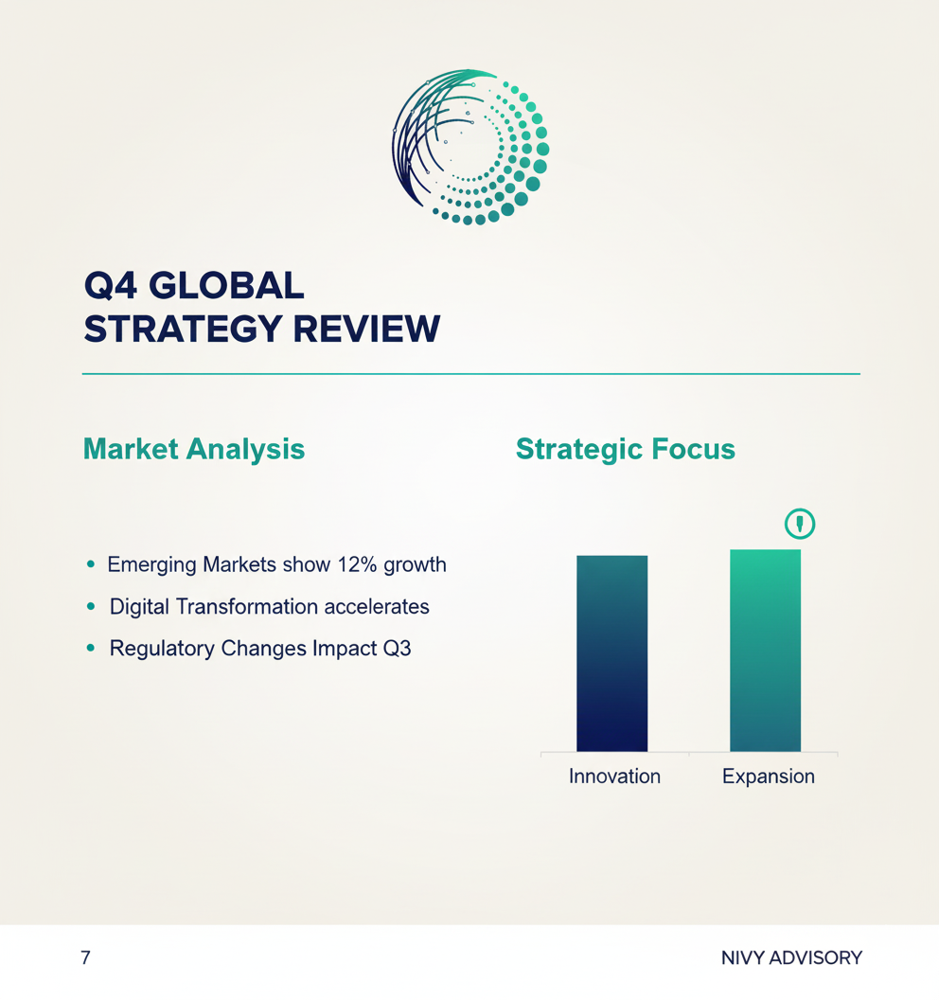

# Nivy Advisory Brand Color Palette

Perfect — what you’ve described here is a **hybrid palette** combining the strength of the **Modern Global Advisory** style with the elegance and precision of the **Luxury Precision** tone.

It’s *exactly right* for a firm like **NIVY ADVISORY**:

- Global sophistication 🌍
- Financial clarity 💼
- Executive-level trust ⚖️
- Innovative visual edge 💡

Here’s your **complete, unified branding color palette** built from those logo elements, expanded into a full professional system ready for design, social media, and corporate documentation.

## 🎨 **NIVY ADVISORY — Executive Global Brand Color Palette (Final Refined System)**

### **1. Core Brand Colors**

| Role | Color Name | HEX | RGB | Description |
| --- | --- | --- | --- | --- |
| **Midnight Base (Primary Background)** | `#0A1420` | (10, 20, 32) | Deep navy-black background for digital and print. Sets a tone of trust, authority, and sophistication. |  |
| **Deep Navy Blue (Primary Structural Base)** | `#0D1B2A` | (13, 27, 42) | A slightly lighter, more visible navy for layouts and gradients. Represents professional stability and depth. |  |
| **Ocean Teal (Accent)** | `#008B8B` | (0, 139, 139) | Modern teal for innovation, intelligence, and clarity — perfect for highlights and call-to-action elements. |  |

---

### **2. Secondary & Supporting Colors**

| Role | Color Name | HEX | RGB | Description |
| --- | --- | --- | --- | --- |
| **Accent Silver** | `#C9CDD3` | (201, 205, 211) | Metallic sophistication for icons, outlines, and typography on dark backgrounds. |  |
| **Warm White** | `#F4F5F7` | (244, 245, 247) | Clean and soft for presentations, documents, and body backgrounds. |  |
| **Graphite Gray** | `#2E2E2E` | (46, 46, 46) | Neutral, readable text tone for light backgrounds and balanced layouts. |  |
| **Soft Slate Gray** | `#5C677D` | (92, 103, 125) | Smooth, professional neutral for footers, secondary text, or soft UI sections. |  |

---

### **3. Highlight & Glow Colors**

| Role | Color Name | HEX | RGB | Description |
| --- | --- | --- | --- | --- |
| **Aurora Blue Glow (Optional Light Effect)** | `#4FD3FF` | (79, 211, 255) | Subtle glow for dotted spirals or motion lines, adds digital depth and futuristic feel. |  |
| **Emerald Tint (Optional Modern Accent)** | `#007C77` | (0, 124, 119) | Symbolizes growth, strategy, and precision. Excellent for infographics or success visuals. |  |

---

### **4. Gradients (Brand Motion System)**

| Name | From → To | Description |
| --- | --- | --- |
| **Corporate Depth Gradient** | `#0D1B2A → #008B8B` | Main brand gradient — “stability merging with innovation.” Use for logo arcs, hero backgrounds, and banners. |
| **Silver Clarity Gradient** | `#C9CDD3 → #F4F5F7` | For glowing dots, outlines, or subtle motion trails — adds clean metallic contrast. |
| **Executive Shadow Gradient** | `#0A1420 → #0D1B2A` | Used in backgrounds, cards, and presentation covers to create layered depth. |
| **Emerald Growth Gradient (Optional)** | `#008B8B → #007C77` | For analytics or growth visuals — symbolizing progress and global expansion. |

---

### **5. Typography Colors**

| Context | Color | HEX | Notes |
| --- | --- | --- | --- |
| **Headings / Logo (Dark Backgrounds)** | Gradient: `#E6E9EE → #F9FAFB` | Subtle metallic silver-white gradient for modern luxury. |  |
| **Headings / Logo (Light Backgrounds)** | `#0D1B2A` | Strong, refined contrast. |  |
| **Body Text (Light Mode)** | `#2E2E2E` | Clean, readable, grounded. |  |
| **Body Text (Dark Mode)** | `#C9CDD3` | Crisp and modern on navy or black. |  |
| **Highlight Text / Key Metrics** | `#008B8B` | Teal accent for emphasis on insights or figures. |  |

---

### **6. Font System (Corporate Type Hierarchy)**

| Role | Font | Style |
| --- | --- | --- |
| **Logo / Headlines** | *Poppins*, *Montserrat*, or *Avenir Next* | Modern geometric sans-serif — professional and strong. |
| **Body Text** | *Inter* or *Lato* | Clean, readable typography ideal for documents and reports. |
| **Data & Financial Figures** | *IBM Plex Mono* | Monospaced font for accounting statements and tables. |

---

### **7. Recommended Usage Ratios**

| Category | % Usage | Application |
| --- | --- | --- |
| **Midnight Base + Deep Navy Blue** | 45% | Backgrounds, headers, presentations, and hero visuals. |
| **Ocean Teal + Emerald Tint** | 25% | Highlights, lines, arcs, data visuals, call-to-action elements. |
| **Accent Silver + Warm White** | 20% | Text, backgrounds, iconography, and subtle glows. |
| **Graphite + Slate Gray** | 8% | Neutral text and balanced structural elements. |
| **Aurora Blue Glow (optional)** | 2% | Decorative or digital accent only. |

---

### **8. Brand Mood Summary**

> Tone: Executive · Global · Intelligent · Innovative
> 
> 
> **Mood:** Calm Confidence · Precision · Modern Luxury
> 
> **Texture:** Subtle metallics · Smooth gradients · Dimensional depth
> 
> **Inspiration:** Accenture’s innovation + Deloitte’s trust + Goldman Sachs’ executive tone
> 

---

### ✅ **Ideal Applications**

- **Logo / Symbol:** Deep Navy background with Corporate Depth Gradient arcs
- **Social Media:** Navy or black base with Silver text and Teal motion lines
- **Reports / Proposals:** Off-White pages, Teal headers, Gold separators
- **Presentation Slides:** Midnight → Teal gradient covers, Silver text
- **Website UI:** Dark backgrounds with clean teal interactions and silver typography

---

Would you like me to generate a **visual brand color sheet** (a clean, exportable PDF or image) showing all these tones, gradients, and usage examples side-by-side?

It’s perfect for sharing with designers or adding to your brand guideline document

---