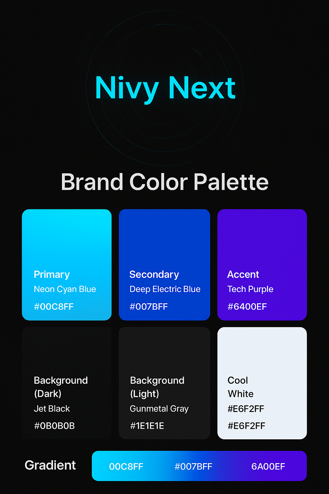
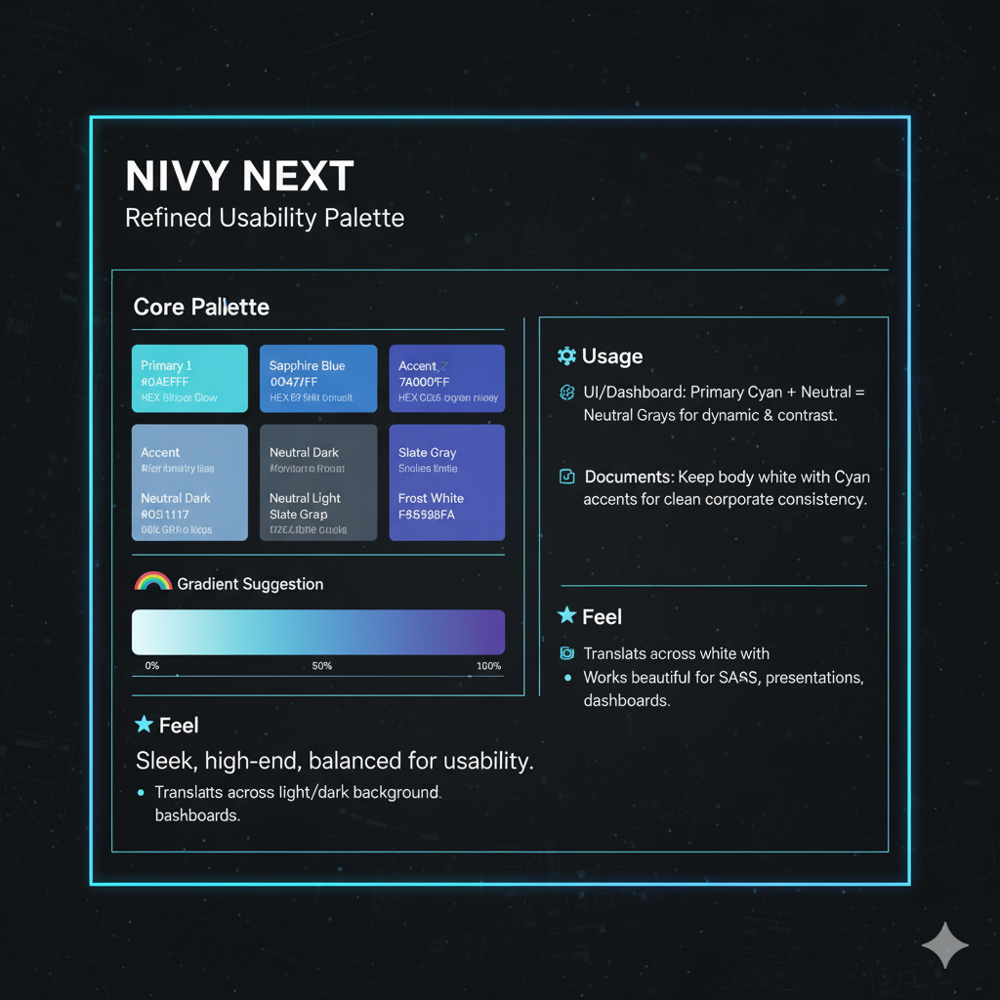
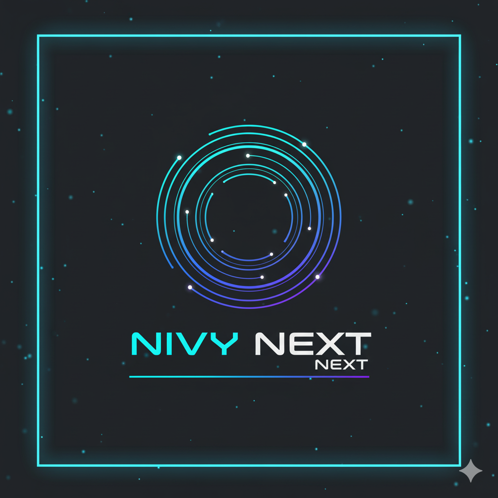
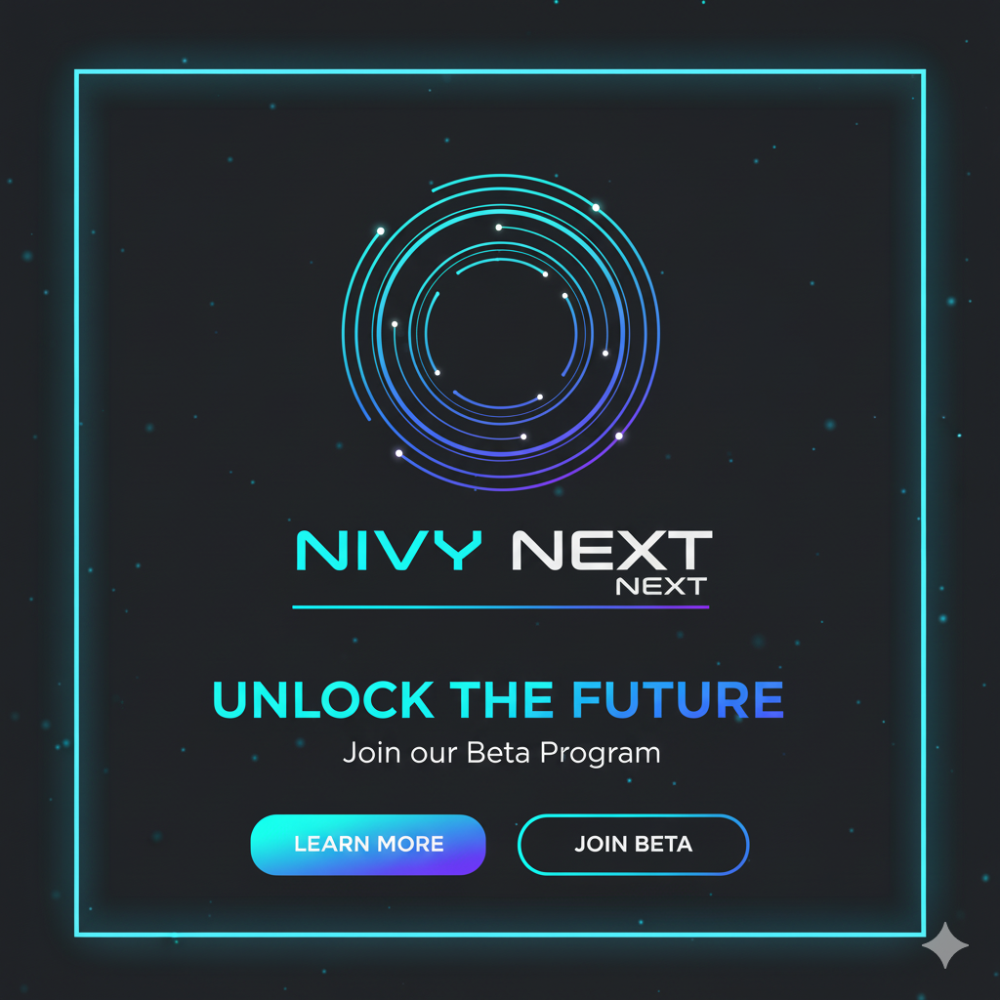

# 🎨 Branding — Nivy Next Visual Identity

---

## **Nivy Next color palette**

[Presentation Intelligence](https://www.pi.inc/theme) ai presentation ppt site

## 🚀 OPTION 2: **Refined Usability Palette**

*(Inspired by your logo — optimized for readability, versatility, and design balance)*

### 🎨 Core Palette

| Type | Color Name | HEX | Usage |
| --- | --- | --- | --- |
| **Primary** | **Cyan Glow** | `#0AEFFF` | Brand identity color, buttons, accents |
| **Secondary** | **Sapphire Blue** | `#0047FF` | Headers, active states, key UI |
| **Accent** | **Violet Pulse** | `#7A00FF` | Contrast pops in charts or banners |
| **Neutral Dark** | **Midnight Gray** | `#0E1117` | Background, dashboard shell |
| **Neutral Light** | **Slate Gray** | `#2C2F36` | Cards, components, dividers |
| **Text / Light Base** | **Frost White** | `#F5F8FA` | Light theme text, document layouts |

### 🌈 Gradient Suggestion

`linear-gradient(135deg, #0AEFFF 0%, #0047FF 50%, #7A00FF 100%)`

### ⚙️ Usage

- **UI/Dashboard:** Primary Cyan + Neutral Grays = clarity & contrast.
- **Marketing Materials:** Violet & Blue for dynamic depth.
- **Documents:** Keep body white with Cyan accents for clean corporate consistency.

### ✨ Feel

- Sleek, high-end, but more **balanced** for long-term usability (especially UI/print).
- Translates better across light and dark backgrounds.
- Works beautifully for SaaS websites, presentations, and dashboards.

---

## 

Excellent — this **Refined Usability Palette** is a **modern, tech-driven, high-contrast system** that still feels *corporate and premium*.

It’s ideal if you want **NIVY NEXT** to project a **global, digital-first identity** — sleek, confident, and adaptable for both **corporate presentations and modern web interfaces**.

Below is the **full extended brand palette**, carefully structured for design, reports, UI, and marketing consistency.

---

## 🚀 **NIVY NEXT— Refined Usability Brand Color Palette (Corporate + Digital Hybrid)**

### **1. Core Brand Colors**

| Role | Color Name | HEX | RGB | Description |
| --- | --- | --- | --- | --- |
| **Primary — Cyan Glow** | `#0AEFFF` | (10, 239, 255) | Vibrant, energetic cyan — the defining accent. Symbolizes intelligence, agility, and digital clarity. Use for primary buttons, call-to-actions, and key highlights. |  |
| **Secondary — Sapphire Blue** | `#0047FF` | (0, 71, 255) | Deep electric blue for structure, hierarchy, and professional tone. Ideal for headers, links, or data visuals. |  |
| **Accent — Violet Pulse** | `#7A00FF` | (122, 0, 255) | Luxurious, innovative pop color — best used for dynamic highlights, charts, and visual energy. |  |

---

### **2. Neutral & Background Colors**

| Role | Color Name | HEX | RGB | Description |
| --- | --- | --- | --- | --- |
| **Neutral Dark — Midnight Gray** | `#0E1117` | (14, 17, 23) | Deep, high-contrast background base for dark mode, dashboards, and hero sections. Conveys stability and sophistication. |  |
| **Neutral Light — Slate Gray** | `#2C2F36` | (44, 47, 54) | Mid-tone gray for UI elements, cards, shadows, and panel contrasts. Maintains readability without harsh contrast. |  |
| **Text / Base Light — Frost White** | `#F5F8FA` | (245, 248, 250) | Clean and modern white tone for text on dark backgrounds or general light-theme documents. |  |

---

### **3. Supporting Colors**

| Role | Color Name | HEX | RGB | Description |
| --- | --- | --- | --- | --- |
| **Cool Silver** | `#DDE3E8` | (221, 227, 232) | Balanced neutral used for borders, iconography, and light UI components. Keeps modern metallic tone. |  |
| **Graphite Gray** | `#22252A` | (34, 37, 42) | Structural gray for text, sidebars, and shadows in dark themes. |  |
| **Highlight Mint (Optional)** | `#6FFFE9` | (111, 255, 233) | Used sparingly for visual motion, charts, or glow accents — gives a digital-edge flair. |  |

---

### **4. Gradient Systems**

| Name | Colors | Description |
| --- | --- | --- |
| **Signature Brand Gradient** | `#0AEFFF → #0047FF → #7A00FF` | Core identity gradient — symbolizing insight, growth, and precision. Use for logo, buttons, or hero backgrounds. |
| **Cyan–Blue Flow** | `#0AEFFF → #0047FF` | Clean, professional tone — best for presentations and structured layouts. |
| **Blue–Violet Motion** | `#0047FF → #7A00FF` | Dynamic energy for banners, headers, and hover transitions. |
| **Glow Accent (for dark backgrounds)** | `#0AEFFF → #6FFFE9` | Creates subtle light motion in charts or infographics. |

---

### **5. Typography Colors**

| Use | Color | HEX | Notes |
| --- | --- | --- | --- |
| **Primary Text (Light Mode)** | `#0E1117` | Deep neutral for readability on light backgrounds. |  |
| **Primary Text (Dark Mode)** | #e6f2ff | cool white or navy backgrounds. |  |
| **Secondary Text** | `#DDE3E8` | Used for muted copy or supporting UI text. |  |
| **Highlight Text / Links** | `#0AEFFF` | Cyan highlight for interactivity and attention. |  |
| **Muted / Disabled Text** | `#5F6368` | Subtle neutral tone for low-importance elements. |  |

---

### **6. Font System**

| Role | Font | Style |
| --- | --- | --- |
| **Logo / Headings** | *Poppins* or *Montserrat* | Modern, geometric sans-serif for corporate consistency. |
| **Body Text** | *Inter* or *Lato* | Clean, accessible typography optimized for screens and documents. |
| **Monospace (Financial Data)** | *IBM Plex Mono* | Technical clarity for data tables and analytics visuals. |

---

### **7. Usage Ratios**

| Category | % Usage | Application |
| --- | --- | --- |
| **Midnight Gray + Slate Gray** | 45% | Backgrounds, structure, main UI |
| **Cyan Glow + Sapphire Blue** | 25% | Highlights, buttons, primary visuals |
| **Frost White + Silver** | 20% | Text, borders, and clarity elements |
| **Violet Pulse + Mint Accent** | 8–10% | Energy points, charts, or infographics |

---

### **8. Visual Personality**

> Tone: Digital · Global · Precise · Bold
> 
> 
> **Mood:** Futuristic Confidence · Professional Clarity · Energetic Intelligence
> 
> **Texture:** Smooth gradients · Light glow · Metallic contrast
> 

---

### **9. Application Guide**

- **Logo / Identity:** Signature gradient `#0AEFFF → #0047FF → #7A00FF` on Midnight Gray background
- **Social Media / Hero Banners:** Gradient overlay with Frost White text
- **Reports / Documents:** Light background with Sapphire headers and Cyan highlights
- **Web / Dashboard UI:** Dark theme base with Cyan + Violet accents for focus points

---

✅ **Summary:**

This palette gives *Nivy NEXT* a **digital-corporate identity** that’s modern, international, and visually distinctive.

It bridges the world of **executive professionalism** and **innovative design** — suitable for global NEXT, financial intelligence, or data-centric consulting.

---

Would you like me to create a **visual brand board** (image or PDF) showing this palette with color blocks, gradients, and usage mockups for logo + document + UI?

That would serve as a complete visual reference for your brand guidelines.

Absolutely — here are **much better, modern, premium light-theme colors** derived *strictly* from your NIVY NEXT palette.

These are optimized for **readability, luxury, and a crisp consulting look** (not washed-out like standard white themes).

---

# 🌤 **NIVY NEXT — Optimized Light Theme Colors**

### 👌 *Goal:*

A light mode that feels **premium**, **tech-forward**, and **on-brand**, without using stark white or dull grays.

---

# 🎨 **1. Light Theme Background System (Improved)**

### ✅ **Primary Page Background (Best Overall Choice)**

**Cool Silver Soft**

- **HEX:** `#E9EEF2`
- Balanced, modern, slightly metallic
- Gives a premium fintech/AI-consulting feel
- Reduces harsh contrast but stays clean

### ✅ **Secondary Background (Sections, Cards, Panels)**

**Frost White (Softened)**

- **HEX:** `#F5F8FA`
- Use for content blocks, card backgrounds, timelines
- Better than pure white because it feels more “designed”

### ✅ **Optional Light-Dark Hybrid Background**

**Slate Mist**

- **HEX:** `#DDE3E8`
- For highlighted sections or alternate slide layouts
- Matches perfectly with your digital palette

---

# 🖌 **2. Light Theme Text Colors (Readable + Premium)**

### **Primary Text (Headings)**

**Midnight Graphite**

- **HEX:** `#1A1D22`
- Deep, elegant, crisp on light backgrounds
- Better than jet black → more premium, less harsh

### **Secondary Text (Subheadings)**

**Charcoal Gray**

- **HEX:** `#2C2F36`
- High readability, soft, professional

### **Body Text**

**Graphite Gray**

- **HEX:** `#43464D`

### **Muted / Low Importance**

**Muted Slate**

- **HEX:** `#5F6368`

---

# ✨ **3. Light Theme Accent Colors (Brand Highlights)**

These stay the same from your palette — your accents were already excellent.

### **Primary Accent**

- **Cyan Glow** — `#0AEFFF`

### **Secondary Accents**

- **Sapphire Blue** — `#0047FF`
- **Violet Pulse** — `#7A00FF`
- **Highlight Mint** — `#6FFFE9` *(sparingly)*

Use accents primarily for:

- CTA buttons
- Charts
- Key numbers
- Icons
- Section separators
- Emphasis boxes

---

# 🗂 **4. Light Theme Card / Element Colors**

### **Card Background**

- **Soft Frost White** — `#F5F8FA`

### **Card Borders**

- **Cool Silver** — `#DDE3E8` *(thin 1–1.5px)*

### **Card Title Text**

- **Sapphire Blue** — `#0047FF`

### **Card Subtitle**

- **Graphite Gray** — `#43464D`

### **Card Body Text**

- **Charcoal Gray** — `#2C2F36`

---

# 🔥 **5. Recommended Light Theme Color Set (Final)**

Use this exact set for your PPT template:

| Element | Color | HEX |
| --- | --- | --- |
| **Main Background** | Cool Silver Soft | `#E9EEF2` |
| **Secondary Background** | Soft Frost White | `#F5F8FA` |
| **Highlight Background** | Slate Mist | `#DDE3E8` |
| **Heading Text** | Midnight Graphite | `#1A1D22` |
| **Subtitle Text** | Charcoal | `#2C2F36` |
| **Body Text** | Graphite | `#43464D` |
| **Muted Text** | Muted Slate | `#5F6368` |
| **Primary Accent** | Cyan Glow | `#0AEFFF` |
| **Secondary Accent** | Sapphire Blue | `#0047FF` |
| **Tertiary Accent** | Violet Pulse | `#7A00FF` |
| **Card Border** | Cool Silver | `#DDE3E8` |

---

# 🎯 Why this light theme is *much* better

✔ Not too white → avoids cheap look

✔ Soft metallic vibe → premium corporate consulting feel

✔ Fully aligned with your dark-mode palette

✔ Perfect contrast with Cyan/Sapphire/Violet

✔ Very readable for presentations & reports

---

If you want, I can now:

✅ Create a **final PPT color theme XML**

OR

✅ Build a **complete PPTX template** with these light-theme colors

OR

✅ Generate **sample slides** to visualize the theme

Just tell me — **which one should I deliver?**

PPT TEMPLATE

Here is your **NIVY NEXT– DARK THEME PPT COLOR SYSTEM**

(Perfectly aligned with your brand palette + optimized for readability + premium futuristic corporate look.)

---

# 🌑 **NIVY NEXT — Official DARK THEME PPT Colors**

Below is a **ready-to-use** color set specifically for **PPT Dark Mode Templates**.

---

Here is **the full color system in clean table format (non-image)**, neatly categorized for PPT dark theme use.

---

# 🎨 **NIVY NEXT — Dark Theme Color Tables**

## **1. Background Colors**

| Purpose | Color Name | HEX |
| --- | --- | --- |
| Primary Background | Midnight Gray | `#0E1117` |
| Secondary Background | Graphite Gray | `#22252A` |
| Tertiary Background | Slate Gray | `#2C2F36` |

---

## **2. Text Colors**

| Purpose | Color Name | HEX |
| --- | --- | --- |
| Heading Text | Cool White | `#E6F2FF` |
| Card Title Text (Option 1) | Cyan Glow | `#0AEFFF` |
| Card Title Text (Option 2) | Sapphire Blue | `#0047FF` |
| Subtitle Text | Silver Mist | `#DDE3E8` |
| Body Text | Light Graphite | `#C9D1D9` |
| Muted Text | Muted Gray | `#5F6368` |

---

## **3. Accent & Brand Colors**

| Purpose | Color Name | HEX |
| --- | --- | --- |
| Primary Accent | Cyan Glow | `#0AEFFF` |
| Secondary Accent | Sapphire Blue | `#0047FF` |
| Tertiary Accent | Violet Pulse | `#7A00FF` |
| Optional Highlight | Mint Glow | `#6FFFE9` |

---

## **4. Card System Colors**

| Purpose | Color Name | HEX |
| --- | --- | --- |
| Card Background 1 | Graphite Gray | `#22252A` |
| Card Background 2 | Slate Gray | `#2C2F36` |
| Card Border | Cool Silver | `#DDE3E8` |
| Card Title | Sapphire Blue / Cyan Glow | `#0047FF` / `#0AEFFF` |
| Card Subtitle | Silver Mist | `#DDE3E8` |
| Card Body Text | Light Graphite | `#C9D1D9` |

---

## **5. Gradients (Component Colors)**

*(Use individually or in combinations)*

| Gradient Name | Colors Used (HEX) |
| --- | --- |
| Signature Gradient | `#0AEFFF → #0047FF → #7A00FF` |
| Tech Gradient | `#0AEFFF → #0047FF` |
| Energy Gradient | `#0047FF → #7A00FF` |
| Glow Accent | `#0AEFFF → #6FFFE9` |

---

If you want, I can also convert this into:

🔹 **A downloadable PPT color theme XML**

🔹 **A master slide layout**

🔹 **A ready PPTX with all colors applied**

Just tell me what format you want next.

# 🎨 **1. Theme Palette (Dark Theme Edition)**

### **Primary Accent**

- **Cyan Glow** — `#0AEFFF`
    
    *Main action color for buttons, highlights, numbers, icons.*
    

### **Secondary Accents**

- **Sapphire Blue** — `#0047FF`
- **Violet Pulse** — `#7A00FF`
- **Highlight Mint (Optional)** — `#6FFFE9`

Use accents for charts, emphasize data, quotes, or gradient overlays.

---

# 🖤 **2. Background Colors (Dark Mode)**

### **Primary Background (Slide Deck Default)**

- **Midnight Gray** — `#0E1117`
    
    *Ultra-premium, deep, and cinematic.*
    

### **Secondary Background (Cards, Panels, Section Blocks)**

- **Graphite Gray** — `#22252A`
    
    *Slightly elevated surfaces, clean for content blocks.*
    

### **Tertiary Background (Light highlight panels)**

- **Slate Gray** — `#2C2F36`
    
    *Use for callouts, statistic cards, comparison sections.*
    

---

# ✍️ **3. Text Colors for Dark Theme (Highly Readable)**

### **Primary Text (Headings)**

- **Cool White** — `#E6F2FF`
    
    *Clean, high legibility without harshness.*
    

### **Card Title Text**

- **Cyan Glow** — `#0AEFFF`
    
    *(Instant brand visual, futuristic)*
    

— OR —

- **Sapphire Blue** — `#0047FF`
    
    *More corporate tone*
    

Choose depending on slide energy.

### **Subtitle Text**

- **Silver Mist** — `#DDE3E8`
    
    *(Soft, modern, perfect for subheaders)*
    

### **Body Text**

- **Light Graphite** — `#C9D1D9`
    
    *(Smooth, balanced body text for dark backgrounds)*
    

### **Muted Text**

- **Muted Gray** — `#5F6368`

---

# 🧩 **4. Card System (For content blocks, data cards, boxes)**

### **Card Background**

- Graphite Gray — `#22252A`
- Slate Gray — `#2C2F36` *(alternate)*

### **Card Border**

- Cool Silver — `#DDE3E8` *(0.5–1px)*

### **Card Title Text**

- Sapphire Blue — `#0047FF`
- (Alternate): Cyan Glow — `#0AEFFF`

### **Card Subtitle**

- Silver Mist — `#DDE3E8`

### **Card Body Text**

- Light Graphite — `#C9D1D9`

---

# 🔤 **5. Font System (Dark Theme PPT)**

### **Headings**

- **Poppins** — *Bold (700)*
    
    Color: `#E6F2FF`
    

### **Subtitles**

- **Inter** — *Medium (500)*
    
    Color: `#DDE3E8`
    

### **Body**

- **Inter** — *Regular (400)*
    
    Color: `#C9D1D9`
    

### **Data / Tables / KPIs**

- **IBM Plex Mono** — *Regular*
    
    Color: `#0AEFFF` or `#E6F2FF`
    

---

# 🌌 **6. Dark Theme Gradient Options (For section covers)**

### **Signature Gradient**

`#0AEFFF → #0047FF → #7A00FF`

### **Tech Gradient**

`#0AEFFF → #0047FF`

### **Energy Gradient**

`#0047FF → #7A00FF`

### **Glow Accent (Dark Mode Only)**

`#0AEFFF → #6FFFE9`

---

# 🖼 **7. Theme Image Style Prompt (Dark Theme)**

Use this for all AI slide visuals to keep a unified brand identity:

**“Futuristic dark corporate aesthetic, deep midnight gray background, cyan–blue–violet neons, soft glow edges, metallic digital textures, premium executive feel, clean gradients, high contrast, 3D glass surfaces, global tech consulting, ultra-sharp and minimalistic.”**

Optional add-ons:

- “8k ultra detailed”
- “neon reflections”
- “AI consulting theme”
- “data visualization aesthetic”

---

# 🧾 **8. Final Dark Theme Set (Compact Summary for PPT)**

| Element | Color | HEX |
| --- | --- | --- |
| **Background Primary** | Midnight Gray | `#0E1117` |
| **Background Secondary** | Graphite Gray | `#22252A` |
| **Background Tertiary** | Slate Gray | `#2C2F36` |
| **Heading Text** | Cool White | `#E6F2FF` |
| **Subtitle Text** | Silver Mist | `#DDE3E8` |
| **Body Text** | Light Graphite | `#C9D1D9` |
| **Muted Text** | Muted Gray | `#5F6368` |
| **Card Border** | Cool Silver | `#DDE3E8` |
| **Primary Accent** | Cyan Glow | `#0AEFFF` |
| **Secondary Accent** | Sapphire Blue | `#0047FF` |
| **Tertiary Accent** | Violet Pulse | `#7A00FF` |
| **Highlight Accent** | Mint Glow | `#6FFFE9` |

---

# Ready?

I can now generate:

✅ A **complete PPT template (.pptx)** in dark theme

OR

✅ A **PPT color theme XML file**

OR

✅ A **slide master layout** with this dark branding

Tell me which one you want!