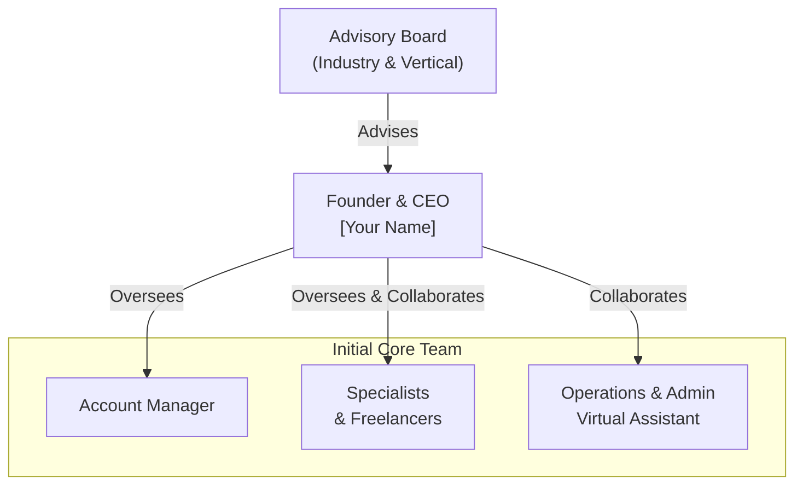

# 6.0 Organization & Management

Of course. Here is a detailed and comprehensive "Organization & Management" section for the Nivy Tech business plan.

---

### **6.0 Organization & Management**

### **6.1 Organizational Structure**

Nivy Tech will adopt a flat organizational structure initially to ensure agility, clear communication, and direct oversight by the founder. As the company grows, the structure will evolve into a more defined departmental model. The chart below outlines the planned structure for the first 18-24 months.

**Phase 1 (Months 0-12):** The founder will manage all strategy, sales, and client relations, supported by a network of specialized freelancers and a part-time virtual assistant.
 
**Phase 2 (Months 12-24):** Key roles (Account Manager, SEO/PPC Specialist) will be brought in-house to improve quality control, deepen institutional knowledge, and scale operations.

### **6.2 Management Team**

**Founder & Chief Executive Officer (CEO): [Your Name]**

- **Role & Responsibilities:** Ultimate responsibility for company vision, strategy, financial health, and business development. Leads client strategy on initial accounts and manages key partnerships.
- **Relevant Experience:**
    - **[Number] Years of Experience** in digital marketing, with a proven track record of driving growth for clients.
    - Previously held the position of **[Previous Title, e.g., Senior Marketing Manager]** at **[Previous Company]**, managing an annual ad spend of over **$[X] Million** and achieving an average ROI of **X%**.
    - **Expertise:** Certified professional in **Google Ads, Google Analytics, and HubSpot Inbound Marketing**. Deep hands-on experience with SEO technical audits, PPC campaign architecture, and data-driven content strategy.
- **Why I/We Are the Right Team:** My experience is not just in executing campaigns but in aligning them with core business objectives to generate revenue. I have managed the client-agency relationship from both sides and founded Nivy Tech to directly address the frustrations and inefficiencies I witnessed industry-wide.

### **6.3 Advisory Board**

Nivy Tech will establish an advisory board comprising two key roles to provide strategic guidance and industry-specific insight:

1. **Industry Advisor (Agency Operations):** A seasoned digital agency owner or executive who has successfully scaled a similar business. They will provide advice on operational efficiency, pricing, client retention, and growth strategies.
2. **Vertical Market Advisor (Legal/Healthcare):** A professional within our target vertical (e.g., a practicing dentist or lawyer) who can provide critical insight into the specific pain points, regulatory considerations, and marketing sensitivities of the industry.

### **6.4 Personnel Plan & Hiring Strategy**

The following table outlines the projected hiring plan and associated costs for the first three years. Salaries are estimated for the Austin, TX market.

| Role | Timing | Responsibilities | Annual Salary/Budget | Rationale |
| --- | --- | --- | --- | --- |
| **Founder/CEO** | Launch | Strategy, Sales, Finance, Client Delivery | $60,000 (Year 1) | Keep initial costs low; reinvest profits. |
| **Virtual Assistant (PT)** | Month 4 | Email management, scheduling, invoicing, basic ops | $12,000 | Free up Founder's time for revenue-generating activities. |
| **Freelance Specialists** | Month 1 | Execute SEO, PPC, Content tasks on a project basis | $40,000 (Year 1) | Access top-tier talent without full-time commitment. Provides flexibility. |
| **Account Manager (FT)** | Month 9 | Primary client contact, reporting, campaign oversight | $65,000 | Needed to maintain service quality as client roster grows beyond 8-10 clients. |
| **In-House Marketer (FT)** | Month 14 | Execute all strategies, replacing freelance network | $75,000 | Improve quality control, speed, and build institutional knowledge. |
| **Sales Associate** | Year 3 | Lead generation, outreach, sales calls | $70,000 | Systematize and scale the sales process to accelerate growth. |

**Total Projected Personnel Expense:**

- **Year 1:** $112,000
- **Year 2:** $212,000
- **Year 3:** $340,000

### **6.5 Ownership Structure**

- **Current Ownership:** 100% owned by **[Your Name]**.
- **Investment Dilution:** The sought-after seed investment of $75,000 is offered for a **[X]%** equity stake in Nivy Tech LLC.
- **Employee Stock Option Pool (ESOP):** An option pool of 10% will be created prior to investment to attract and retain mission-critical high-level talent in the future (e.g., a Chief Operating Officer or Director of Marketing).

### **6.6 Gaps & Mitigation**

We acknowledge current gaps in our team's capabilities:

- **Gap: Lack of a Full-Time, In-House Specialist.**
    - **Mitigation:** This is mitigated by the use of vetted, highly skilled freelancers who are managed closely by the founder. The hiring plan addresses this gap directly in Year 2.
- **Gap: Limited Sales Capacity.**
    - **Mitigation:** Initially, the founder will handle all sales. The documented sales process and lead generation strategy are designed to be efficient. A sales role is budgeted for in Year 3 to scale this function.
- **Gap: Financial Management.**
    - **Mitigation:** The founder will manage finances with the support of a contracted Certified Public Accountant (CPA) for tax preparation, financial review, and strategic advice.