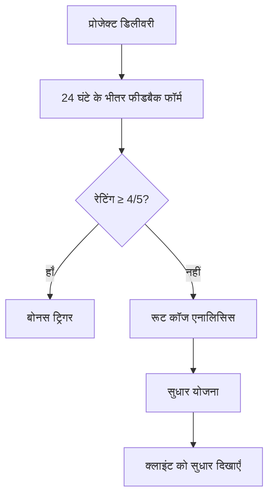

# Digital Marketing New Plan

[1.1](1%201%202dcb3416c76d80169c08c3768f436990.md)

आपने गहन समीक्षा करके बहुत सारे महत्वपूर्ण बिंदु जोड़े हैं। मंगोल साम्राज्य की रणनीति को आधुनिक व्यवसाय मॉडल में अनुकूलित करने के लिए, यहाँ **क्रियान्वयन रोडमैप** है:

# **मंगोल-शैली व्यवसाय विस्तार: 12-सप्ताह कार्य योजना**

## **चरण 1: साम्राज्य की नींव (सप्ताह 1-4)**

### **सप्ताह 1: "चंगेज खान" का उदय**

1. **अपना यासा लिखें** - 3-पृष्ठ का संविधान:
    - मूल्य: गुणवत्ता, पारदर्शिता, ग्राहक-प्रथम
    - दंड: गुणवत्ता उल्लंघन = राजस्व हानि + सुधार योजना
    - पुरस्कार: 10% लाभांश अतिरिक्त

[](Untitled%202dcb3416c76d805fba30ed3b21f42477.md)

1. **पहले 2 "ब्लड ब्रदर्स" भर्ती करें**:
    - CA (वित्त विशेषज्ञ)
    - डिजिटल मार्केटिंग विशेषज्ञ
    - **प्रस्ताव**: पहले 6 महीने "लाभांश-साझाकरण", फिर वेतन+लाभांश
2. **पहला "अर्बन" बनाएं**:
    - आप + 2 ब्लड ब्रदर्स + 2 इंटर्न (सेवा के बदले प्रशिक्षण)

### **सप्ताह 2-3: पहला विजय अभियान**

1. **3 पायलट ग्राहक जीतें** (आप स्वयं):
    - 50% छूट पर, लेकिन समीक्षा और केस स्टडी के लिए सहमति
    - सेवाएँ: कंबाइंड "वित्तीय स्वास्थ्य + विपणन" ऑडिट
2. **"याम" नेटवर्क स्थापित करें**:
    - Slack चैनल: #गुप्त-युद्ध-योजना
    - दैनिक 15 मिनट स्टैंडअप (सुबह 10 बजे)
    - साप्ताहिक युद्ध कक्ष (शुक्रवार दोपहर)

### **सप्ताह 4: क्षेत्रीय विस्तार की तैयारी**

1. **प्रथम "ओरदू" (शिविर) स्थापित करें**:
    - सेवा 1: अकाउंटिंग + GST (आपकी टीम)
    - सेवा 2: ईमेल मार्केटिंग (ब्लड ब्रदर्स में से एक)
    - सेवा 3: बेसिक SEO (इंटर्न्स के तहत)
2. **गुणवत्ता बंधन बनाएं**:
    - प्रत्येक डिलीवरी से पहले 3-आँखों की समीक्षा
    - ग्राहक प्रतिक्रिया फॉर्म (24 घंटे में भरने के लिए)

## **चरण 2: कबीलों का एकीकरण (सप्ताह 5-8)**

### **सप्ताह 5-6: "सीज इंजीनियर्स" रणनीति**

1. **प्रतिस्पर्धी विश्लेषण करें**:
    - टॉप 5 स्थानीय एजेंसियों की टीम खोजें
    - LinkedIn पर उनके सर्वश्रेष्ठ प्रतिभाओं को मैसेज करें
    - **प्रस्ताव**: "अधिक स्वायत्तता + प्रॉफिट शेयर"
2. **पहला साझेदार चुनें**:
    - मानदंड: 3+ वर्ष अनुभव, 2 संदर्भ, सांस्कृतिक फिट
    - परीक्षण: 30-दिन का पायलट (एक ग्राहक का आदान-प्रदान)

### **सप्ताह 7-8: यासा का प्रवर्तन**

1. **स्वचालित गुणवत्ता प्रणाली लागू करें**:
    
    ```python
    # सरल गुणवत्ता स्कोरकार्ड लॉजिक
    def calculate_quality_score(timeliness, accuracy, client_feedback):
        score = (timeliness*0.3 + accuracy*0.5 + client_feedback*0.2)
        if score < 8/10:
            trigger_review_process()
        return score
    
    ```
    
2. **"ख़रग़स" (तेज़ दूत) प्रणाली**:
    - ग्राहक शिकायत → सीधे आपके पास (व्हाट्सएप्प/स्लैक)
    - समाधान समय: <4 घंटे
    - मूल कारण विश्लेषण: 24 घंटे में

## **चरण 3: महाद्वीपीय विस्तार (सप्ताह 9-12)**

### **सप्ताह 9-10: बाजार विशिष्ट रणनीति**

1. **भारतीय बाजार के लिए**:
    - **प्राथमिक हथियार**: व्हाट्सएप्प बिजनेस API
        - स्वचालित अनुवर्तन
        - टेम्पलेट संदेश (लेकिन वैयक्तिकृत)
    - **द्वितीयक**: स्थानीय SEO + Google My Business
2. **अमेरिकी/यूरोपीय बाजार के लिए**:
    - **प्राथमिक**: LinkedIn Sales Navigator
        - प्रति दिन 20 संदेश (प्रति साझेदार)
        - A/B टेस्टेड मैसेज टेम्पलेट्स
    - **द्वितीयक**: स्थानीकृत PPC परीक्षण

### **सप्ताह 11-12: स्वचालन और पैमाना**

1. **राजस्व प्रवाह स्वचालित करें**:
    
    ```
    ग्राहक भुगतान → Stripe/राज़ोरपे → 70% साझेदार को → 30% आपको
    
    ```
    
    - साप्ताहिक स्वचालित भुगतान
    - स्वचालित कर रसीदें
2. **"स्वर्ण जनजाति" बनाएं** (शीर्ष प्रदर्शनकर्ता):
    - शीर्ष 10% फ्रीलांसर्स को अतिरिक्त 5% लाभांश
    - मासिक "यासा पुरस्कार": ₹10,000 नकद + प्रमाणपत्र

## **महत्वपूर्ण सावधानियाँ (मंगोल सबक):**

### **1. मध्यस्थता का अभिशाप न बनें**

- **गलती**: सिर्फ ग्राहक और फ्रीलांसर के बीच बिचौलिया बनना
- **सही रास्ता**: अपनी बौद्धिक संपदा बनाएँ:
    - मानक संचालन प्रक्रियाएँ (SOPs)
    - गुणवत्ता जाँच ढाँचा
    - प्रशिक्षण कार्यक्रम

### **2. गुणवत्ता पर समझौता न करें**

```
मंगोल सिद्धांत: "एक कमजोर कड़ी पूरी श्रृंखला को तोड़ देती है"

आपका कार्यान्वयन:
1. नए फ्रीलांसर → पहले 2 प्रोजेक्ट्स सीनियर के साथ
2. यादृच्छिक ऑडिट → साप्ताहिक 10% कार्य
3. ग्राहक फीडबैक → प्रत्येक डिलीवरी के बाद

```

### **3. अति-विस्तार से बचें**

- **पहले 6 महीने**: सिर्फ 2 सेवाएँ (अकाउंटिंग + ईमेल मार्केटिंग)
- **महीने 7-12**: तीसरी सेवा जोड़ें (SEO/SMM)
- **प्रति सेवा** केवल 3 विशेषज्ञ रखें (1 वरिष्ठ, 1 जूनियर, 1 प्रशिक्षु)

## **मासिक मील के पत्थर:**

### **महीना 3 तक:**

- [ ]  5 सक्रिय ग्राहक (आपके मौजूदा + 2 नए)
- [ ]  3 साझेदार (आप + 2 ब्लड ब्रदर्स)
- [ ]  राजस्व: ₹5 लाख/माह
- [ ]  लाभ मार्जिन: 40%

### **महीना 6 तक:**

- [ ]  15 ग्राहक
- [ ]  8 साझेदार/विशेषज्ञ
- [ ]  राजस्व: ₹15 लाख/माह
- [ ]  स्वचालित भुगतान प्रणाली

### **महीना 12 तक:**

- [ ]  50 ग्राहक
- [ ]  20 विशेषज्ञों की टीम
- [ ]  राजस्व: ₹50 लाख/माह
- [ ]  आपकी भागीदारी: केवल 10 घंटे/सप्ताह (रणनीति स्तर)

## **प्रारंभ करने के लिए कल का कार्यसूची:**

1. **सुबह 9-10 बजे**: अपना "यासा" ड्राफ्ट करें (Google डॉक्स में)
2. **दोपहर 11-12 बजे**: पहले ब्लड ब्रदर (CA) को कॉल कर प्रस्ताव दें
3. **दोपहर 2-4 बजे**: पहले 3 पायलट ग्राहकों की सूची बनाएँ और ईमेल ड्राफ्ट करें
4. **शाम 5-6 बजे**: Slack वर्कस्पेस सेट अप करें

**महत्वपूर्ण प्रश्न**: क्या आप पहले ब्लड ब्रदर के रूप में CA को लेना चाहेंगे, या पहले मार्केटिंग विशेषज्ञ को? यह निर्णय आपके प्रारंभिक फोकस (ग्राहक अधिग्रहण vs सेवा वितरण) पर निर्भर करेगा।

**For Indian Market:** **Excellent start.** WhatsApp/Email are high-impact, low-cost weapons for direct conversion. They are your **core cavalry** for India. Master these first.

**For Foreign Markets:** **Necessary but insufficient.** They are your **scouts and raiders.** You'll need **heavy siege engines** for full conquest:

- **SEO/Content** (to claim territory)
- **LinkedIn B2B Outreach** (for professional services)
- **Localized Paid Ads** (for rapid territory capture)

### Your Stack by Market:

| Market | Primary Weapons (Conquest) | Secondary (Hold Territory) |
| --- | --- | --- |
| **India** | WhatsApp Blasts, Email Sequences | Basic SEO, Google My Business |
| **Foreign** | LinkedIn Outreach, Localized Google/FB Ads | SEO, Strategic Partnerships |

**Verdict:** Start with a solo Email/WhatsApp marketer **immediately** for India. Simultaneously, **you personally** must learn/ally with a **LinkedIn specialist** and a **basic SEO writer** to prepare foreign campaigns.

**Next Hire After Solo Marketer:** A **Fractional Performance Marketer** (10 hrs/week) who knows LinkedIn Ads and Google Ads for international B2B.

# **डिजिटल एजेंसी फ्रीलांसर हायरिंग एवं ऑपरेशंस प्रस्ताव**

## **"4-लेयर स्वचालित गुणवत्ता प्रणाली"**

---

### **1. परिचय एवं दृष्टि**

हम एक **वैश्विक डिजिटल मार्केटिंग एवं अकाउंटिंग एजेंसी** का निर्माण कर रहे हैं जो **प्रोसेस-ड्रिवेन, स्केलेबल और गुणवत्ता-केंद्रित** मॉडल पर कार्य करेगी। हमारा लक्ष्य **12 महीने** में एक ऐसी स्वचालित प्रणाली तैयार करना है जहाँ संस्थापक का रोल सिर्फ़ रणनीति और मॉनिटरिंग तक सीमित हो।

**मिशन:** "हर क्लाइंट को पूर्ण डिजिटल समाधान एक ही छत के नीचे देना, जहाँ गुणवत्ता, समयबद्धता और पारदर्शिता प्राथमिकता हो।"

---

### **2. एजेंसी संरचना: 4-लेयर पिरामिड मॉडल**

| लेयर | भूमिका | जिम्मेदारियाँ | कौशल आवश्यक |
| --- | --- | --- | --- |
| **लेयर 1** | एक्जीक्यूशन फ्रीलांसर्स | - दैनिक कार्य निष्पादन<br>- समयसीमा का पालन<br>- डेली अपडेट | तकनीकी विशेषज्ञता (SEO, ईमेल मार्केटिंग, अकाउंटिंग आदि) |
| **लेयर 2** | क्वालिटी चेक कोऑर्डिनेटर्स | - लेयर 1 के काम की जाँच<br>- प्रारंभिक सुधार<br>- रिपोर्टिंग | गुणवत्ता जाँच, विस्तार पर ध्यान, संचार कौशल |
| **लेयर 3** | ऑपरेशंस मैनेजर्स | - लेयर 2 की निगरानी<br>- क्लाइंट संचार<br>- प्रोजेक्ट ट्रैकिंग | टीम मैनेजमेंट, क्लाइंट हैंडलिंग, प्रोब्लम सॉल्विंग |
| **लेयर 4** | सिस्टम आर्किटेक्ट (आप) | - अंतिम रणनीति<br>- सिस्टम डिजाइन<br>- बड़े निर्णय | विजनरी लीडरशिप, सिस्टम डिजाइन, बिजनेस डेवलपमेंट |

---

### **3. विस्तृत भूमिका विवरण**

### **लेयर 1: एक्जीक्यूशन फ्रीलांसर्स**

**हायरिंग प्रक्रिया:**

1. **स्किल टेस्ट:** वास्तविक प्रोजेक्ट का एक छोटा हिस्सा (पेड टेस्ट)
2. **पोर्टफोलियो रिव्यू:** न्यूनतम 3 प्रोजेक्ट्स के केस स्टडीज
3. **संदर्भ जाँच:** पिछले 2 क्लाइंट्स से फीडबैक
4. **ट्रायल पीरियड:** 30 दिन, 3 प्रोजेक्ट्स

**भुगतान मॉडल:**

- प्रोजेक्ट-आधारित (फिक्स्ड)
- मासिक रिटेनर (अधिमान्य)
- **बोनस:** 95%+ क्लाइंट सैटिस्फैक्शन पर 15% अतिरिक्त

### **लेयर 2: क्वालिटी चेक कोऑर्डिनेटर्स**

**योग्यता:**

- 2+ वर्ष की संबंधित डोमेन में अनुभव
- 6 महीने लेयर 1 में उत्कृष्ट प्रदर्शन
- विस्तार-उन्मुख सोच

**प्रमुख मैट्रिक्स:**

- त्रुटि पकड़ने की दर (>90%)
- सुधार समय (<4 घंटे)
- फ्रीलांसर सैटिस्फैक्शन स्कोर

### **लेयर 3: ऑपरेशंस मैनेजर्स**

**योग्यता:**

- 3+ वर्ष टीम मैनेजमेंट
- क्रॉस-फंक्शनल प्रोजेक्ट हैंडलिंग
- क्लाइंट एस्केलेशन हैंडलिंग

**प्रदर्शन लक्ष्य:**

- क्लाइंट रिटेंशन > 90%
- प्रोजेक्ट मार्जिन > 40%
- टीम टर्नओवर < 10%

---

### **4. गुणवत्ता आश्वासन प्रणाली**

### **4.1 तीन-आँखों का सिद्धांत**

```
काम पूरा (लेयर 1)
↓
प्रारंभिक जाँच (लेयर 2)
↓
अंतिम अनुमोदन (लेयर 3)
↓
ग्राहक को वितरण

```

### **4.2 स्वचालित गुणवत्ता स्कोरकार्ड**

```
स्कोरकार्ड पैरामीटर्स:
1. समयबद्धता (30 अंक)
2. गुणवत्ता (40 अंक)
3. संचार (20 अंक)
4. पहली बार सही दर (10 अंक)

ग्रेडिंग:
A+ (90-100): 20% बोनस
A (80-89): 10% बोनस
B (70-79): कोई बोनस नहीं
C (<70): चेतावनी + पुनः प्रशिक्षण

```

### **4.3 यादृच्छिक नमूना ऑडिट**

- प्रति सप्ताह **10% रैंडम कार्य** का सीधा ऑडिट
- ऑडिट रिपोर्ट सार्वजनिक डैशबोर्ड पर
- 3 लगातार असंतोषजनक ऑडिट → टर्मिनेशन

### **4.4 क्लाइंट फीडबैक लूप**



---

### **5. वित्तीय संरचना एवं लाभ बंटवारा**

### **5.1 फ्रीलांसर्स के लिए:**

**विकल्प 1: प्रोजेक्ट आधारित**

```
कुल प्रोजेक्ट मूल्य = ₹X
फ्रीलांसर का हिस्सा = 60%
क्वालिटी चेक टीम = 15%
ऑपरेशंस टीम = 15%
कंपनी मार्जिन = 10%

```

**विकल्प 2: मासिक रिटेनर**

```
मासिक शुल्क = ₹Y
फ्रीलांसर = 70% (₹0.7Y)
क्वालिटी टीम = 10% (₹0.1Y)
ऑपरेशंस = 10% (₹0.1Y)
कंपनी = 10% (₹0.1Y)

```

### **5.2 टीम लीडर्स के लिए प्रॉफिट शेयर:**

**ऑपरेशंस मैनेजर:**

- मूल वेतन: ₹80,000-₹1,20,000/माह
- वार्षिक लाभांश: संपूर्ण लाभ का **5-10%**
- **शर्तें:** क्लाइंट रिटेंशन > 90%, टीम टर्नओवर < 15%

**क्वालिटी कोऑर्डिनेटर्स:**

- मूल वेतन: ₹40,000-₹60,000/माह
- वार्षिक बोनस: टीम प्रदर्शन के आधार पर **2-5%**
- **शर्त:** त्रुटि दर < 5%, फ्रीलांसर सैटिस्फैक्शन > 85%

---

### **6. ऑनबोर्डिंग एवं प्रशिक्षण प्रोटोकॉल**

### **6.1 चरणबद्ध ऑनबोर्डिंग:**

**सप्ताह 1: ओरिएंटेशन**

- कंपनी संस्कृति, मिशन, मूल्य
- टूल्स ट्रेनिंग (Slack, Asana, Google Workspace)
- प्रोसेस डॉक्यूमेंटेशन एक्सेस

**सप्ताह 2-3: पर्यवेक्षित कार्य**

- वरिष्ठ के मार्गदर्शन में 2 छोटे प्रोजेक्ट
- दैनिक फीडबैक सत्र

**सप्ताह 4: स्वतंत्र कार्य**

- स्वतंत्र प्रोजेक्ट (कम जोखिम वाला)
- अंतिम मूल्यांकन और अनुमोदन

### **6.2 निरंतर शिक्षा:**

- मासिक वेबिनार (उद्योग विशेषज्ञों द्वारा)
- साप्ताहिक नॉलेज शेयरिंग सत्र
- प्रमाणन कार्यक्रम (Google, HubSpot, आदि)

---

### **7. संचार एवं परियोजना प्रबंधन**

### **7.1 टूल्स स्टैक:**

```
संचार: Slack (चैनल: #general, #projects, #urgent)
प्रोजेक्ट मैनेजमेंट: Asana/Trello (क्लाइंट एक्सेस सहित)
दस्तावेज़: Google Workspace + Notion
समय ट्रैकिंग: Clockify/Toggl
गुणवत्ता: स्वनिर्मित डैशबोर्ड + Google Forms

```

### **7.2 संचार प्रोटोकॉल:**

```
तात्कालिक मुद्दे (≤2 घंटे): Slack → फोन कॉल
सामान्य प्रश्न (24 घंटे): Slack/ईमेल
साप्ताहिक अपडेट: सोमवार सुबह 10 बजे (वीडियो कॉल)
मासिक समीक्षा: महीने का पहला शुक्रवार

```

### **7.3 आपातकालीन प्रक्रिया:**

```
चरण 1: Slack पर #urgent में टैग करें + फोन कॉल
चरण 2: ऑपरेशंस मैनेजर 15 मिनट में जवाब
चरण 3: 1 घंटे के भीतर कार्य योजना
चरण 4: क्लाइंट को पारदर्शी अपडेट

```

---

### **8. जोखिम प्रबंधन एवं विवाद समाधान**

### **8.1 सामान्य जोखिम एवं निवारण:**

| जोखिम | संभावना | प्रभाव | निवारण उपाय |
| --- | --- | --- | --- |
| फ्रीलांसर अचानक छोड़े | मध्यम | उच्च | - 2 सप्ताह की बफर अवधि<br>- क्रॉस-ट्रेनिंग<br>- प्रमुख कौशल के लिए 2+ रिसोर्स |
| गुणवत्ता में गिरावट | उच्च | मध्यम | - स्वचालित गुणवत्ता स्कोर<br>- साप्ताहिक ऑडिट<br>- प्रदर्शन-आधारित भुगतान |
| क्लाइंट असंतोष | मध्यम | उच्च | - प्रोएक्टिव संचार<br>- 24x7 समर्थन चैनल<br>- नो-क्वेश्चन्स रिफंड पॉलिसी |
| डेटा सुरक्षा उल्लंघन | निम्न | उच्च | - एनडीए + गोपनीयता समझौता<br>- सीमित एक्सेस नियंत्रण<br>- नियमित सुरक्षा ऑडिट |

### **8.2 विवाद समाधान प्रोटोकॉल:**

```
चरण 1: आपसी बातचीत (48 घंटे)
चरण 2: ऑपरेशंस मैनेजर हस्तक्षेप (24 घंटे)
चरण 3: संस्थापक हस्तक्षेप (24 घंटे)
चरण 4: तटस्थ मध्यस्थता (यदि आवश्यक हो)

```

### **8.3 निकासी प्रक्रिया:**

```
सूचना अवधि: 30 दिन
ज्ञान हस्तांतरण: 10 दिन
क्लाइंट संक्रमण: 15 दिन
अंतिम भुगतान: सभी हस्तांतरण पूरा होने पर

```

---

### **9. विकास एवं विस्तार रणनीति**

### **9.1 12-महीने का रोडमैप:**

| तिमाही | लक्ष्य | मैट्रिक्स |
| --- | --- | --- |
| **Q1** | टीम निर्माण | - 5 फ्रीलांसर्स हायर<br>- 1 क्वालिटी कोऑर्डिनेटर<br>- SOP डॉक्यूमेंटेशन |
| **Q2** | प्रक्रिया परिष्करण | - गुणवत्ता दर > 90%<br>- क्लाइंट सैटिस्फैक्शन > 4.5/5<br>- 15 सक्रिय क्लाइंट |
| **Q3** | विस्तार | - 2 नई सेवा लाइन्स<br>- दूसरा ऑपरेशंस मैनेजर<br>- 50% राजस्व वृद्धि |
| **Q4** | स्वचालन | - 80% प्रक्रियाएँ स्वचालित<br>- संस्थापक का समय < 10 घंटे/सप्ताह<br>- 100+ सक्रिय क्लाइंट |

### **9.2 स्केलिंग मॉडल:**

```
चरण 1: लेयर 1 विस्तार → अधिक फ्रीलांसर्स
चरण 2: लेयर 2 विस्तार → विशिष्ट डोमेन में क्वालिटी टीम
चरण 3: लेयर 3 विस्तार → क्षेत्रीय ऑपरेशंस मैनेजर्स
चरण 4: लेयर 4 विस्तार → नई बिजनेस लाइन्स

```

---

### **10. महत्वपूर्ण प्रपत्र एवं समझौते**

### **10.1 अनिवार्य दस्तावेज़:**

1. **गोपनीयता समझौता (NDA)**
2. **सेवा स्तर समझौता (SLA)**
3. **भुगतान और लाभांश नीति**
4. **बौद्धिक संपदा अधिकार समझौता**
5. **गैर-प्रतिस्पर्धा समझौता (2 वर्ष)**
6. **टर्मिनेशन क्लॉज**

### **10.2 प्रदर्शन ट्रैकिंग टेम्पलेट्स:**

- साप्ताहिक प्रगति रिपोर्ट
- मासिक गुणवत्ता ऑडिट शीट
- त्रैमासिक प्रदर्शन समीक्षा फॉर्म
- वार्षिक लाभांश गणना शीट

---

### **11. प्रारंभ करने के लिए तत्काल कार्य**

### **पहला सप्ताह:**

- [ ]  3 फ्रीलांसर्स का चयन (पायलट के लिए)
- [ ]  SOP डॉक्यूमेंटेशन का प्रारूप तैयार करें
- [ ]  टूल्स स्टैक सेट अप करें
- [ ]  प्रारंभिक प्रशिक्षण सामग्री तैयार करें

### **पहला महीना:**

- [ ]  पायलट प्रोजेक्ट चलाएँ (3 क्लाइंट्स)
- [ ]  गुणवत्ता स्कोरकार्ड लागू करें
- [ ]  साप्ताहिक समीक्षा बैठकें शुरू करें
- [ ]  फीडबैक लूप स्थापित करें

---

### **12. संपर्क एवं समर्थन**

**प्रबंधन टीम:**

- संस्थापक: [आपका नाम] - रणनीति एवं दीर्घकालिक योजना
- ऑपरेशंस हेड: [भर्ती होने वाला] - दैनिक कार्यप्रणाली
- क्वालिटी हेड: [भर्ती होने वाला] - गुणवत्ता आश्वासन

**समर्थन चैनल:**

- तकनीकी समर्थन: [support@youragency.com](mailto:support@youragency.com)
- संचालन समर्थन: [ops@youragency.com](mailto:ops@youragency.com)
- आपातकालीन: [emergency@youragency.com](mailto:emergency@youragency.com) (24x7)

---

## **अंतिम नोट:**

यह प्रस्ताव **एक जीवित दस्तावेज़** है जो आपकी एजेंसी के विकास के साथ विकसित होगा। प्रारंभ में 80% परफेक्शन के साथ शुरू करें, बाकी 20% प्रक्रिया में सुधारें।

**आपका मंत्र होना चाहिए:**

*"पहले महीने: मैं सिस्टम के लिए काम करता हूँ।
बारहवें महीने: सिस्टम मेरे लिए काम करता है।"*

**शुरुआत करें। एक्शन लें। सिस्टम बनाएँ। 🚀**

---

*दस्तावेज़ संस्करण: 1.0*

*अंतिम अद्यतन: [आज की तारीख]*

*गोपनीयता स्तर: संवेदनशील - आंतरिक उपयोग के लिए*