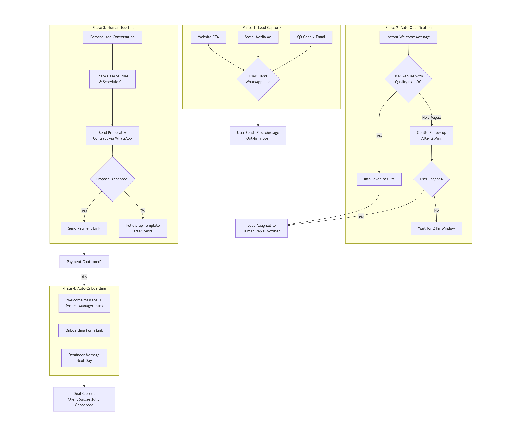

# Messaging Apps Lead Generation Automation Blueprint

# ****

[Whatsapp Setup](Whatsapp%20Setup%2027eb3416c76d809baf17d38ad6bc1f78.md)

### **Lead Generation → Deal Closure**

---

### **Detailed Breakdown of the Workflow Stages**



**PHASE 1: CHANNEL SETUP & GROWTH**

### **WhatsApp Business Strategy:**

- **Business Profile:** Complete with catalog, services, description
- **Quick Replies:** Pre-set responses for common questions
- **Labels:** Organize contacts (New Lead, Hot, Customer, etc.)

### **Telegram Channels/Groups:**

- **Public Channel:** Broadcast value content
- **Private Group:** Exclusive community for leads
- **Bot Integration:** @BotFather for automation

### **Discord Server Structure:**

- **Welcome Channel:** Rules and value proposition
- **Resource Channels:** Free tools and templates
- **Support Channels:** Q&A and community help

## **PHASE 2: LEAD CAPTURE AUTOMATION**

### **Opt-in Triggers:**

```
Website: "Click to WhatsApp" buttons
Social Media: "DM 'JOIN' on WhatsApp for free template"
Landing Pages: "Get updates on WhatsApp"
QR Codes: Physical marketing materials

```

### **Welcome Sequence (Automated):**

**Message 1 (Instant):**
"Welcome! Thanks for joining. You'll get:
✓ Free [resource] immediately
✓ Daily marketing tips
✓ Exclusive offers

Reply:
1 - Get your free [resource]
2 - Speak with expert
3 - See pricing"

**Message 2 (5 minutes if no response):**
"Not sure if you saw my previous message. Would you like your free [resource]? Reply 1 to get it now!"

## **PHASE 3: MULTI-PLATFORM BOT AUTOMATION**

### **WhatsApp Business API Flow:**

```
User: "Hi" / "Hello" / "Start"
Bot: "Welcome! Choose option:
1 - Free website audit
2 - Social media templates
3 - Pricing info
4 - Speak to human"

→ Option 1: "Please share your website URL"
→ Option 2: "Sending templates... [file] Need help implementing? Reply YES"
→ Option 3: "What service? 1-SEO 2-Social 3-Websites"
→ Option 4: "Connecting you with specialist..."

```

### **Telegram Bot Commands:**

```
/start - "Welcome! Get started with free resources"
/audit - "Free website audit request"
/templates - "Download marketing templates"
/call - "Schedule free consultation"
/pricing - "Service packages and pricing"

```

### **Discord Bot Features:**

- **!leadgen** - Free lead magnet delivery
- **!audit** - Website analysis request
- **!support** - Connect with sales team
- **!resources** - Access free tools library

## **PHASE 4: LEAD QUALIFICATION SEQUENCE**

### **Automated Qualification Flow:**

```
Day 1:
Q1: "What's your biggest marketing challenge right now?"
→ Options: [Leads, Visibility, Sales, Website, Other]

Day 2 (Based on answer):
"If more leads is your challenge, our [solution] helped [case study]. Want similar results? Reply YES"

Day 3:
"Quick question: Are you currently spending on marketing?"
→ Options: [Yes, No, Planning to]

Day 4:
"Based on your answers, you might benefit from [service]. Free strategy call tomorrow?"

```

### **Scoring System:**

- +10: Responds to first message
- +20: Answers qualification questions
- +30: Requests specific service info
- +50: Shares business details
- +100: Asks for pricing/call

## **PHASE 5: SALES HANDOFF AUTOMATION**

### **Hot Lead Triggers:**

- **Score 75+:** Auto-send Calendly link
- **Score 100+:** Immediate human takeover
- **"Call" "Price" "Buy" keywords:** Instant BDE assignment

### **Warm Lead Nurture:**

```
Day 1-3: Value content (tips, case studies)
Day 4-7: Soft offers (discounts, bonuses)
Day 8-14: Hard offers (limited spots, urgency)

```

## **PHASE 6: BROADCAST & RETENTION**

### **WhatsApp Broadcast Rules:**

- **Weekly Value:** Every Tuesday - marketing tip
- **Monthly Offer:** First week - special discount
- **Case Study:** Mid-month - success story
- **Urgency:** Month-end - limited offer

### **Telegram Channel Automation:**

- Daily tip at 9 AM
- Weekly template every Friday
- Monthly webinar announcement
- Customer spotlight stories

### **Discord Engagement:**

- Weekly Q&A sessions
- Monthly challenge events
- Daily prompts in general chat
- Automated resource updates

## **PHASE 7: CROSS-PLATFORM INTEGRATION**

### **Unified Lead Management:**

```
WhatsApp Lead → Add to Telegram broadcast
Telegram Member → Invite to Discord community
Discord Engager → Transfer to WhatsApp for personal conversation

```

### **Automated Follow-up:**

- **No response in 24h:** Send different value offer
- **No response in 72h:** "Last attempt" message
- **No response in 1 week:** Move to email sequence

## **TECH STACK FOR AUTOMATION**

### **WhatsApp:**

- **Business API:** Official solution
- **Tools:** Wati, WhatsApp Business app
- **Automation:** ManyChat for WhatsApp

### **Telegram:**

- **Bots:** @BotFather created bots
- **Tools:** Telethon, Telegram API
- **Automation:** Integromat/Make.com

### **Discord:**

- **Bots:** MEE6, Carl-bot, custom bots
- **Tools:** Discord Webhooks
- **Automation:** Zapier integrations

## **PERFORMANCE METRICS**

### **Key KPIs:**

- **Response Rate:** >60%
- **Conversion to Qualified Lead:** >25%
- **Cost Per Lead:** <₹50
- **Response Time:** <2 minutes
- **Sales Conversion:** >20%

### **Scaling Rules:**

- Expand broadcast lists when engagement >40%
- Add new triggers after 100 successful conversions
- Increase automation complexity after 500 leads

## **COMPLIANCE & BEST PRACTICES**

### **WhatsApp:**

- Business profile verification
- Opt-in requirements
- Clear unsubscribe option
- Business hours messaging

### **Telegram:**

- Channel description clarity
- No spam broadcasting
- Value-first approach
- Regular engagement

### **Discord:**

- Clear community rules
- Active moderation
- Value-driven channels
- Member recognition

## **IMPLEMENTATION TIMELINE**

**Week 1:** Setup business accounts and bots
**Week 2:** Create automation flows and sequences
**Week 3:** Test with small group (50 contacts)
**Week 4:** Scale successful flows + add integrations
**Month 2:** Full automation + performance optimization

This system captures, qualifies, and converts messaging app users into clients 24/7 with personalized automated conversations that feel human-driven.