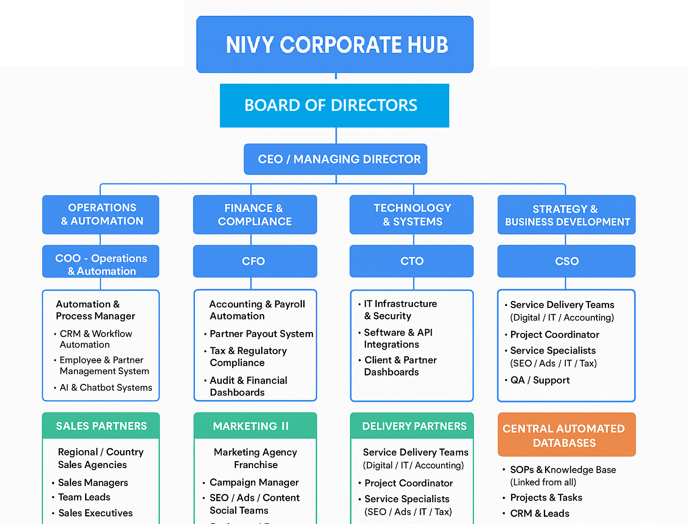

# Organization Map

[Position Details](Position%20Details%20292b3416c76d80e7a8b8f1a98f6522a4.md)

### Nivy Corporate Structure

---

**NIVY CORPORATE HUB (WORKSPACE)**

│

├─ **BOARD OF DIRECTORS**

│   └─ **CEO / MANAGING DIRECTOR**

│       ├─ COO – Operations & Automation

│       ├─ CFO – Finance & Compliance

│       ├─ CTO – Technology & Systems

│       └─ CSO – Strategy & Partnerships

│

├─ **OPERATIONS & AUTOMATION (In-House)**

│   ├─ Automation & Process Manager

│   │   ├─ CRM & Workflow Automation (HubSpot / Zapier / Make)

│   │   ├─ Employee & Partner Management System (Deel / Remote)

│   │   └─ AI & Chatbot Systems (Client & Partner Support)

│   └─ Partner Management Lead

│       ├─ Sales Partner Coordination

│       ├─ Delivery Partner Quality Control

│       └─ Performance Dashboards (Auto Synced)

│

├─ **FINANCE & COMPLIANCE (In-House)**

│   ├─ CFO

│   │   ├─ Accounting & Payroll Automation (QuickBooks / Xero)

│   │   ├─ Partner Payout System (Auto Payout Reports)

│   │   ├─ Tax & Regulatory Compliance

│   │   ├─ Audit & Financial Dashboards

│   │   └─ **Legal Officer**

│   │       ├─ Corporate Governance

│   │       ├─ Contracts & Agreements (Clients, Partners, Employees)

│   │       ├─ Risk & Compliance Advisory

│   │       └─ Litigation / Legal Support

│

├─ **COMPLIANCE & POLICY OVERSIGHT**

│   ├─ **Responsible for monitoring all departments**

│   │   ├─ CFO – Ensures finance, accounting, and regulatory compliance

│   │   ├─ Legal Officer – Corporate governance, contracts, risk advisory

│   │   └─ COO – Monitors SOP adherence and operational process compliance

│   └─ **Central Dashboard** (All departments report SOP & policy adherence)

│

├─ **TECHNOLOGY & SYSTEMS (In-House)**

│   ├─ CTO

│   │   ├─ IT Infrastructure & Security

│   │   ├─ Software & API Integrations (CRM + PM + Finance)

│   │   └─ Client & Partner Dashboards

│

├─ **STRATEGY & BUSINESS DEVELOPMENT (In-House)**

│   ├─ CSO

│   │   ├─ Partnerships & Alliances

│   │   ├─ Franchise / Regional Expansion

│   │   └─ Strategic Analytics Dashboard

│

├─ **SALES PARTNERS (Outsourced)**

│   ├─ Regional / Country Sales Agencies

│   │   ├─ Sales Managers

│   │   │   ├─ Team Leads

│   │   │   └─ Sales Executives

│   │   └─ Reporting:

│   │       • Leads Generated

│   │       • Deals Closed

│   │       • Client Satisfaction

│   │       • Payouts (Auto via CRM)

│

├─ **MARKETING PARTNERS (Outsourced)**

│   ├─ Marketing Agency / Franchise

│   │   ├─ Campaign Manager

│   │   │   ├─ SEO / Ads / Content / Social Teams

│   │   │   └─ Designers / Copywriters

│   │   └─ Reports:

│   │       • Campaign Performance

│   │       • ROI / Conversions

│   │       • Client Reports (Auto Shared)

│

├─ **DELIVERY PARTNERS (Outsourced)**

│   ├─ Service Delivery Teams (Digital / IT / Accounting)

│   │   ├─ Project Coordinator

│   │   │   ├─ Service Specialists (SEO / Ads / IT / Tax)

│   │   │   └─ QA / Support

│   │   └─ Reports:

│   │       • Project Status

│   │       • Quality & Feedback

│   │       • SLA / Timelines

│

├─ **CENTRAL AUTOMATED DATABASES**

│   ├─ SOPs & Knowledge Base (Linked from all)

│   ├─ Projects & Tasks (ClickUp / Notion / Asana)

│   ├─ CRM & Leads (Sales + Marketing)

│   ├─ Finance & Payout Dashboard

│   └─ Company-Wide Reports & Analytics (Power BI / Data Studio)

│

└─ **CEO EXECUTIVE DASHBOARD**

├─ Department Performance Overview

├─ Partner KPIs & Quality Scores

├─ Finance Summary (Revenue / Expenses / Profit)

└─ Alerts for Bottlenecks & Automation Failures

---

If you want, I can **convert this into a clean horizontal Mermaid org chart** with **Compliance & Policy Oversight clearly highlighted**, so you can paste it directly in **Notion** and visualize it nicely.

Do you want me to create that Mermaid chart?

### General Corporate Version

Nivy Corporate Hub (Workspace)
│
├─ Board of Directors
│   └─ CEO / Managing Director
│       ├─ Overview & Strategy
│       ├─ Company-wide Documents
│       ├─ Reports & Dashboards (linked from all departments)
│       └─ Strategic Projects
│
├─ Operations
│   ├─ COO / General Manager
│   │   ├─ Operations Director
│   │   │   ├─ Production / Service Managers
│   │   │   │   ├─ Team Leads / Supervisors
│   │   │   │   └─ Frontline / Field Staff
│   │   │   ├─ Overview & Goals
│   │   │   ├─ Service Delivery SOPs
│   │   │   ├─ Projects & Tasks (linked to Master Projects DB)
│   │   │   └─ Reports & Dashboards
│
├─ Finance
│   ├─ CFO / Chief Financial Officer
│   │   ├─ Finance Controller
│   │   │   ├─ Accounting & Payroll Team
│   │   │   │   └─ Accountants / AR / AP / Assistants
│   │   │   ├─ Overview & Goals
│   │   │   ├─ SOPs & Processes
│   │   │   ├─ Reports & Dashboards
│   │   │   └─ Templates
│   │   └─ Budgeting & Financial Planning
│   │       └─ Analysts / Auditors
│
├─ Technology
│   ├─ CTO / Chief Technology Officer
│   │   ├─ Technology Director
│   │   │   ├─ IT Infrastructure & Systems
│   │   │   │   └─ Network / Security Engineers
│   │   │   ├─ Software Development
│   │   │   │   └─ Developers / QA / Support
│   │   │   ├─ Overview & Goals
│   │   │   ├─ Systems & Infrastructure
│   │   │   ├─ Development / DevOps SOPs
│   │   │   ├─ Reports & Dashboards
│   │   │   └─ Knowledge Base / Tools
│   ├─ Project Management
│   │   ├─ Overview & Goals
│   │   ├─ Project Workflow SOPs
│   │   ├─ Active Projects (linked to Master Projects DB)
│   │   ├─ Reports & Dashboards
│   │   └─ Templates
│
├─ Marketing & Sales
│   ├─ CMO / Chief Marketing Officer
│   │   ├─ Marketing Director
│   │   │   └─ Digital / Social Media / Content Team
│   │   │       ├─ Overview & Strategy
│   │   │       ├─ Campaigns & Projects
│   │   │       ├─ SOPs / Templates (Pricing, Offers, Marketing Collateral)
│   │   │       └─ Reports & Dashboards
│   │   │           ├─ Digital Marketing
│   │   │           ├─ Offline Marketing
│   │   │           ├─ Sales
│   │   │           └─ Partnerships
│   │   ├─ Sales Director
│   │   │   └─ Regional Sales Managers
│   │   │       └─ Sales Executives
│   │   └─ Branding & PR Head
│   │       └─ Media / Events / PR Team
│
├─ Human Resources
│   ├─ CHRO / Chief Human Resources Officer
│   │   ├─ HR Manager
│   │   │   └─ HR Executives / Admin
│   │   │       ├─ Overview & Goals
│   │   │       ├─ Policies & Compliance
│   │   │       ├─ Recruitment & Onboarding
│   │   │       ├─ Performance Management
│   │   │       └─ Reports & Dashboards
│   │   ├─ Recruitment Manager
│   │   │   └─ Recruiters / Coordinators
│   │   └─ L&D / Training Manager
│   │       └─ Trainers / Mentors
│
├─ Legal & Compliance
│   ├─ CLO / Chief Legal & Compliance Officer
│   │   ├─ Legal Advisors
│   │   ├─ Compliance Officers
│   │   └─ Auditors / Policy Analysts
│
├─ Strategy & Business Development
│   ├─ CSO / Chief Strategy Officer
│   │   ├─ Partnerships & Alliances
│   │   └─ Market Expansion / Strategy Team
│
├─ Risk & Data
│   ├─ CRO / Chief Risk Officer
│   │   └─ Risk Assessment / Corporate Governance
│   ├─ CDO / Chief Data / Innovation Officer
│       └─ Innovation Lab / Data Analytics Team
│
├─ SOPs & Knowledge Base (Master Database)
│   ├─ Linked from all departments
│   ├─ Properties: Title, Department, Type, Owner, Last Updated
│   └─ Views: By Department, By Type
│
├─ Projects & Tasks (Master Database)
│   ├─ Properties: Project Name, Department, Status, Priority, Owner, Deadline
│   ├─ Views: Kanban (by Department), Calendar, Table
│   └─ Linked in Departments & Home Dashboard
│
├─ Reports & Dashboards
│   ├─ Financial Dashboard (CFO)
│   ├─ Marketing Dashboard (CMO)
│   ├─ Sales Dashboard
│   ├─ Operations Dashboard
│   ├─ HR Metrics Dashboard
│   └─ CEO Executive Summary Dashboard (linked from all)
│
└─ Templates
├─ Project Templates
├─ SOP / Process Templates
├─ Reports & Dashboard Templates
├─ Proposal / Email Templates
└─ Budget & Forecasting Templates

| Role | Qualifications | Knowledge / Expertise | Experience | Soft Skills | KPIs / Performance Metrics | Responsibilities | Key Tasks / Activities |
| --- | --- | --- | --- | --- | --- | --- | --- |
| CEO / Managing Director | MBA / Master’s in Business or related field; Bachelor’s in Business, Management, or Engineering | Strategic planning, corporate governance, financial oversight, business development, stakeholder management | 15–25 years; 7–10+ years in executive leadership | Visionary, decision-making, communication, leadership | Revenue growth, profitability, market share, strategic goal achievement | Lead company vision, strategy, and operations; ensure alignment across all departments | Approve strategic initiatives, oversee financial and operational performance, manage board relationships, drive partnerships |
| CFO / Chief Financial Officer | MBA in Finance / Accounting; CPA / CA / ACCA | Financial strategy, budgeting, reporting, taxation, compliance, ERP systems | 15–25 years; 7–10+ years in senior finance leadership | Analytical, detail-oriented, communication, risk management | Financial health, budget adherence, ROI, cost control | Oversee financial operations, strategy, and reporting; ensure compliance; manage finance team | Prepare financial reports, budget planning, monitor cash flow, coordinate audits, manage accounting team |
| CTO / Chief Technology Officer | B.Tech / M.Tech in CS/IT; MBA (Tech Management optional); AWS / Azure / CISSP | IT architecture, software development, cybersecurity, cloud, DevOps | 15–25 years; 7–10+ years in senior tech leadership | Visionary, strategic, communication, innovation | System uptime, technology ROI, cybersecurity incident rate | Lead tech strategy, architecture, and innovation; ensure secure, scalable systems | Approve tech roadmap, oversee development and infrastructure, evaluate new technologies, manage tech team |
| CMO / Chief Marketing Officer | MBA / Master’s in Marketing; Bachelor’s in Marketing / Communication | 360° marketing, digital & offline campaigns, branding, analytics | 15–25 years; 7–10+ years in senior marketing roles | Creative, strategic, data-driven, leadership | Brand awareness, lead generation, marketing ROI | Develop and execute marketing strategy, oversee marketing team, drive brand growth | Plan campaigns, monitor performance, manage budgets, coordinate with sales and product teams |
| CHRO / Chief Human Resources Officer | MBA / Master’s in HR; SHRM-SCP / CIPD | HR strategy, workforce planning, culture, compliance, HRIS | 15–25 years; 7–10+ years in HR leadership | Empathy, strategic thinking, leadership, communication | Employee retention, engagement, HR compliance | Lead HR strategy, policies, talent management, and culture | Oversee recruitment, manage performance systems, implement training programs, monitor employee satisfaction |
|  |  |  |  |  |  |  |  |

[Job Positions](Job%20Positions%202afb3416c76d8000aae2ece0d6cc58b0.md)