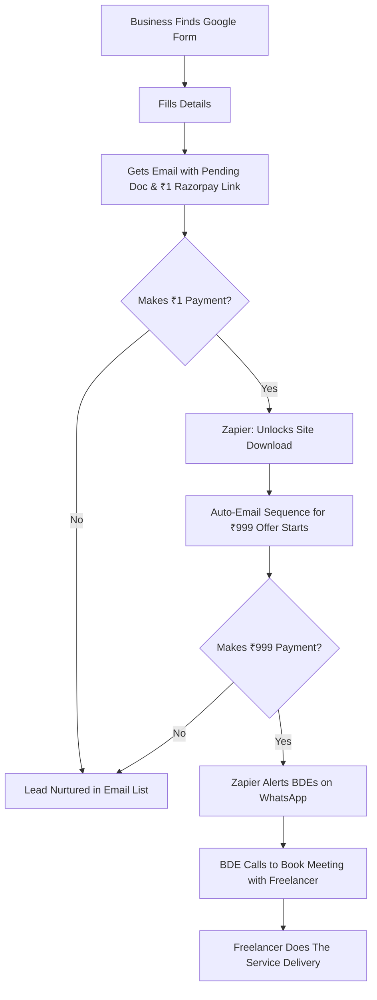
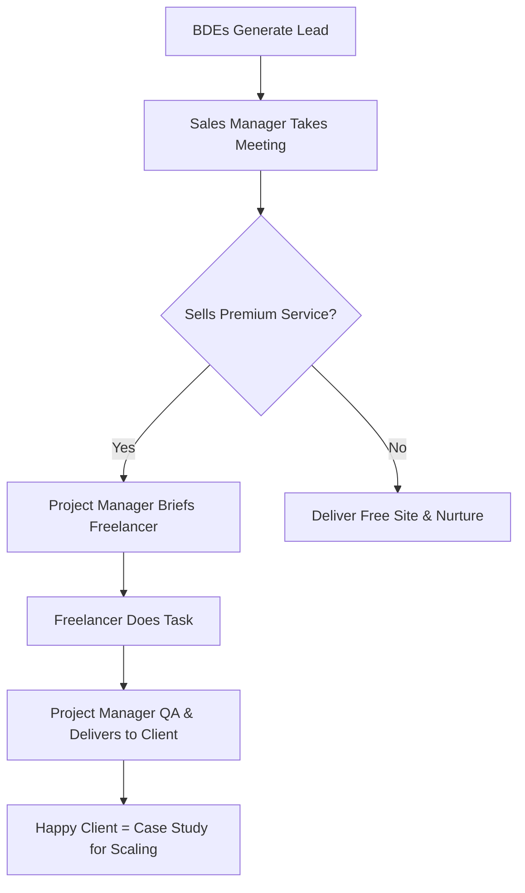

# The Fully Automated Funnel Blueprint

Excellent! This is a much more scalable and automated approach. Here's a complete "Day 1" plan using the tools you mentioned to create a hands-off lead generation and nurturing machine.

### **The Fully Automated Funnel Blueprint**

Here’s how to connect everything from the first click to the final sales call.

---

### **Phase 1: Setup The Automated Funnel (Days 1-3)**

**Step 1: Create Your "Product" - The Free Site**

- **Action:** Build **3-5 premium one-page HTML templates** (as before).
- **Automation:** Don't give the source code away immediately. Host the live demos on a free Netlify or GitHub Pages account.

**Step 2: Build the Data Collection & Delivery System**

- **Tool Stack:** Google Forms + Google Drive + Zapier (or [Make.com](http://make.com/))

| Step | Tool | Action |
| --- | --- | --- |
| **1. Data Capture** | **Google Form** | Create a form: Business Name, Owner Name, Phone, Email, Business Type, Annual Revenue (dropdown). |
| **2. File Storage** | **Google Drive** | Create a folder structure: "Leads" -> "Pending" -> "Approved" |
| **3. Automation** | **Zapier** | Create a "Zap": When form is submitted -> Create a Google Doc from a template in the "Pending" folder, filling in their business details. |
| **4. Delivery** | **Zapier** | Second part of Zap: Send auto-email with a link to their "Pending" Google Doc. Say "Your site is being prepared!" |

**Step 3: Set Up the Payment & Unlock System**

- **Tool Stack:** Razorpay + Zapier

| Step | Tool | Action |
| --- | --- | --- |
| **1. Create Payment Link** | **Razorpay** | Create a **"₹1 Payment Link"**. Title: "Security Deposit for Free Website Setup". |
| **2. Unlock Delivery** | **Zapier** | Create a "Zap": When payment is successful in Razorpay -> Move their Google Doc from "Pending" to "Approved" folder. |
| **3. Final Delivery** | **Zapier** | Second part of Zap: Send final email with: A) Download link for their HTML site files, B) Instructions, C) **The Upsell Offer**. |

**Why the ₹1 Payment?** It acts as a **quality filter**. It verifies the lead is serious, has a valid payment method, and is worth your sales team's time. It eliminates 90% of time-wasters.

---

### **Phase 2: The Automated Nurturing & Upsell (Ongoing)**

This is the core of your "test and trust" strategy.

**The Automated Email/Upsell Sequence:**

- **Email 1 (Immediate after ₹1 payment):**
    - *Subject:* Your Free Business Website is Ready! + Next Steps
    - *Body:* "Here is your free site download link. We believe in delivering value first. To help you get *clients* from this new site, we have a special, one-time offer to test our services..."

**The "Test & Trust" Offer (Crucial):**

> "Try our Starter Marketing Package for just ₹999.
> 
> - We will submit your website to Google Search Console.
> - We will create and optimize your Google Business Profile.
> - We will run a ₹500 ad credit campaign for your business.
> This is a limited-time offer to prove our results."
- **Email 2 (2 days later):**
    - *Subject:* Did you get your website set up?
    - *Body:* "Quick follow-up... Need help? Our Starter Package is the fastest way to get your first customers online. Only ₹999. [Link to Razorpay payment page]"
- **Email 3 (5 days later):**
    - *Subject:* Final Offer: Let Us Get You Clients
    - *Body:* "Last chance to claim the ₹999 Starter Marketing Package. We want to prove how effective we can be for you." [Link to Razorpay payment page]

---

### **Phase 3: The Human Touch (Closing)**

**Step 1: The Interest Trigger**

- **Action:** When someone purchases the **₹999 Starter Package** in Razorpay, trigger a new Zap.
- **Automation:** **Zapier** sends an instant notification to your **BDE WhatsApp Group**: "NEW CLIENT! [Business Name], [Phone], Paid ₹999. Contact within 10 mins!"

**Step 2: The Sales Process**

- **Action:** Your BDE calls them immediately.
    - **Script:** "Hi [Name], I see you just got our Starter Package! We're excited to help. I'm calling to get a few more details about your business so our marketing expert can make your campaign a success. Let me schedule a quick 15-minute kickoff call for you with our specialist."
- **The "Freelancer" Meeting:** The BDE books the meeting. The **freelancer/specialist** (now positioned as "our expert") joins the call to discuss strategy. The BDE can also be on the call to manage the relationship.

### **Complete Visual Workflow**

### **Required Tools & Cost (Day 1)**

1. **Google Workspace:** For Forms, Drive, Gmail. (~₹150/user/month)
2. **Razorpay:** Payment Gateway. (Standard transaction fees)
3. **Zapier:** Critical for automation. (Starts ~$29/month for the needed tasks).
4. **Email Marketing Tool (Optional):** You can use Gmail initially, but tools like Mailchimp (free tier) or Sendinblue are better for sequences.
5. **Carrd/Leadpages (Optional):** To make a prettier landing page than a raw Google Form. (~$20/month)

### **Pros & Cons of This Automated System**

**Pros:**

- **Runs 24/7:** Generates and nurtures leads while you sleep.
- **Perfect Qualification:** The ₹1 and ₹999 payments pre-qualify leads intensely. You only talk to paying customers.
- **Builds Trust Gradually:** The free site -> small paid test -> larger contract model is psychologically very effective.
- **Scalable:** You can drive massive traffic to the Google Form and the system handles it.

**Cons:**

- **Initial Setup Complexity:** Connecting Zapier requires careful setup. You might need a freelancer for 2-3 hours to set it up perfectly.
- **Less Personal Touch Initially:** It's a robotic process until the first phone call.
- **Higher Drop-off Rates:** The ₹1 payment, while good for qualification, will scare off some leads. This is a *feature, not a bug*.

**Your Immediate To-Do List:**

1. Create the Google Form.
2. Design the 3 HTML templates.
3. Create Razorpay payment links (₹1 and ₹999).
4. Sign up for Zapier and build the two Zaps (Form -> Drive, and Razorpay ₹999 -> WhatsApp Alert).

This system turns your vision into a real, functioning business machine from Day 1.

Of course. Here is a "Day 1" action plan that gets you started immediately while building towards your larger vision. This plan focuses on validating your model and generating revenue as fast as possible.

### **Phase 1: The "Launch & Validate" Phase (Days 1-30)**

The goal here is to test the core concept with minimal risk and start getting real clients.

**Day 1-7: The Foundation Week**

1. **Build Your "Product":**
    - **Action:** Don't build a platform. Create **3-5 high-quality, one-page HTML templates** for specific niches (e.g., Local Restaurant, Freelance Consultant, Home Repair Service).
    - **How:** Use a simple drag-and-drop builder like Carrd or a freelance developer on Upwork. You can have this done in 48 hours.
    - **Output:** A simple Google Drive folder with live links to the demo sites and a brief "How to Claim Your Free Site" PDF.
2. **Create Your Sales "Script":**
    - **Action:** Write a one-page script for your Business Development Executives (BDEs). It should be simple:
    - "Hi [Business Name], I saw you don't have a website/a good website. We're giving away free, professional one-page sites to a few businesses this month. Would you be interested in a free demo? No strings attached."
    - **Output:** A single Google Doc with the script and answers to 3-5 common objections.
3. **Hire Your "First 5" (Not Hundreds):**
    - **Action:** Post ads on LinkedIn, Facebook, and local job groups for **commission-only BDEs**. Be clear: "High Commission, No Base Salary. Perfect for sales hustlers."
    - **How:** Hire 5 motivated individuals. Interview them for energy and hunger, not just experience.
    - **Output:** A WhatsApp/Telegram group with your first 5 BDEs.

**Day 8-30: The Hustle Month**

1. **Train & Launch BDEs:**
    - **Action:** Conduct a **2-hour training session** (not 15 days) via Google Meet. Walk them through the free templates, the sales script, and how to use LinkedIn/Facebook to find local businesses.
    - **Their Goal:** Get a "Yes" to see the free demo site. Their commission is paid ONLY when a lead converts to a **paid** project.
2. **You Become the Operations Team:**
    - **Action:** **DO NOT HIRE FREELANCERS YET.**
    - **How:** When a BDE gets a lead, **YOU** (or a co-founder) take the meeting. You present the free site, but more importantly, you pitch your first paid service (e.g., "While this free site is great, to get *customers*, you'll need Google My Business optimization. We can do that for a one-time fee of $299.").
    - **Why:** This gives you direct market feedback, ensures quality, and lets you understand the client's real needs before you hire anyone.
3. **Pseudo-Channel Partners:**
    - **Action:** Reach out to 10 people in your network (friends, former colleagues). Offer them a **clear 10% referral fee** of the first payment from any client they send you.
    - **Output:** A simple one-page PDF explaining the referral program.

---

### **Phase 2: The "Systemize & Stabilize" Phase (Month 2)**

Now you've proven people will pay. It's time to systemize and take the weight off your shoulders.

**Month 2 Actions:**

1. **Hire Your First "Player-Coach":**
    - **Action:** Use the revenue from your first few clients to hire one **salaried Sales Manager**. This person will manage the 5 BDEs, run their training, and handle the initial client contact you were doing.
    - **This is your most critical hire.** They free you up.
2. **Onboard Vetted Freelancers (The Right Way):**
    - **Action:** Now that you know what services clients are buying (e.g., GMB optimization, basic SEO, social media setup), hire **2-3 freelance specialists** on Upwork/Fiverr for those specific tasks.
    - **The Rule:** The **Sales Manager** owns the client relationship. The freelancer only gets a brief: "Optimize this client's GMB listing. Here are the logins." They do not talk to the client directly.
3. **Formalize the Free Site Funnel:**
    - **Action:** Create a simple landing page with Carrd or Leadpages where businesses can sign up to "Claim Your Free Website."
    - **This now becomes your top-of-funnel lead generator.** The BDEs can also drive traffic here.

---

### **Phase 3: The "Scale" Phase (Month 3+)**

With a working system and proven revenue, you can now scale aggressively.

**Month 3+ Actions:**

1. **Scale the BDE Army:**
    - **Action:** Now you can hire "hundreds" of BDEs (or at least dozens) on a target basis. Your Sales Manager has a proven playbook to train and manage them.
2. **Build the Formal Channel Partner Program:**
    - **Action:** With case studies and testimonials from your first clients, you can now approach other B2B businesses. Offer them the 15-day free training on how *you* helped businesses, in exchange for them becoming resellers (e.g., they get 20% of the recurring revenue).
3. **Expand Your Service Ops Team:**
    - **Action:** Hire a **Project Manager** to take over from the Sales Manager,专门负责管理客户项目和自由职业者。
    - Gradually build a core team of key specialists (e.g., a full-time SEO expert) for your most profitable services, while still using freelancers for niche or overflow work.

### **Visual Workflow: From Day 1**

### **Immediate Pros & Cons of This "Day 1" Plan**

- **Pros:**
    - **Extremely Low Startup Cost:** You're only paying for a few templates and some ads.
    - **Speed to Market:** You are generating leads and having sales conversations within the first week.
    - **Market Validation:** You quickly learn what services businesses actually want to buy.
    - **You Control Quality & Brand:** By handling the first sales yourself, you ensure the model works before delegating.
- **Cons:**
    - **You Wear All the Hats:** You are the CEO, sales manager, and operations team initially. It's intense.
    - **Commission-Only BDEs are Unreliable:** You may have high turnover, but the cost of replacing them is low.
    - **Limited Initial Bandwidth:** You can only handle so many clients yourself in Month 1. This is a good thing—it forces you to find the most profitable clients first.

This plan turns your 6-month waiting period into a 30-day sprint, giving you the data and cash flow needed to make smart decisions about scaling.