# Organisation Map

Nivy Company Hub (Workspace)
│
├─ Home Dashboard
│   ├─ Quick Links (Departments, Projects, SOPs, Reports, Templates)
│   ├─ Announcements / Updates
│   └─ CEO Dashboard / High-Level KPIs
│
├─ Company Strategy
│   ├─ Business Plan
│   ├─ Business Model Canvas
│   ├─ Growth & Expansion Plans
│   └─ Living Documentation / Decisions Log
│
├─ Departments
│   ├─ CEO / Executive Office
│   │   ├─ Overview & Strategy
│   │   ├─ Company-wide Documents
│   │   ├─ Reports & Dashboards (linked from all departments)
│   │   └─ Strategic Projects
│   │
│   ├─ CFO / Finance
│   │   ├─ Overview & Goals
│   │   ├─ SOPs & Processes
│   │   ├─ Reports & Dashboards
│   │   └─ Templates

                   Accounts & Finance
│   │
│   ├─ CMO / Marketing
│   │   ├─ Overview & Strategy
│   │   ├─ Campaigns & Projects
│   │   ├─ SOPs / Templates (Pricing, Offers, Marketing Collateral)
│   │   └─ Reports & Dashboards
│   │          Digital Marketing 

 |     |     |___Offline Marketing

 |     |     |___Sales

 |     |     |___Partnership
│   ├─ CTO / Technology
│   │   ├─ Overview & Goals
│   │   ├─ Systems & Infrastructure
│   │   ├─ Development / DevOps SOPs
│   │   ├─ Reports & Dashboards
│   │   └─ Knowledge Base / Tools
│   │
│   ├─ Project Management
│   │   ├─ Overview & Goals
│   │   ├─ Project Workflow SOPs
│   │   ├─ Active Projects (linked to Master Projects DB)
│   │   ├─ Reports & Dashboards
│   │   └─ Templates
│   │
│   ├─ Sales
│   │   ├─ Overview & Goals
│   │   ├─ Sales Processes / SOPs
│   │   ├─ Commission & Incentives
│   │   └─ Reports & Dashboards
│   │
│   ├─ Operations
│   │   ├─ Overview & Goals
│   │   ├─ Service Delivery SOPs
│   │   ├─ Projects & Tasks (linked to Master Projects DB)
│   │   └─ Reports & Dashboards
│   │
│   ├─ HR
│   │   ├─ Overview & Goals
│   │   ├─ Policies & Compliance
│   │   ├─ Recruitment & Onboarding
│   │   ├─ Performance Management
│   │   └─ Reports & Dashboards
│   │
│   └─ Accounting & Finance
│       ├─ Overview & Goals
│       ├─ Processes & SOPs
│       ├─ Reports & Dashboards
│       └─ Templates
│
├─ SOPs & Knowledge Base (Master Database)
│   ├─ Linked from all departments
│   ├─ Properties: Title, Department, Type, Owner, Last Updated
│   └─ Views: By Department, By Type
│
├─ Projects & Tasks (Master Database)
│   ├─ Properties: Project Name, Department, Status, Priority, Owner, Deadline
│   ├─ Views: Kanban (by Department), Calendar, Table
│   └─ Linked in Departments & Home Dashboard
│
├─ Reports & Dashboards
│   ├─ Financial Dashboard (CFO)
│   ├─ Marketing Dashboard (CMO)
│   ├─ Sales Dashboard
│   ├─ Operations Dashboard
│   ├─ HR Metrics Dashboard
│   └─ CEO Executive Summary Dashboard (linked from all)
│
└─ Templates
├─ Project Templates
├─ SOP / Process Templates
├─ Reports & Dashboard Templates
├─ Proposal / Email Templates
└─ Budget & Forecasting Templates

```mermaid
graph TD

A[Board of Directors] --> B[CEO / Managing Director]

%% Top Management
B --> C1[COO / General Manager]
B --> C2[CFO / Chief Financial Officer]
B --> C3[CTO / Chief Technology Officer]
B --> C4[CMO / Chief Marketing Officer]
B --> C5[CHRO / Chief Human Resources Officer]
B --> C6[CLO / Chief Legal & Compliance Officer]
B --> C7[CSO / Chief Strategy & Business Development Officer]
B --> C8[CRO / Chief Risk Officer]
B --> C9[CDO / Chief Data / Innovation Officer]

%% COO Branch
C1 --> D1A[Operations Director]
D1A --> E1A[Production / Service Managers]
E1A --> F1A[Team Leads / Supervisors]
F1A --> G1A[Frontline / Field Staff]

%% CFO Branch
C2 --> D2A[Finance Controller]
D2A --> E2A[Accounting & Payroll Manager]
E2A --> F2A[Accountants / AR / AP]
F2A --> G2A[Assistants / Clerks]
C2 --> D2B[Budgeting & Financial Planning]
D2B --> E2B[Analysts / Auditors]

%% CTO Branch
C3 --> D3A[Technology Director]
D3A --> E3A[IT Infrastructure & Systems]
E3A --> F3A[Network / Security Engineers]
D3A --> E3B[Software Development Head]
E3B --> F3B[Developers / QA / Support]

%% CMO Branch
C4 --> D4A[Marketing Director]
D4A --> E4A[Digital / Social Media Team]
E4A --> F4A[Content Creators / Designers]
C4 --> D4B[Sales Director]
D4B --> E4B[Regional Sales Managers]
E4B --> F4B[Sales Executives]
C4 --> D4C[Branding & PR Head]
D4C --> E4C[Media / Events / PR Team]

%% CHRO Branch
C5 --> D5A[HR Manager]
D5A --> E5A[HR Executives / Admin]
C5 --> D5B[Recruitment Manager]
D5B --> E5B[Recruiters / Coordinators]
C5 --> D5C[L&D / Training Manager]
D5C --> E5C[Trainers / Mentors]

%% CLO Branch
C6 --> D6A[Legal Advisors]
C6 --> D6B[Compliance Officers]
C6 --> D6C[Auditors / Policy Analysts]

%% CSO Branch
C7 --> D7A[Partnerships & Alliances]
C7 --> D7B[Market Expansion / Strategy Team]

%% CRO Branch
C8 --> D8A[Risk Assessment & Audit]
C8 --> D8B[Corporate Governance Team]

%% CDO Branch
C9 --> D9A[Innovation Lab]
C9 --> D9B[Data Analytics & Insights Team]

```

can u create this hierrchy 

[Tasks Tracker](Tasks%20Tracker%20636eb94b1a2a83f7a6dd81050aebe614.md)

[**Technical Division - Complete Structure (Indian Market Rates)**](Technical%20Division%20-%20Complete%20Structure%20(Indian%20Ma%20630eb94b1a2a823a8ee401c5787f32ff.md)

[Executive Departments](Executive%20Departments%2034eeb94b1a2a83eaa00f019638d0de7b.md)