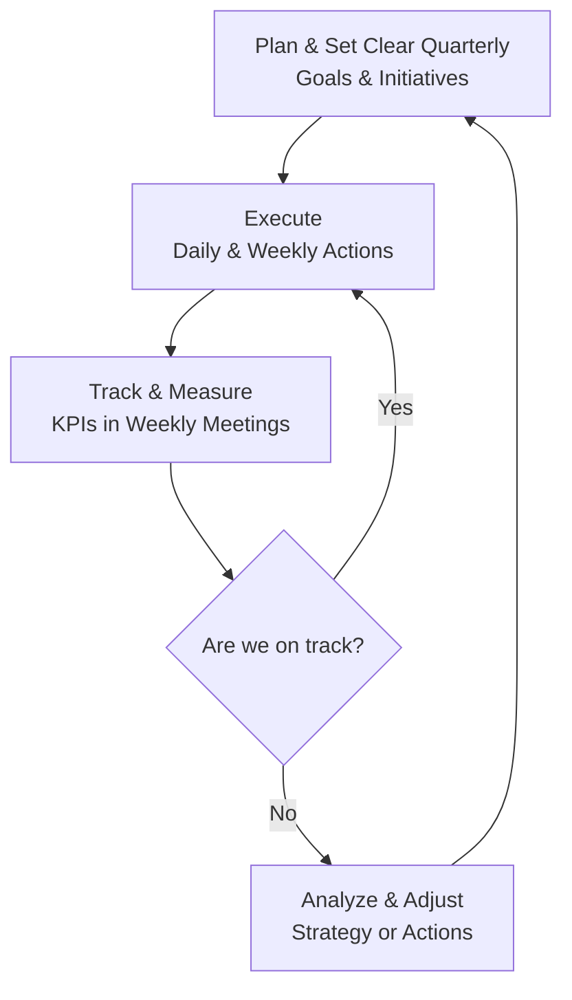

# 📄 Business Plan v1.0

## **Business Plan: Nivy Tech**

**Date:** October 21-9- 2025

**Version:** 1.0

**Confidentiality Notice:** This document contains proprietary and confidential information. No part of it may be reproduced or transmitted without prior written permission.

---

This is about setting the stage for flawless execution.

1. **Translate the Plan into an Operational Roadmap:**
    - **Break it down:** Take your high-level goals (e.g., "Achieve $100k ARR in Year 1") and break them into quarterly, monthly, and weekly objectives.
    - **Define KPIs (Key Performance Indicators):** How will you measure success for each goal? (e.g., KPI for "Acquire Clients" is *Number of New Client Proposals Sent per Week*, *Lead-to-Client Conversion Rate*).
    - **Assign Ownership:** If you have a team, who is responsible for what? If you're solo, you need to block time for each key activity.
2. **Set Up Your Financial Systems:**
    - **Open a business bank account.** Never mix personal and business finances.
    - **Choose an accounting tool:** (e.g., QuickBooks, Xero) to track income, expenses, and profitability from day one.
    - **Set up billing and invoicing:** Use a tool like Stripe, PayPal, or FreshBooks to send professional, automated invoices.
3. **Build Your "Launch Stack" (Tools & Technology):**
    - **Project Management:** Asana, Trello, or ClickUp to manage tasks and workflows.
    - **Communication:** Slack or Microsoft Teams for internal comms.
    - **CRM (Customer Relationship Management):** HubSpot CRM (free tier is great), or Streak to track leads and client interactions.
    - **Documentation:** Google Workspace or Microsoft 365 for proposals, contracts, and reports.
4. **Develop Your Core Service Delivery Process:**
    - Document exactly what happens when a new client signs. What is the onboarding process? What's the first step? Who does what? This creates consistency and quality.

---

### **Phase 2: The Execution Cycle (Ongoing Process)**

Execution is not a one-time event; it's a continuous cycle.

**The Core Execution Loop:**

**1. Plan & Set Clear Goals (Quarterly/Monthly):**

- Hold a quarterly planning session. Review the previous quarter and set 3-5 key objectives for the next 90 days (e.g., "Launch our new service package," "Acquire 3 new retainer clients").
- Break these quarterly goals into specific initiatives and tasks for the month.

**2. Execute (Daily/Weekly):**

- This is the "doing." Your team works on the tasks laid out in the project management tool.
- **Focus on priorities:** Use a framework like the **Rocks, Pebbles, Sand metaphor**. Your quarterly goals are the "Rocks." Ensure time is blocked for these first.

**3. Track & Measure (Weekly):**

- **Hold a weekly team meeting** (even if it's just you). This is the most critical habit.
- Agenda:
    - Review last week's priorities: Did we get them done?
    - Check this week's KPIs: How many leads? What's the cash flow? What are client campaign results?
    - Set clear priorities for the coming week.
    - Identify roadblocks and solve them quickly.

**4. Analyze & Adjust (Monthly/Quarterly):**

- Review your financial reports and key metrics.
- **Be ruthlessly honest:** What's working? What isn't?
- **Pivot quickly:** If a service isn't selling, adjust the offering or marketing. If a channel isn't generating leads, stop wasting time on it and double down on what works. Your business plan is a guide, not a sacred text.

---

### **Phase 3: Key Focus Areas for Execution**

- **Client Acquisition & Sales:**
    - **Process:** Have a standardized sales process: Initial Contact > Discovery Call > Proposal > Close.
    - **Pricing:** Be confident in your pricing. Don't undervalue your expertise just to get a client.
    - **Contracts:** Always use a contract that outlines scope, deliverables, payment terms, and termination clauses.
- **Service Delivery & Client Management:**
    - **Onboard flawlessly:** A great onboarding experience sets the tone for the entire relationship.
    - **Set clear expectations:** Communicate how often you'll report results and have calls.
    - **Underpromise and Overdeliver:** It's better to surprise a client with great results than to fail to meet inflated expectations.
- **Financial Management:**
    - **Watch cash flow like a hawk:** Profit is theory, cash is fact. Ensure you have enough cash to cover expenses.
    - **Get a deposit upfront:** Standard practice is to require the first month's retainer or a project deposit before work begins.
    - **Review finances monthly:** Know your profitability per client and per service.
- **Scaling the Operation:**
    - **Systematize everything:** Document processes (SOPs) for every repeatable task. This allows you to hire and train easily later.
    - **Hire strategically:** Your first hires should relieve your biggest pain points. Usually, this is either a delivery specialist (to do more work) or an admin/operations person (to free up your time).
    - **Protect your culture:** As you grow, hire people who fit your values and mission.

### **Common Execution Pitfalls to Avoid**

- **Shiny Object Syndrome:** Stick to your core plan. Don't jump on every new social media platform or offer a new service just because a competitor does.
- **Working *in* the business, not *on* it:** As the founder, you must carve out time for strategy, sales, and planning, not just client work.
- **Ignoring the Data:** Your KPIs will tell you a story. Listen to them.
- **Poor Client Selection:** Not every client who can pay you is a good client. Learn to identify red flags and say "no" to bad fits. It saves immense time and stress.

**In summary: Execution is a discipline.** It's the relentless commitment to doing the important work, measuring the results, and having the courage to adapt. Your business plan is the map, but execution is the journey.

[**2.0 Executive Summary**](2%200%20Executive%20Summary%2033ceb94b1a2a830985cf01f9b3856ddc.md)

[**3.0 Company Description**](3%200%20Company%20Description%205d8eb94b1a2a821a816e8104776a692f.md)

[**4.0 Problem & Solution**](4%200%20Problem%20&%20Solution%20b47eb94b1a2a834fbbcd818050a843d8.md)

[**5.0 Industry & Market Analysis**](5%200%20Industry%20&%20Market%20Analysis%20de3eb94b1a2a825e999d015ddcc3b908.md)

[**6.0 Organization & Management**](6%200%20Organization%20&%20Management%20b49eb94b1a2a8283b890010a950be72c.md)

[**7.0 Marketing & Sales Strategy**](7%200%20Marketing%20&%20Sales%20Strategy%20afdeb94b1a2a820490e3813df0b2857c.md)

[**8.0 Products or Services**](8%200%20Products%20or%20Services%2076ceb94b1a2a824cb0b601657a15e99d.md)

[**11.0 Risk Analysis**](11%200%20Risk%20Analysis%20a9aeb94b1a2a83ed8807014f462df4ba.md)

[**Operating system of your company:** Living Documentation](Operating%20system%20of%20your%20company%20Living%20Documentat%207b4eb94b1a2a8228ac498142cc14c9d2.md)

[11. **Growth & Expansion Plan**](11%20Growth%20&%20Expansion%20Plan%20732eb94b1a2a830c82aa81c2b8c5ef92.md)

[12. **Sustainability & CSR (optional)**](12%20Sustainability%20&%20CSR%20(optional)%20e94eb94b1a2a822282b78132041f039c.md)

[13. **Appendices**](13%20Appendices%20d69eb94b1a2a8251a65301aae8669fe4.md)